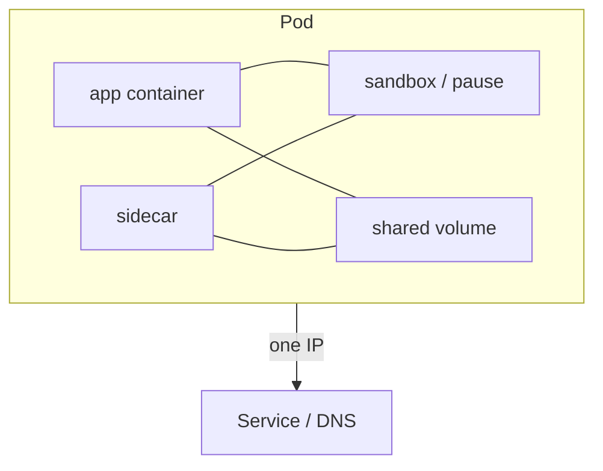

import { ConceptTemplate } from '@/features/kb/components/templates/ConceptTemplate'
import { Callout } from '@/features/kb/components/mdx/Callout'
import { ComparisonTable } from '@/features/kb/components/mdx/ComparisonTable'

export default function Layout({ children }) {
  return (
    <ConceptTemplate title="Kubernetes Pods">
      {children}
    </ConceptTemplate>
  )
}

A **Pod** is the smallest Kubernetes schedulable unit. It is not "a container." It is a bag of containers that share a network namespace (one IP, localhost) and can share volumes. Controllers (Deployment, StatefulSet, Job, DaemonSet) create and replace pods. You almost never apply a raw Pod in production.

## 1. Deep Dive and Mechanics

**Sandbox.** The runtime starts a pause/sandbox container that owns the net namespace. App containers join it. They share localhost and can use IPC if enabled. They do not share a PID namespace unless you set `shareProcessNamespace`.

**Single-container default.** Scale by adding pods, not by stuffing more copies of the app into one pod. Extra containers are sidecars: proxy, log shipper, adapter.

**Lifecycle.** Pending (unscheduled or pulling) → Running → Succeeded/Failed. kubelet runs probes. The pod IP dies with the pod. Services exist because of that.

**QoS.** Guaranteed (requests = limits), Burstable, BestEffort. Eviction order prefers BestEffort. Requests are what the scheduler packs; limits are what the cgroup enforces.

**Init containers.** Run to completion in order before app containers start. Useful for migrations-as-a-hack (prefer a Job) or waiting for a dependency.

<Callout icon="warning" title="Never deploy naked pods">
A lone Pod that dies is gone. No replica, no rollout. `kubectl run` is a lab tool. Production uses a controller.
</Callout>

## 2. Mathematical / Theoretical Foundation

**Atomic placement.** The scheduler assigns the whole pod to one node. You cannot split containers of a pod across machines. That is the definition that makes localhost and shared volumes work.

**Ephemerality.** Identity of a Deployment pod is not stable. Replacement has a new name and IP. Persistent identity is a StatefulSet ordinal plus a PVC, not the pod object UID.

<ComparisonTable
  headers={['Controller', 'Pod names', 'When to use']}
  rows={[
    ['Deployment', 'Hashed, disposable', 'Stateless'],
    ['StatefulSet', 'Ordinal, sticky PVC', 'Identity + disk'],
    ['DaemonSet', 'One per node', 'Agents'],
    ['Job', 'Until success', 'Batch'],
  ]}
/>

## 3. Real-World Implementation

```yaml
apiVersion: v1
kind: Pod
metadata:
  name: debug-api
  namespace: shop
spec:
  restartPolicy: Never
  containers:
    - name: curl
      image: registry.example.com/netdebug:1.2.0
      command: ["curl", "-sS", "http://api.shop.svc:8080/healthz"]
      resources:
        requests:
          cpu: "50m"
          memory: 64Mi
        limits:
          memory: 64Mi
```

```yaml
# Production shape lives under a Deployment template
# spec.template.spec is the PodSpec: containers, probes, volumes
```

Debug pods are the legitimate naked exception. Delete them.

## 4. Visualizations



## 5. Interview Prep

**Q: Why pods instead of scheduling containers?**
**A:** Some processes must be co-located (mesh proxy, log agent). The pod is that colocation + shared IP contract.

**Q: What happens on node death?**
**A:** Pods on that node are gone. A controller creates new pod objects. StatefulSets reattach the same PVC to the same ordinal name.

**Q: liveness versus readiness versus startup?**
**A:** Liveness restarts. Readiness removes from Endpoints. Startup delays the others during boot. Wrong liveness is a restart loop.

## 6. Production Use Cases

- **App + Envoy sidecar** (mesh injection).
- **App + fluentbit** sharing an emptyDir of logs.
- **Ephemeral debug** pods in a restricted namespace.

<Callout icon="tip" title="Requests are scheduling truth">
A pod with no requests is packed as BestEffort and evicted first. Set requests from observed usage; set memory limits to protect the node.
</Callout>
