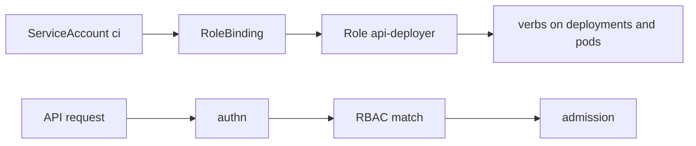

import { ConceptTemplate } from '@/features/kb/components/templates/ConceptTemplate'
import { Callout } from '@/features/kb/components/mdx/Callout'
import { ComparisonTable } from '@/features/kb/components/mdx/ComparisonTable'

export default function Layout({ children }) {
  return (
    <ConceptTemplate title="Kubernetes RBAC">
      {children}
    </ConceptTemplate>
  )
}

**RBAC** answers "may this identity perform this verb on this resource in this namespace?" Authentication (OIDC, cert, ServiceAccount token) only establishes who. The apiserver evaluates RoleBindings and ClusterRoleBindings before admission. Deny by default: no bind, no access.

## 1. Deep Dive and Mechanics

**Role.** Namespaced list of rules: `apiGroups`, `resources`, `verbs` (get, list, watch, create, update, patch, delete). A Role can also name specific resourceNames.

**ClusterRole.** Same shape, cluster-scoped. Used for nodes, PVs, CRDs, and for reusable permission sets that RoleBindings then scope to a namespace (`admin`, `edit`, `view`).

**Binding.** RoleBinding: subject plus Role (or ClusterRole) in one namespace. ClusterRoleBinding: subject plus ClusterRole everywhere. Subjects are User, Group, or ServiceAccount.

**Aggregation.** ClusterRoles can aggregate other ClusterRoles via label selectors (how some distros extend `view`).

**Privilege escalation.** You cannot bind a Role you could not already create. `escalate` and `bind` verbs exist so this stays explicit. A ServiceAccount used by a controller should not be `cluster-admin` unless it truly must be.

<Callout icon="error" title="cluster-admin is not a default">
Binding `cluster-admin` to a human group or to every Operator SA is how a leaked token becomes the cluster. Use `view` / `edit` / custom Roles. Break-glass a separate group.
</Callout>

## 2. Mathematical / Theoretical Foundation

**Allow-list union.** Authorized if any matching binding's rule covers the request tuple (verb, group, resource, namespace, name). There is no deny rule in RBAC. Narrower access means fewer binds, not a deny object.

**Least privilege.** Minimize the set of rules in the bind graph. Audit regularly; unused binds accumulate. `kubectl auth can-i --list` dumps the effective union.

<ComparisonTable
  headers={['Object', 'Scope', 'Typical subject']}
  rows={[
    ['Role + RoleBinding', 'One namespace', 'Team user, app SA'],
    ['ClusterRole + RoleBinding', 'Role reused, still one ns', 'edit in shop only'],
    ['ClusterRole + ClusterRoleBinding', 'Whole cluster', 'Prometheus, node kubelet'],
  ]}
/>

## 3. Real-World Implementation

```yaml
apiVersion: rbac.authorization.k8s.io/v1
kind: Role
metadata:
  name: api-deployer
  namespace: shop
rules:
  - apiGroups: ["apps"]
    resources: ["deployments"]
    verbs: ["get", "list", "watch", "patch"]
  - apiGroups: [""]
    resources: ["pods", "pods/log"]
    verbs: ["get", "list"]
---
apiVersion: rbac.authorization.k8s.io/v1
kind: RoleBinding
metadata:
  name: api-deployer
  namespace: shop
subjects:
  - kind: ServiceAccount
    name: ci
    namespace: shop
roleRef:
  apiGroup: rbac.authorization.k8s.io
  kind: Role
  name: api-deployer
```

```bash
kubectl auth can-i patch deployments --namespace shop --as=system:serviceaccount:shop:ci
```

CI should deploy with this SA, not with a human cloud-admin kubeconfig.

## 4. Visualizations



## 5. Interview Prep

**Q: Role versus ClusterRole?**
**A:** Scope of the *definition*. A ClusterRole can still be bound in one namespace. ClusterRoleBinding is what makes it global.

**Q: Why can I not get Secrets after getting edit?**
**A:** You might not have `edit`; built-in `edit` does include Secrets in many versions — which is why teams replace it with a custom Role that omits secrets and exec.

**Q: How does kubelet authenticate?**
**A:** Node authorizer + NodeRestriction plus a kubelet identity, not a human Role. Do not confuse that path with user RBAC.

## 6. Production Use Cases

- **CI ServiceAccounts** that can patch Deployments in one namespace.
- **Read-only** ClusterRoleBindings for dashboards on non-secret resources.
- **Break-glass** group with time-bounded access reviews.

<Callout icon="tip" title="Prefer impersonation tests">
`kubectl auth can-i --as=...` in CI after every Role change. YAML that looks tight but binds the wrong ClusterRole is a common miss.
</Callout>
