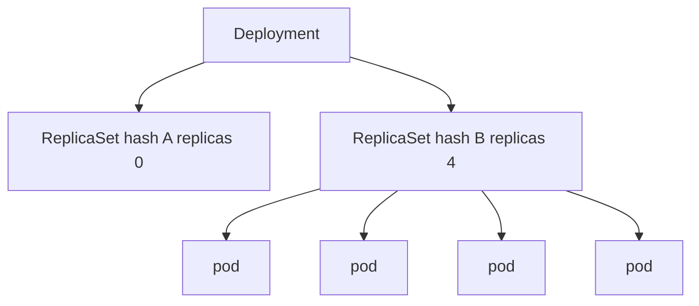

import { ConceptTemplate } from '@/features/kb/components/templates/ConceptTemplate'
import { Callout } from '@/features/kb/components/mdx/Callout'
import { ComparisonTable } from '@/features/kb/components/mdx/ComparisonTable'

export default function Layout({ children }) {
  return (
    <ConceptTemplate title="ReplicaSets">
      {children}
    </ConceptTemplate>
  )
}

A **ReplicaSet** makes the number of running pods that match its selector equal `spec.replicas`. If a node dies and two pods vanish, it creates two more. It does not know about rolling image changes. A **Deployment** creates a new ReplicaSet per template hash and scales the pair during a rollout.

## 1. Deep Dive and Mechanics

**Selector.** Labels on the pod template must match the selector. The ReplicaSet adopts any matching pod, including ones you created by hand. A too-wide selector steals pods from another controller.

**Reconciliation.** List matching pods, subtract deleting/failed as the implementation dictates, create or delete the difference. Pods are not "restarted" in place when the node is gone; new pod objects appear.

**Owner.** Deployment sets ownerReferences. Garbage collection deletes child ReplicaSets when the Deployment goes (subject to history). `revisionHistoryLimit` keeps old ReplicaSets at 0 replicas for rollback.

**Scaling.** HPA patches the Deployment's replicas; the Deployment writes the active ReplicaSet. Patching a ReplicaSet that a Deployment owns is a fight you will lose.

<Callout icon="warning" title="Do not hand-edit a Deployment's ReplicaSet">
kubectl scale on the ReplicaSet is undone by the Deployment. Scale the Deployment (or HPA).
</Callout>

## 2. Mathematical / Theoretical Foundation

**Invariant.** Let S be pods matching the selector that the controller considers available. Drive |S| → N. This is the same count loop as a replicated state machine's follower count, without identity.

**Template hash.** Deployment computes a hash of the pod template. That hash is a label. Two templates ⇒ two ReplicaSets ⇒ two disjoint S sets. Rolling update is two count loops moving in opposite directions.

<ComparisonTable
  headers={['Object', 'Keeps a count?', 'Rolls an image?']}
  rows={[
    ['ReplicaSet', 'Yes', 'No'],
    ['Deployment', 'Via ReplicaSets', 'Yes'],
    ['ReplicationController', 'Yes (legacy)', 'No'],
    ['StatefulSet', 'Yes, with identity', 'Ordered'],
  ]}
/>

## 3. Real-World Implementation

```yaml
# You will see this generated; rarely write it
apiVersion: apps/v1
kind: ReplicaSet
metadata:
  name: api-7f3b2c
  namespace: shop
  labels:
    app: api
    pod-template-hash: 7f3b2c
spec:
  replicas: 4
  selector:
    matchLabels:
      app: api
      pod-template-hash: 7f3b2c
  template:
    metadata:
      labels:
        app: api
        pod-template-hash: 7f3b2c
    spec:
      containers:
        - name: api
          image: registry.example.com/api:1.4.2
```

```bash
kubectl get rs -n shop
kubectl describe deploy api -n shop
```

The Deployment's Events and `kubectl rollout history` are the human interface.

## 4. Visualizations



## 5. Interview Prep

**Q: Why do we still have ReplicaSets if we use Deployments?**
**A:** Because a rollout is two replica counts and a history of templates. ReplicaSet is that primitive. Deployment is the strategy.

**Q: ReplicationController versus ReplicaSet?**
**A:** RC is the ancestor with a simpler selector. ReplicaSet supports set-based selectors. Do not create RCs.

**Q: Orphan pods?**
**A:** If you delete a ReplicaSet with `--cascade=orphan`, pods stay. A new ReplicaSet with the same selector will adopt them.

## 6. Production Use Cases

- **Behind every Deployment** as the actual count loop.
- **Rollback** by reactivating an old ReplicaSet (via `kubectl rollout undo`).
- **Forensics**: leftover ReplicaSets at 0 show what images ran.

<Callout icon="tip" title="Selectors are immutable for a reason">
Changing a selector on a live ReplicaSet is rejected or disastrous. Get labels right in the Deployment template the first time.
</Callout>
