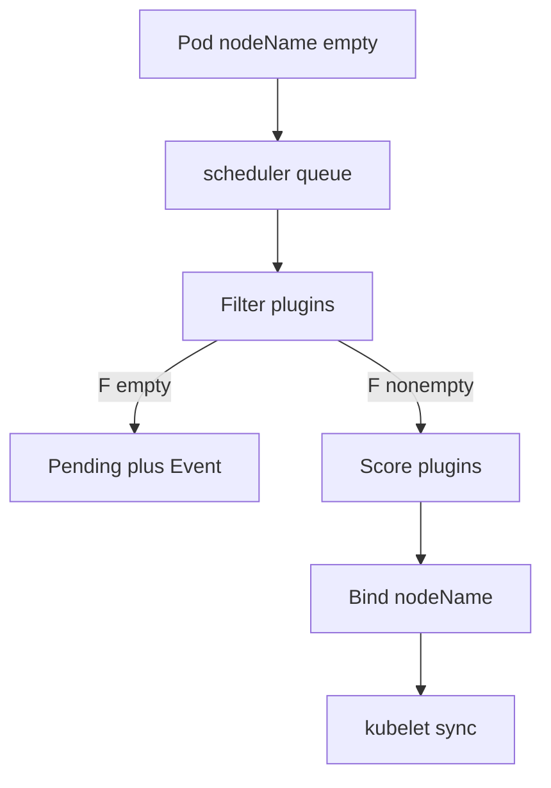

import { ConceptTemplate } from '@/features/kb/components/templates/ConceptTemplate'
import { Callout } from '@/features/kb/components/mdx/Callout'
import { ComparisonTable } from '@/features/kb/components/mdx/ComparisonTable'

export default function Layout({ children }) {
  return (
    <ConceptTemplate title="kube-scheduler">
      {children}
    </ConceptTemplate>
  )
}

**kube-scheduler** watches pods with an empty `nodeName` and writes a binding. It does not start containers. It picks a node; kubelet does the rest. If no node passes the filter plugins, the pod stays Pending with Events that name the failed predicate.

## 1. Deep Dive and Mechanics

**Two phases.** *Filter* (predicates): drop nodes that lack CPU/memory, miss required affinity, are tainted without a toleration, cannot attach the PVC's zone, or fail a custom plugin. *Score* (priorities): rank survivors — least requested, image locality, inter-pod affinity, topology spread. Highest score wins; ties break.

**Plugins.** The scheduling framework is a plugin graph (QueueSort, Filter, Score, Bind, Reserve, Permit). Vendors add GPU or topology plugins without forking the binary.

**Taints and tolerations.** A taint `dedicated=gpu:NoSchedule` keeps ordinary pods off. Only pods with a matching toleration land there. `NoExecute` evicts running pods that do not tolerate.

**Affinity.** Node affinity is a required/preferred match on node labels. Pod affinity/anti-affinity pull toward or away from other pods (spread replicas, colocate with a cache).

**Preemption.** A higher PriorityClass pod can evict lower-priority pods to make filter pass. Disruption budgets still apply. This is how system-critical pods jump the queue.

<Callout icon="info" title="Pending is usually a filter, not a bug">
`0/12 nodes are available: 8 Insufficient cpu, 4 node(s) had taint`. That Event is the scheduler explaining the empty feasible set. Add capacity or relax the spec.
</Callout>

## 2. Mathematical / Theoretical Foundation

**Bin packing.** Assigning pods with sizes to nodes with remaining allocatable is a multi-dimensional bin-packing / knapsack variant (CPU, memory, pods, GPU). Optimal packing is NP-hard; Kubernetes uses greedy filter + weighted scores.

**Feasible set.** Let F = nodes that satisfy all filter plugins. If F is empty, no bind. Score is a weighted sum of plugin scores on F. Bind is an API write of the chosen node.

<ComparisonTable
  headers={['Constraint', 'Phase', 'Example']}
  rows={[
    ['Requests versus allocatable', 'Filter', '4Gi request, 1Gi free'],
    ['Taint without toleration', 'Filter', 'gpu-only node'],
    ['Least requested', 'Score', 'Spread load'],
    ['PriorityClass', 'Preempt', 'Evict batch for API'],
  ]}
/>

## 3. Real-World Implementation

```yaml
apiVersion: v1
kind: Pod
metadata:
  name: trainer
  namespace: ml
spec:
  priorityClassName: interactive
  tolerations:
    - key: dedicated
      operator: Equal
      value: gpu
      effect: NoSchedule
  affinity:
    nodeAffinity:
      requiredDuringSchedulingIgnoredDuringExecution:
        nodeSelectorTerms:
          - matchExpressions:
              - key: nvidia.com/gpu.present
                operator: In
                values: ["true"]
  containers:
    - name: train
      image: registry.example.com/train:2.0.0
      resources:
        requests:
          cpu: "4"
          memory: 16Gi
          nvidia.com/gpu: "1"
```

```bash
kubectl get events -n ml --field-selector reason=FailedScheduling
kubectl describe pod trainer -n ml
```

Custom schedulers can run beside the default (`schedulerName` on the pod). Most clusters should not.

## 4. Visualizations



## 5. Interview Prep

**Q: Who starts the container?**
**A:** kubelet, after the bind. The scheduler only writes `nodeName` (via a Binding object).

**Q: requiredDuringSchedulingIgnoredDuringExecution?**
**A:** The affinity must hold at schedule time. Later label changes do not evict (unless you use taints NoExecute or a descheduler).

**Q: Why topology spread?**
**A:** Anti-affinity "not on the same host" is coarse. Topology spread uses `topology.kubernetes.io/zone` (or hostname) to keep replica skew under a maxSkew.

## 6. Production Use Cases

- **GPU pools** with taints so CPU apps cannot starve accelerators.
- **AZ spread** for HA APIs via topology constraints.
- **Batch preemption** so interactive inference evicts spot training.

<Callout icon="tip" title="Requests must be honest">
The scheduler packs requests, not live usage. Inflated requests waste nodes; missing requests overpack and OOM. VPA recommendations help; lying to the scheduler does not.
</Callout>
