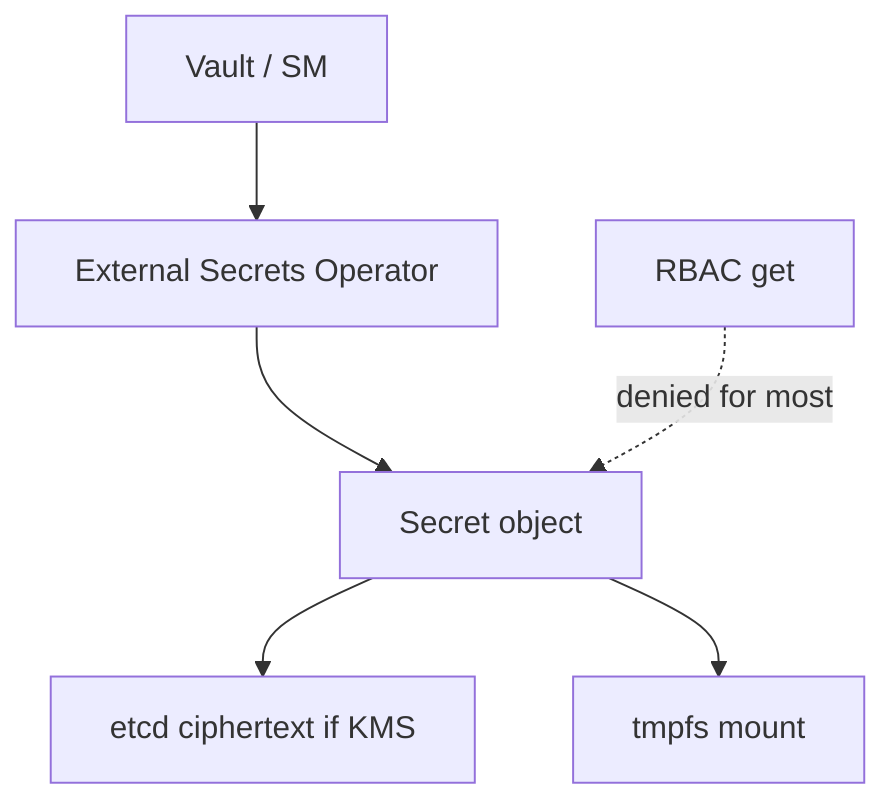

import { ConceptTemplate } from '@/features/kb/components/templates/ConceptTemplate'
import { Callout } from '@/features/kb/components/mdx/Callout'
import { ComparisonTable } from '@/features/kb/components/mdx/ComparisonTable'

export default function Layout({ children }) {
  return (
    <ConceptTemplate title="Kubernetes Secrets">
      {children}
    </ConceptTemplate>
  )
}

A **Secret** injects sensitive bytes into pods as env vars or files. The YAML you apply is **base64**, not encryption. Anyone with `get secrets` can decode it. Production security is encryption at rest, tight RBAC, short-lived tokens, and often an external manager that syncs into the cluster.

## 1. Deep Dive and Mechanics

**Types.** `Opaque` (generic keys), `kubernetes.io/tls` (Ingress), `kubernetes.io/dockerconfigjson` (image pull), ServiceAccount tokens (projected, bound, time-limited in modern clusters).

**Projection.** Env vars are easy to leak in `/proc` and crash logs. Volume mounts use tmpfs so the node disk does not keep a copy. Prefer files and a file watcher over env for rotation.

**etcd.** Without `EncryptionConfiguration`, Secret bodies sit readable in etcd and in snapshots. Enable a provider (aescbc, kms). Rotate keys.

**RBAC.** Split `view` so developers can read ConfigMaps but not Secrets. Audit `get secrets` list/watch — list returns the data.

**External.** External Secrets Operator, CSI Secrets Store, Vault Agent: the source of truth is AWS SM / Vault / Azure KV. The in-cluster Secret is a cache. Rotation happens outside.

<Callout icon="warning" title="Base64 is encoding">
`echo YWRtaW4= | base64 -d` is the whole "cryptanalysis." Never commit Secret YAML to Git. Sealed Secrets or SOPS if you must store ciphertext in Git.
</Callout>

## 2. Mathematical / Theoretical Foundation

**Confidentiality layers.** Encoding ≠ encryption ≠ authorization. Security is the product of (RBAC deny, etcd ciphertext, node tmpfs, no log exfil). Break any layer and the bytes are gone.

**Bound tokens.** A projected ServiceAccount token is a JWT with audience and expiry, bound to the pod. Stolen token usefulness shrinks with TTL. Old unlimited SA secrets were a cluster-wide credential dump.

<ComparisonTable
  headers={['Store', 'Encrypted at rest?', 'Rotation']}
  rows={[
    ['Plain Secret', 'Only if you configure KMS', 'Manual / controller'],
    ['External Secrets', 'In the external system', 'Vendor + sync'],
    ['CSI Secrets Store', 'External, optional sync', 'Mount refresh'],
    ['ConfigMap', 'No, and not for secrets', 'N/A'],
  ]}
/>

## 3. Real-World Implementation

```yaml
apiVersion: v1
kind: Secret
metadata:
  name: db
  namespace: shop
type: Opaque
stringData:
  DATABASE_URL: postgres://api:REDACTED@db:5432/shop
---
apiVersion: apps/v1
kind: Deployment
metadata:
  name: api
  namespace: shop
spec:
  replicas: 2
  selector:
    matchLabels:
      app: api
  template:
    metadata:
      labels:
        app: api
    spec:
      containers:
        - name: api
          image: registry.example.com/api:1.4.2
          volumeMounts:
            - name: db
              mountPath: /var/run/secrets/db
              readOnly: true
      volumes:
        - name: db
          secret:
            secretName: db
```

```yaml
# EncryptionConfiguration on the apiserver (control plane)
apiVersion: apiserver.config.k8s.io/v1
kind: EncryptionConfiguration
resources:
  - resources:
      - secrets
    providers:
      - kms:
          name: cloudkms
          endpoint: unix:///var/run/kms.sock
      - identity: {}
```

Use `stringData` in apply pipelines that never persist the file. Prefer generating the Secret in CI from a vault, not from a laptop.

## 4. Visualizations



## 5. Interview Prep

**Q: Are Secrets encrypted by default?**
**A:** No. Base64 in etcd. Encryption at rest is an apiserver flag plus a provider. Many managed clusters now offer this; still verify.

**Q: Env versus volume?**
**A:** Env is visible to the process table and often dumped on crash. Volumes are files on tmpfs and can rotate without a new spec hash if the app re-reads.

**Q: How do you keep Secrets out of Git?**
**A:** CI pulls from a vault and applies. Or SOPS/SealedSecrets ciphertext only. Never raw Secret manifests on main.

## 6. Production Use Cases

- **TLS materials** for Ingress (`type: kubernetes.io/tls`).
- **Registry pull** secrets on the ServiceAccount.
- **Synced cloud credentials** with External Secrets and short TTLs.

<Callout icon="tip" title="Disable automount where unused">
`automountServiceAccountToken: false` on pods that do not call the API. The token is a credential; do not mount it into every frontend.
</Callout>
