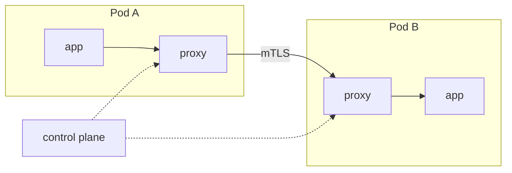

import { ConceptTemplate } from '@/features/kb/components/templates/ConceptTemplate'
import { Callout } from '@/features/kb/components/mdx/Callout'
import { ComparisonTable } from '@/features/kb/components/mdx/ComparisonTable'

export default function Layout({ children }) {
  return (
    <ConceptTemplate title="Service Mesh">
      {children}
    </ConceptTemplate>
  )
}

A **service mesh** moves cross-cutting RPC concerns out of library code and into a **data plane** that sees every hop. In Kubernetes that is usually a sidecar proxy per pod, or an ambient / eBPF path. The app still dials `http://payments`. Timeouts, retries, encryption, and golden metrics happen beside it.

## 1. Deep Dive and Mechanics

**Sidecar.** A mutating webhook injects a proxy. iptables (or eBPF) redirects pod traffic. Inbound and outbound both pass the proxy. Control plane (istiod, linkerd-destination) pushes endpoints and certs via xDS or a custom API.

**Ambient / node proxy.** Some meshes put a shared ztunnel or eBPF program on the node to cut per-pod RAM. L7 policy may still need a waypoint proxy.

**What the mesh owns.** mTLS identity, outlier ejection, traffic splits, HTTP route timeouts, authorization on method/path. What it should not own: your business transactions.

**Cost.** One extra container (or node agent), extra latency, extra failure domain, extra YAML. If you have ten services and one language, a well-used library may be cheaper.

**Not Ingress.** Ingress/Gateway is north-south. Mesh is east-west (and can attach to the edge). You often run both.

<Callout icon="warning" title="A mesh does not fix a bad service graph">
Retries on a write without idempotency multiply load. Timeouts that are longer than the client's timeout hide errors. Mesh defaults can DDoS yourself.
</Callout>

## 2. Mathematical / Theoretical Foundation

**Identity.** SPIFFE IDs bind a certificate to a workload (ServiceAccount). Authorization is a relation on identities, not on ephemeral IPs. Cert TTL bounds the value of theft.

**Reliability composition.** Retries × fan-out amplify tail latency (head-of-line, retry storms). Circuit breakers (outlier detection) are a hysteresis controller on error rate. Tune with budgets, not "retry 10."

<ComparisonTable
  headers={['Approach', 'Where logic lives', 'Consistency']}
  rows={[
    ['App libraries', 'Each language', 'Drifts'],
    ['Service mesh', 'Proxy / eBPF', 'Fleet-wide'],
    ['API gateway only', 'Edge', 'No east-west'],
    ['CNI L7', 'Kernel + optional proxy', 'Overlap with mesh'],
  ]}
/>

## 3. Real-World Implementation

```yaml
# Namespace opt-in (Istio-style injection)
apiVersion: v1
kind: Namespace
metadata:
  name: shop
  labels:
    istio-injection: enabled
```

```yaml
# Linkerd-style inject
apiVersion: v1
kind: Namespace
metadata:
  name: shop
  annotations:
    linkerd.io/inject: enabled
```

Roll out one namespace. Confirm mTLS (peer authentication / `linkerd viz`), then add a single traffic split. Do not enable global retry on day one.

## 4. Visualizations



## 5. Interview Prep

**Q: Why not just mTLS in the app?**
**A:** You can. The mesh makes identity and rotation uniform across languages and stops each team from inventing a different JWT story.

**Q: Sidecar versus library mesh (e.g. some gRPC stacks)?**
**A:** Libraries avoid a hop but require every runtime to implement the same policy. Sidecars work for the binary you cannot recompile.

**Q: When would you skip a mesh?**
**A:** Small fleet, one language, already have a gateway and NetworkPolicies, and no compliance demand for uniform east-west crypto.

## 6. Production Use Cases

- **Regulated encryption** between every microservice.
- **Canary** of v2 by weight at the mesh, not only at Ingress.
- **Uniform RED metrics** and traces without a new SDK per repo.

<Callout icon="tip" title="Measure the proxy budget">
Track sidecar CPU/RAM and p99 added latency before you inject the next 200 Deployments. Capacity planning that ignores the mesh is fiction.
</Callout>
