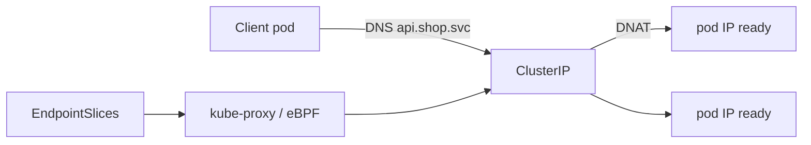

import { ConceptTemplate } from '@/features/kb/components/templates/ConceptTemplate'
import { Callout } from '@/features/kb/components/mdx/Callout'
import { ComparisonTable } from '@/features/kb/components/mdx/ComparisonTable'

export default function Layout({ children }) {
  return (
    <ConceptTemplate title="Kubernetes Services">
      {children}
    </ConceptTemplate>
  )
}

A **Service** is a stable name and (usually) a stable ClusterIP for a set of pods. Pods die and come back with new IPs. Clients call `http://api.shop.svc:8080`. kube-proxy, Cilium, or another datapath maps that VIP to ready endpoints from **EndpointSlices**.

## 1. Deep Dive and Mechanics

**Selector.** The Service lists labels. The endpoint controller writes slices of pod IPs that match and are Ready (and passing readiness gates). No selector means you manage endpoints yourself (ExternalName, or a headless + manual).

**ClusterIP.** Default. Virtual IP inside the cluster. Not reachable from the internet. The right type for east-west.

**NodePort.** Opens a high port on every node. A packet to any node IP on that port DNAT toward an endpoint. Useful behind a DIY load balancer; ugly as a public API.

**LoadBalancer.** Cloud controller allocates an external LB that forwards to NodePorts or to pods (NLB/IP-mode). One LB per Service is expensive; Ingress/Gateway multiplex HTTP instead.

**Headless.** `clusterIP: None`. DNS returns pod IPs (or StatefulSet ordinals). Clients load-balance themselves. Databases and gRPC sometimes want this.

**sessionAffinity.** ClientIP sticks to one endpoint for a timeout. Not a cookie. Not a substitute for a mesh or sticky ingress.

<Callout icon="info" title="Ready endpoints only">
A pod that fails readiness is not in the slice. Traffic stops before kubelet kills anything. That is why rolling updates need a real readiness probe.
</Callout>

## 2. Mathematical / Theoretical Foundation

**Indirection.** Client → VIP → set E of endpoint addresses. E changes; VIP does not. L4 pick from E is approximately uniform (iptables random or IPVS scheduler). It is not least-outstanding-HTTP-requests unless a mesh sits in front.

**DNS.** CoreDNS A/AAAA for ClusterIP, or multiple A records for headless. TTL is short. Clients that cache forever are wrong.

<ComparisonTable
  headers={['Type', 'Stable VIP', 'From outside']}
  rows={[
    ['ClusterIP', 'Yes, internal', 'No'],
    ['NodePort', 'Yes plus node ports', 'If nodes are reachable'],
    ['LoadBalancer', 'Yes plus cloud LB', 'Yes'],
    ['Headless', 'No VIP', 'Via pod IPs / DNS'],
  ]}
/>

## 3. Real-World Implementation

```yaml
apiVersion: v1
kind: Service
metadata:
  name: api
  namespace: shop
spec:
  type: ClusterIP
  selector:
    app: api
  ports:
    - name: http
      port: 8080
      targetPort: 8080
---
apiVersion: v1
kind: Service
metadata:
  name: mongo
  namespace: shop
spec:
  clusterIP: None
  selector:
    app: mongo
  ports:
    - port: 27017
```

```bash
kubectl get endpointslice -n shop -l kubernetes.io/service-name=api
kubectl exec -n shop debug -- wget -qO- http://api.shop.svc:8080/healthz
```

Frontend in another namespace must use `api.shop.svc.cluster.local`, not `api`.

## 4. Visualizations



## 5. Interview Prep

**Q: Service versus Ingress?**
**A:** Service is L4 (TCP/UDP) to pods. Ingress is L7 HTTP routing onto Services. You need a Service even when you have Ingress.

**Q: Why is ClusterIP unreachable from my laptop?**
**A:** It is a cluster-internal VIP. Use port-forward, an Ingress, or a LoadBalancer.

**Q: What is kube-proxy's role?**
**A:** Program the node so VIP packets become pod packets. It does not implement HTTP.

## 6. Production Use Cases

- **Internal APIs** as ClusterIP, one per Deployment.
- **StatefulSet peers** as headless Services for ordinal DNS.
- **Cloud LBs** only for the few non-HTTP protocols you cannot put on a Gateway.

<Callout icon="tip" title="Name ports and use targetPort names">
If the container port number changes, a named `targetPort` keeps the Service YAML stable. HPA and policies also read names more safely.
</Callout>
