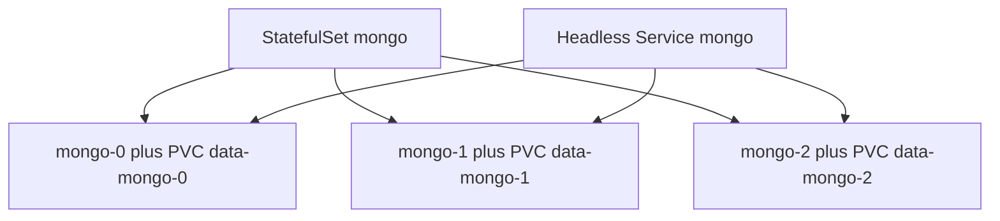

import { ConceptTemplate } from '@/features/kb/components/templates/ConceptTemplate'
import { Callout } from '@/features/kb/components/mdx/Callout'
import { ComparisonTable } from '@/features/kb/components/mdx/ComparisonTable'

export default function Layout({ children }) {
  return (
    <ConceptTemplate title="StatefulSets">
      {children}
    </ConceptTemplate>
  )
}

A **StatefulSet** gives each replica a **stable identity**: `mongo-0`, `mongo-1`, `mongo-2`, each with its own PVC from `volumeClaimTemplates`, and DNS such as `mongo-1.mongo.shop.svc`. If `mongo-1` dies, a new pod is created with the same name and the same disk. A Deployment cannot do that.

## 1. Deep Dive and Mechanics

**Ordinals.** Replicas are 0..N-1. Scale-up creates the next ordinal; scale-down removes the highest first (by default). Ordered ready (`podManagementPolicy: OrderedReady`) waits for each pod to be Ready before the next. `Parallel` starts them together (faster, more dangerous for some DBs).

**Headless Service.** You must create a Service with `clusterIP: None` and pass its name as `serviceName`. That is what publishes ordinal DNS.

**PVCs.** Each ordinal gets `data-<sts>-<ordinal>`. Delete the pod, keep the PVC (default). Delete the StatefulSet with retain policy if you need the disks. Cascading delete can still drop PVCs depending on version and policy — read the docs before you `kubectl delete sts`.

**Updates.** RollingUpdate proceeds in reverse ordinal order (N-1 down to 0) with `partition` for canaries. The process must handle peer replacement; Kubernetes will not run your replica-set reconfig for you unless an Operator does.

**Forced identity.** You cannot have two `mongo-1`s. A stuck terminating pod blocks the replacement. That is the split-brain prevention.

<Callout icon="warning" title="Identity is not a quorum protocol">
A StatefulSet will not elect a Mongo primary. It only guarantees names and disks. Use an Operator or well-tested bootstrap scripts.
</Callout>

## 2. Mathematical / Theoretical Foundation

**Stable bijection.** Ordinal i maps to name and to PVC i for the life of the set. Reschedule is the same i, new node (subject to RWO attach). That is enough for software that keys replica IDs in a config file.

**Ordered rollout.** Reverse-ordinal update is a linear sweep. `partition=k` freezes ordinals less than k so you can soak higher replicas. It is a barrier protocol, not a consensus protocol.

<ComparisonTable
  headers={['Controller', 'Name', 'Disk']}
  rows={[
    ['Deployment', 'Random hash', 'Shared PVC is usually wrong'],
    ['StatefulSet', 'Ordinal', 'One PVC per ordinal'],
    ['Operator + STS', 'Ordinal plus failover logic', 'Managed'],
  ]}
/>

## 3. Real-World Implementation

```yaml
apiVersion: v1
kind: Service
metadata:
  name: mongo
  namespace: shop
spec:
  clusterIP: None
  selector:
    app: mongo
  ports:
    - port: 27017
---
apiVersion: apps/v1
kind: StatefulSet
metadata:
  name: mongo
  namespace: shop
spec:
  serviceName: mongo
  replicas: 3
  podManagementPolicy: OrderedReady
  updateStrategy:
    type: RollingUpdate
    rollingUpdate:
      partition: 0
  selector:
    matchLabels:
      app: mongo
  template:
    metadata:
      labels:
        app: mongo
    spec:
      containers:
        - name: mongo
          image: mongo:7.0
          ports:
            - containerPort: 27017
          volumeMounts:
            - name: data
              mountPath: /data/db
          readinessProbe:
            tcpSocket:
              port: 27017
  volumeClaimTemplates:
    - metadata:
        name: data
      spec:
        accessModes: ["ReadWriteOnce"]
        storageClassName: gp3
        resources:
          requests:
            storage: 50Gi
```

Peers discover `mongo-0.mongo.shop.svc`. Pin the storage class and reclaim policy for production.

## 4. Visualizations



## 5. Interview Prep

**Q: Why not a Deployment for Redis?**
**A:** Cache-only ephemeral Redis might work. Anything with a dataset and replica IDs needs sticky volumes and names. Use a StatefulSet or an Operator that creates one.

**Q: What is partition?**
**A:** Updates apply only to ordinals greater than or equal to partition. Raise partition to pause lower ordinals. Classic canary for stateful sets.

**Q: Pod stuck Terminating blocks the set?**
**A:** Yes for that ordinal. You may need to confirm the volume detached, then force-delete only when you are sure the process is dead — or you split-brain the disk.

## 6. Production Use Cases

- **Replica-set databases** (with an Operator preferred).
- **Kafka / ZooKeeper / etcd-like** software that needs stable members (often still better via Operators).
- **Leader + followers** where config references `app-0` as bootstrap.

<Callout icon="tip" title="Back up the PVCs, not just the YAML">
A perfect StatefulSet manifest and empty disks is not a restore. Snapshot the volume class and test attach on a new claim.
</Callout>
