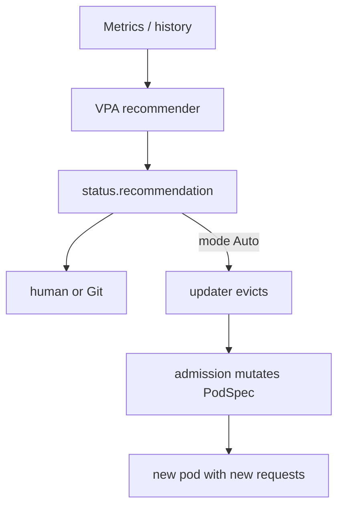

import { ConceptTemplate } from '@/features/kb/components/templates/ConceptTemplate'
import { Callout } from '@/features/kb/components/mdx/Callout'
import { ComparisonTable } from '@/features/kb/components/mdx/ComparisonTable'

export default function Layout({ children }) {
  return (
    <ConceptTemplate title="Vertical Pod Autoscaler">
      {children}
    </ConceptTemplate>
  )
}

The **Vertical Pod Autoscaler (VPA)** watches historical CPU and memory and recommends (or applies) new **requests and limits**. HPA changes how many pods. VPA changes how big each pod is. Linux cannot live-resize most cgroup limits the way you want, so Auto mode **evicts** and an admission webhook writes the new numbers on recreate.

## 1. Deep Dive and Mechanics

**Components.** Recommender (reads Metrics / history), Updater (evicts when recommendation diverges), Admission controller (mutates new pods). Install is not in the Kubernetes core binary; it is an addon.

**Modes.** `Off` — write recommendations to the VPA object only. `Initial` — set resources only at creation. `Auto` / `Recreate` — evict to apply. Use Off or Initial in production until you trust the histogram.

**Histogram.** VPA tracks usage percentiles (typically a high percentile for memory to avoid OOM, a lower target for CPU). Spiky memory needs a higher safety margin than a flat CPU worker.

**With HPA.** Both looping on CPU fights: HPA adds replicas, usage per pod drops, VPA shrinks requests, density rises, HPA adds again. Common pattern: HPA on CPU or QPS, VPA on memory in Off mode, humans apply the recommendation.

**Limits.** VPA can set limits from a policy (max allowed). A recommendation above node allocatable is useless until you change instance size.

<Callout icon="warning" title="Auto VPA is a rolling eviction">
Applying a lower memory request will kill the pod. For a singleton StatefulSet that is an outage. Prefer Off plus a PR, or a controlled rollout.
</Callout>

## 2. Mathematical / Theoretical Foundation

**Right-sizing.** Let u(t) be usage. Request r should satisfy P_p(u) ≤ r ≤ allocatable, with p high for memory (OOM is death) and moderate for CPU (throttle is slow). Waste is Σ (r_i − u_i) across the fleet.

**Discrete apply.** Because limits are applied at container start, VPA is a sampled controller with an eviction actuator, not a continuous PID on a live cgroup.

<ComparisonTable
  headers={['Tool', 'Actuator', 'Risk']}
  rows={[
    ['VPA Off', 'None (status only)', 'Low'],
    ['VPA Auto', 'Evict + mutate', 'Restarts'],
    ['HPA', 'replicas', 'Pending if no nodes'],
    ['Cluster Autoscaler', 'nodes', 'Cost'],
  ]}
/>

## 3. Real-World Implementation

```yaml
apiVersion: autoscaling.k8s.io/v1
kind: VerticalPodAutoscaler
metadata:
  name: api
  namespace: shop
spec:
  targetRef:
    apiVersion: apps/v1
    kind: Deployment
    name: api
  updatePolicy:
    updateMode: "Off"
  resourcePolicy:
    containerPolicies:
      - containerName: api
        minAllowed:
          cpu: "50m"
          memory: 64Mi
        maxAllowed:
          cpu: "2"
          memory: 2Gi
        controlledResources: ["cpu", "memory"]
```

```bash
kubectl describe vpa api -n shop
# Read recommendation. Read your own Prometheus too before you trust Auto.
```

After a week of traffic, copy the recommendation into the Deployment and ship it through Git. That is the boring, safe loop.

## 4. Visualizations



## 5. Interview Prep

**Q: HPA versus VPA?**
**A:** HPA scales out. VPA scales up/down the cgroup. Cluster Autoscaler scales machines. You often want HPA + CA, and VPA in recommendation mode.

**Q: Why can VPA not just change limits in place?**
**A:** Historically, in-place resize was missing or incomplete. In-place resource resize is landing in Kubernetes, and VPA will grow into it; interviews still expect "evict and recreate" for Auto.

**Q: Why did VPA OOM my app?**
**A:** Recommendation used too low a percentile, or the traffic week was quiet. Memory recommendations need headroom for GC heaps and rare spikes.

## 6. Production Use Cases

- **Bin-packing** after a lift-and-shift where every team requested 4Gi "just in case."
- **Memory-only VPA** for Java heaps you keep measuring.
- **Off mode in GitOps**: recommender writes status; a bot opens a PR.

<Callout icon="tip" title="Never VPA Auto a JVM without a heap policy">
If the heap is `-Xmx` 2Gi and VPA drops the cgroup to 512Mi, the kernel OOM killer wins. Coordinate heap flags with the recommendation.
</Callout>
