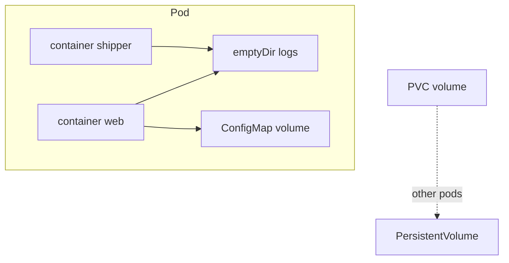

import { ConceptTemplate } from '@/features/kb/components/templates/ConceptTemplate'
import { Callout } from '@/features/kb/components/mdx/Callout'
import { ComparisonTable } from '@/features/kb/components/mdx/ComparisonTable'

export default function Layout({ children }) {
  return (
    <ConceptTemplate title="Kubernetes Volumes">
      {children}
    </ConceptTemplate>
  )
}

A **Volume** is declared on the pod and mounted into one or more containers. The container root filesystem is ephemeral. A volume is how you share files between sidecars, inject config, or attach a PersistentVolumeClaim. "Volume" is the pod-level mount; **PersistentVolume** is the cluster disk object.

## 1. Deep Dive and Mechanics

**emptyDir.** Scratch space that lives with the pod on that node. Survives container restart, dies with the pod (or if the node dies). `medium: Memory` is tmpfs. Use for caches and sidecar log pumps.

**Projected.** ConfigMap, Secret, downward API, and ServiceAccount token can be merged into one directory. Tokens rotate in place.

**CSI / PVC.** `persistentVolumeClaim.claimName` is how durable storage appears as a volume. Block versus filesystem is a CSI detail.

**hostPath.** Mounts a node path. Escape hatch and security hole. Restricted PSA blocks it. Prefer CSI.

**Mount propagation and subPath.** subPath mounts one file from a ConfigMap. A ConfigMap update may not refresh a subPath file until the pod restarts (historical gotcha). Projected volumes behave better for some cases.

<Callout icon="warning" title="emptyDir is not a backup">
Reschedule to another node and the directory is gone. If you needed the bytes, you needed a PVC.
</Callout>

## 2. Mathematical / Theoretical Foundation

**Lifetime inclusion.** L(emptyDir) ⊆ L(pod). L(PVC mount) is L(pod) ∩ Bound(PV). Sidecar sharing works because mounts are pod-scoped: two containers see the same vnode.

**Isolation.** Linux mount namespaces hide the host. hostPath punches a hole. The security story of a volume type is "what inode can this pod name."

<ComparisonTable
  headers={['Type', 'Survives pod delete?', 'Typical use']}
  rows={[
    ['emptyDir', 'No', 'Scratch, sidecar share'],
    ['configMap / secret', 'N/A (injected)', 'Config, creds'],
    ['PVC', 'Yes (the PV)', 'Databases, state'],
    ['hostPath', 'On that node', 'Agents, discouraged'],
  ]}
/>

## 3. Real-World Implementation

```yaml
apiVersion: v1
kind: Pod
metadata:
  name: web-and-shipper
  namespace: shop
spec:
  containers:
    - name: web
      image: registry.example.com/web:1.4.2
      volumeMounts:
        - name: logs
          mountPath: /var/log/web
        - name: cfg
          mountPath: /etc/web
          readOnly: true
    - name: shipper
      image: registry.example.com/shipper:3.1.0
      volumeMounts:
        - name: logs
          mountPath: /input
          readOnly: true
  volumes:
    - name: logs
      emptyDir: {}
    - name: cfg
      configMap:
        name: web
```

The shipper does not need the web image. It only needs the shared directory.

## 4. Visualizations



## 5. Interview Prep

**Q: Volume versus PersistentVolume?**
**A:** Volume is a mount in a pod spec. PersistentVolume is a cluster object. PVC connects them for durable storage.

**Q: Can two containers share a volume?**
**A:** Yes, that is the sidecar pattern. They cannot share a volume with a container in another pod unless the backend is RWX (or they are the same node with hostPath — do not).

**Q: Why did my ConfigMap edit not show up?**
**A:** kubelet eventually syncs ConfigMap volumes, but subPath and some caches lag. Restart, or design the app to watch the file. Secrets/config should be immutable when you need a guaranteed cut.

## 6. Production Use Cases

- **Log directory** between app and shipper.
- **TLS files** from a Secret volume, not env.
- **Scratch tmpfs** for a CPU-heavy worker that must not fill the node disk.

<Callout icon="tip" title="Set sizeLimit on emptyDir">
Unbounded emptyDir can fill nodefs and trigger kubelet eviction of *other* pods. `sizeLimit` makes the blast radius local.
</Callout>
