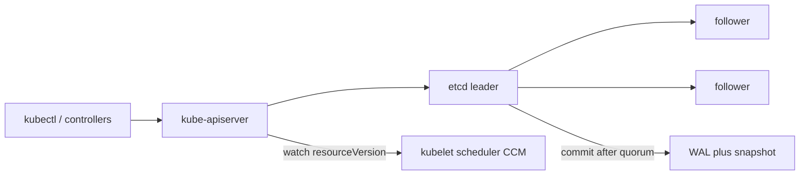

import { ConceptTemplate } from '@/features/kb/components/templates/ConceptTemplate'
import { Callout } from '@/features/kb/components/mdx/Callout'
import { ComparisonTable } from '@/features/kb/components/mdx/ComparisonTable'

export default function Layout({ children }) {
  return (
    <ConceptTemplate title="etcd">
      {children}
    </ConceptTemplate>
  )
}

**etcd** is the strongly consistent key-value store behind the Kubernetes API. Every Pod, Secret, and Lease is a key. The API server is the only process allowed to talk to it. If etcd is gone and you have no snapshot, the cluster definition is gone — running containers keep running, but you cannot schedule, scale, or recover intent.

## 1. Deep Dive and Mechanics

**Raft quorum.** Production etcd is 3 or 5 members. A write is committed only after a majority persists it. 3 members tolerate 1 failure; 5 tolerate 2. Even counts (2, 4) waste a vote without extra fault tolerance.

**MVCC log.** Keys live in a revisioned B+ tree. Each transaction bumps a global revision. Watches are "send me everything after revision N." Controllers and kubelets hang off those watches through the API server, not etcd itself.

**Key layout.** Kubernetes stores objects under prefixes such as `/registry/pods/shop/api-7f3`. Compaction drops old revisions so the history does not grow forever. Too-aggressive compaction breaks long watches; too-loose compaction fills disk.

**Only the apiserver.** kubelet, scheduler, and controllers never open an etcd client. That single door is how authn, RBAC, and admission stay in the path.

**Backups.** `etcdctl snapshot save` is the recovery story. Encrypt at rest on the API server so Secret bytes on disk are not plaintext. Take snapshots off-box; a dead quorum with only local disks is not a backup.

<Callout icon="warning" title="Latency is cluster latency">
etcd fsyncs every commit. Slow disks or a WAN-stretched majority make every kubectl apply and every controller reconcile wait. Put etcd on dedicated SSDs, same region, low RTT.
</Callout>

## 2. Mathematical / Theoretical Foundation

**Linearizability.** Raft elects a leader. Clients that talk to the leader see a total order of committed writes. A minority partition cannot accept writes. Reads can be linearizable (through the leader) or serializable (stale but faster).

**Quorum math.** For N = 2f + 1 members, you need f + 1 acknowledgements. Losing quorum freezes writes. The API goes read-only or down; the data plane may still serve traffic from last-known pods.

**Watch cursors.** `resourceVersion` is the etcd revision projected through the API. Lost-update is compare-and-swap on that version. Controllers that PUT without a version overwrite.

<ComparisonTable
  headers={['Store', 'Consistency', 'K8s role']}
  rows={[
    ['etcd', 'Linearizable Raft', 'Cluster state'],
    ['SQLite (k3s)', 'Local file', 'Single-node / edge'],
    ['Consensus alternatives', 'Various', 'Not the kube-apiserver default'],
  ]}
/>

## 3. Real-World Implementation

```bash
# Health and member list
etcdctl --endpoints=https://127.0.0.1:2379 \
  --cacert=/etc/kubernetes/pki/etcd/ca.crt \
  --cert=/etc/kubernetes/pki/etcd/server.crt \
  --key=/etc/kubernetes/pki/etcd/server.key \
  endpoint health

# Off-cluster snapshot
etcdctl snapshot save /backup/etcd-$(date +%Y%m%d).db

# Restore onto a new member (then rebuild the static pod manifests)
etcdctl snapshot restore /backup/etcd-20260907.db \
  --name etcd-0 \
  --initial-cluster etcd-0=https://10.0.1.10:2380 \
  --initial-advertise-peer-urls https://10.0.1.10:2380
```

On managed Kubernetes you never SSH to these members. You still export etcd snapshots through the vendor API, because "the cloud has backups" is not the same as "you can restore your objects."

## 4. Visualizations



## 5. Interview Prep

**Q: Why odd-sized etcd clusters?**
**A:** Quorum is majority. 3 and 5 maximize failures you can lose for a given node count. 4 members still need 3 votes — you paid for a node that does not raise the failure budget.

**Q: What happens if etcd loses quorum?**
**A:** Writes stop. The API cannot persist new objects. Existing pods keep running until something else fails. Restore from snapshot or bring a member back.

**Q: Why must only the API server talk to etcd?**
**A:** Otherwise RBAC, admission, and audit are bypassable. Direct etcd writes are a cluster-takeover primitive.

## 6. Production Use Cases

- **HA control planes** on kubeadm with 3 etcd members on dedicated nodes.
- **Disaster recovery** drills: snapshot, destroy a lab cluster, restore, confirm Secrets and CRDs return.
- **Managed EKS/GKE/AKS** where you still treat etcd as the blast radius and export backups.

<Callout icon="tip" title="Defrag before the disk fills">
Fragmentation grows after compaction. `etcdctl defrag` on followers first, then the leader, during a quiet window. Monitor `etcd_mvcc_db_total_size_in_bytes` against the quota.
</Callout>
