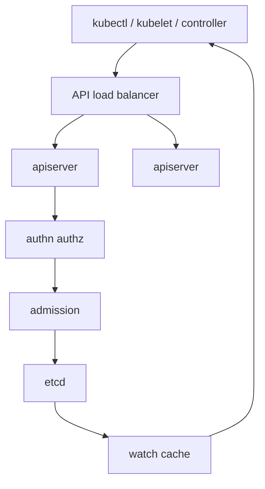

import { ConceptTemplate } from '@/features/kb/components/templates/ConceptTemplate'
import { Callout } from '@/features/kb/components/mdx/Callout'
import { ComparisonTable } from '@/features/kb/components/mdx/ComparisonTable'

export default function Layout({ children }) {
  return (
    <ConceptTemplate title="kube-apiserver">
      {children}
    </ConceptTemplate>
  )
}

**kube-apiserver** is the Kubernetes API. kubectl, kubelet, controllers, and dashboards are HTTP clients. Nothing else is allowed to write cluster state. The process is stateless; durability lives in etcd. Run several servers behind a load balancer for HA.

## 1. Deep Dive and Mechanics

**Request pipeline.** Authentication (certs, tokens, OIDC), then impersonation, then authorization (RBAC), then mutating admission, then object schema validation, then validating admission, then etcd write. A fail at any step is a 4xx/5xx and no persist.

**Watches.** Clients open a long poll with a `resourceVersion`. The apiserver serves from its watch cache (fed by etcd) so every controller is not a raw etcd watcher. Cache lag under load is a real failure mode.

**Aggregated APIs and CRDs.** Built-in types and CRDs are served here. APIService can delegate a group to an extension apiserver (metrics.k8s.io). Discovery (`/apis`) is how kubectl knows the verbs.

**Admission.** Webhooks and built-in plugins (LimitRanger, ResourceQuota, PodSecurity). Mutating webhooks can rewrite pods (sidecars, defaults). They are on the critical path: a down webhook with `failurePolicy: Fail` blocks creates.

**Audit.** Each request can emit an audit event. That is how you answer "who deleted the namespace."

<Callout icon="error" title="A hung admission webhook is an outage">
If the mesh injector or policy engine cannot be reached and failurePolicy is Fail, Deployments freeze. Monitor webhook latency and have a break-glass to remove the config.
</Callout>

## 2. Mathematical / Theoretical Foundation

**Linearizable writes, cached reads.** A successful PUT is in etcd's Raft log. LIST/WATCH from the cache is typically sequential consistency with a revision. Controllers must tolerate "not yet visible" after their own write (read-after-write via resourceVersion).

**Horizontal scale.** N apiservers share one etcd. Throughput is bounded by etcd and by admission. Adding apiservers helps CPU-bound auth and watch fan-out, not a saturated Raft disk.

<ComparisonTable
  headers={['Hop', 'Question it answers', 'Failure']}
  rows={[
    ['Authn', 'Who is this?', '401'],
    ['RBAC', 'May they do this verb on this resource?', '403'],
    ['Admission', 'Does policy allow this object?', '403 / 400'],
    ['etcd', 'Can we persist?', '5xx / timeout'],
  ]}
/>

## 3. Real-World Implementation

```yaml
# Typical kubeadm flag shape (static pod manifest excerpt)
apiVersion: v1
kind: Pod
metadata:
  name: kube-apiserver
  namespace: kube-system
spec:
  containers:
    - name: kube-apiserver
      image: registry.k8s.io/kube-apiserver:v1.31.0
      command:
        - kube-apiserver
        - --etcd-servers=https://127.0.0.1:2379
        - --authorization-mode=Node,RBAC
        - --enable-admission-plugins=NodeRestriction,NamespaceLifecycle
        - --audit-log-path=/var/log/kubernetes/audit.log
        - --encryption-provider-config=/etc/kubernetes/enc.yaml
```

```bash
# Who am I, and what can I do?
kubectl auth can-i create deployments --namespace shop
kubectl get --raw /readyz?verbose
```

On EKS/GKE you do not edit this pod. You still care about webhook health, API QPS from controllers, and encryption-at-rest for Secrets.

## 4. Visualizations



## 5. Interview Prep

**Q: Is the apiserver a single point of failure?**
**A:** The process is not, if you run 2+ behind a VIP. etcd quorum is. Losing all apiservers blocks management; pods keep running.

**Q: Why can I list pods but not Secrets?**
**A:** RBAC is per resource. `get pods` is not `get secrets`. That split is intentional.

**Q: What is the watch cache?**
**A:** An in-memory projection of etcd so LIST/WATCH do not hammer Raft. If it is stale or overflowed, controllers misbehave; that is why apiserver memory and etcd health are paged together.

## 6. Production Use Cases

- **OIDC to the API** (Kubelogin, cloud IAM) instead of long-lived client certs for humans.
- **EncryptionConfiguration** so etcd snapshots are not a Secret dump.
- **Audit to SIEM** for compliance on namespace deletes and RBAC binds.

<Callout icon="tip" title="Protect the anonymous and bootstrap surfaces">
Lock down anonymous auth, rotate the bootstrap token, and never expose the API to the internet without a private link or a hardened auth proxy.
</Callout>
