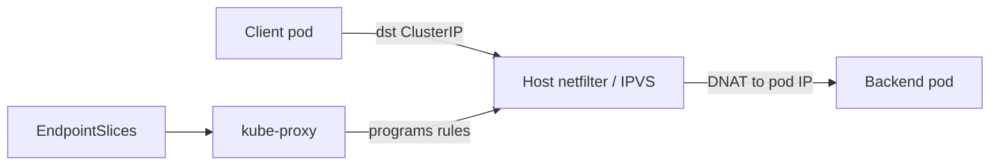

import { ConceptTemplate } from '@/features/kb/components/templates/ConceptTemplate'
import { Callout } from '@/features/kb/components/mdx/Callout'
import { ComparisonTable } from '@/features/kb/components/mdx/ComparisonTable'

export default function Layout({ children }) {
  return (
    <ConceptTemplate title="kube-proxy">
      {children}
    </ConceptTemplate>
  )
}

**kube-proxy** runs on every node (usually a DaemonSet). It does not proxy HTTP in userspace in the default modes. It watches Services and EndpointSlices and installs **DNAT / load-balance rules** so a packet to a ClusterIP:port lands on a healthy pod IP. Without it (or a replacement like Cilium), ClusterIP is a black hole.

## 1. Deep Dive and Mechanics

**iptables mode.** kube-proxy writes chains (`KUBE-SERVICES`, `KUBE-SEP-*`). Each Service is a list of probabilistic jumps to endpoints. Updates rewrite the table. Large clusters spend CPU walking long chains on every packet.

**IPVS mode.** Uses the kernel IP Virtual Server: a hash table of virtual services. Lookup is closer to O(1). Needs the `ip_vs` modules. Still uses iptables for some packet marks and masquerade.

**nftables mode.** Newer datapath on nftables, aiming to replace iptables mode without IPVS operational quirks.

**Userspace mode.** Historic. A real userspace proxy. Slow. Do not use.

**ExternalTrafficPolicy.** `Cluster` SNATs and may hop a second node. `Local` preserves client IP and only uses local endpoints (needed for some ingress and for true source IP). Combined with a load balancer, `Local` can drop traffic on nodes that have no pod.

**Replacement.** Cilium, kube-router, and some service meshes implement Services without kube-proxy. You then disable or do not install kube-proxy to avoid double NAT.

<Callout icon="info" title="It is a programmer of the kernel, not a sidecar">
Traffic never has to enter the kube-proxy process in iptables/IPVS mode. A crash of the process stops rule updates; existing rules keep forwarding until they go stale.
</Callout>

## 2. Mathematical / Theoretical Foundation

**iptables cost.** Evaluating a chain is O(R) in the number of rules in the worst case. R grows with Services × ports × endpoints. Endpoint churn causes full resyncs. That is the scale cliff.

**Load-balance.** iptables uses `--statistic` random; IPVS has rr, lc, dh, sh, sed. Neither is HTTP-aware. Session affinity (`sessionAffinity: ClientIP`) is a timeout-keyed map, not a cookie.

<ComparisonTable
  headers={['Datapath', 'Lookup', 'When to use']}
  rows={[
    ['iptables', 'Linear chains', 'Small/medium clusters'],
    ['IPVS', 'Hashed', 'Many Services'],
    ['nftables', 'nft sets', 'Newer kube-proxy default path'],
    ['eBPF CNI', 'Maps in kernel', 'Cilium kube-proxy-free'],
  ]}
/>

## 3. Real-World Implementation

```yaml
# ConfigMap kube-system/kube-proxy excerpt
apiVersion: v1
kind: ConfigMap
metadata:
  name: kube-proxy
  namespace: kube-system
data:
  config.conf: |
    apiVersion: kubeproxy.config.k8s.io/v1alpha1
    kind: KubeProxyConfiguration
    mode: ipvs
    ipvs:
      scheduler: rr
    clusterCIDR: 10.244.0.0/16
```

```bash
# See what the node thinks a Service maps to
iptables-save | grep KUBE-SVC
ipvsadm -Ln
kubectl get endpointslice -n shop -l kubernetes.io/service-name=api
```

If you enable Cilium kube-proxy replacement, uninstall kube-proxy first in a maintenance window and test ClusterIP, NodePort, and LoadBalancer.

## 4. Visualizations



## 5. Interview Prep

**Q: Does kube-proxy handle Ingress?**
**A:** No. Ingress is L7 in a controller pod. kube-proxy only implements Service IPs and NodePorts.

**Q: Why did `ExternalTrafficPolicy: Local` break my LoadBalancer?**
**A:** The cloud LB still hashed to nodes without local endpoints. Those nodes dropped the packet. Use a LB that honors `healthCheckNodePort` or keep `Cluster`.

**Q: ClusterIP not reachable from a node?**
**A:** Hairpin and kube-proxy mode bugs exist. From a pod it should work. HostNetwork pods and the node itself are the usual edge cases.

## 6. Production Use Cases

- **Default Service connectivity** on kubeadm and most managed node images.
- **IPVS** when Service count makes iptables CPU visible in `softirq`.
- **Disable + Cilium** when you want eBPF Services and one datapath.

<Callout icon="tip" title="Debug with EndpointSlices, not folklore">
If ClusterIP fails, check ready endpoints first. kube-proxy cannot forward to an empty slice. Readiness gates and terminating pods explain most "the Service is down" tickets.
</Callout>
