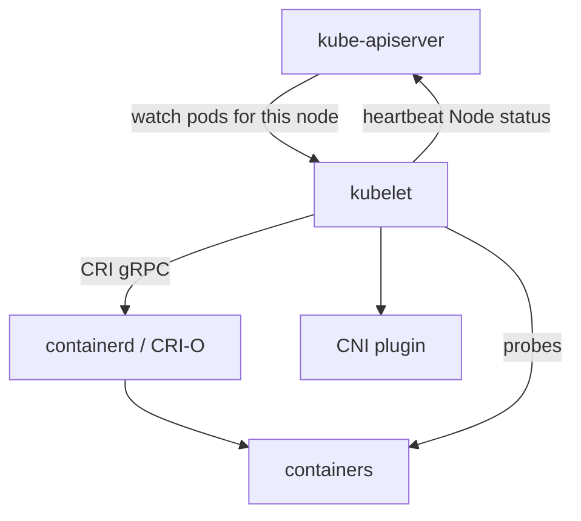

import { ConceptTemplate } from '@/features/kb/components/templates/ConceptTemplate'
import { Callout } from '@/features/kb/components/mdx/Callout'
import { ComparisonTable } from '@/features/kb/components/mdx/ComparisonTable'

export default function Layout({ children }) {
  return (
    <ConceptTemplate title="kubelet">
      {children}
    </ConceptTemplate>
  )
}

The **kubelet** is a systemd (or equivalent) daemon on every node. It is not scheduled as a pod in the usual sense. It registers the Node, watches Pods assigned to that node, and drives the **container runtime** through the CRI. Probes, volume mounts, and most "the container is unhealthy" decisions happen here.

## 1. Deep Dive and Mechanics

**Registration.** On start, kubelet creates or updates a Node object: allocatable CPU/memory, labels, taints, and conditions (Ready, MemoryPressure, DiskPressure, PIDPressure, NetworkUnavailable). The control plane schedules only onto Ready nodes with enough allocatable.

**Sync loop.** For each Pod bound to this node, kubelet makes actual match spec: pull images, create a pod sandbox, start containers in order (init then app), attach volumes, apply cgroup limits. Static pods from a manifest directory (control-plane components on kubeadm) are visible as a mirror object in the API.

**CRI.** gRPC to containerd or CRI-O: `RunPodSandbox`, `CreateContainer`, `StartContainer`. kubelet does not speak Docker Engine API on modern clusters.

**Probes.** Liveness, readiness, and startup probes are executed by kubelet (HTTP, TCP, gRPC, or exec). Liveness failure restarts the container. Readiness failure removes the pod from Endpoints. Startup delays the other two so a slow JVM is not killed.

**Eviction.** When disk or memory pressure crosses a threshold, kubelet evicts pods by priority and usage. This is local and faster than waiting for the API. The ReplicaSet then creates a replacement, often on another node.

<Callout icon="warning" title="A dead kubelet is a silent node">
If kubelet stops heartbeating, the NodeController marks the node NotReady and eventually evicts. The containers may still run. That split-brain is why `node-monitor-grace-period` and pod eviction timeouts exist.
</Callout>

## 2. Mathematical / Theoretical Foundation

**Allocatable.** `Allocatable = Capacity - kube-reserved - system-reserved - eviction-threshold`. The scheduler only sees Allocatable. If you skip reservations, a bursty node-critical daemon OOMs the kubelet.

**Probe as a sampled oracle.** Failure threshold N over period P is a discrete filter against flaky checks. Too tight and you flap; too loose and you serve errors.

<ComparisonTable
  headers={['Agent', 'Where it runs', 'Touches containers?']}
  rows={[
    ['kubelet', 'Every node', 'Yes, via CRI'],
    ['kube-proxy', 'Every node', 'No, programs NAT'],
    ['apiserver', 'Control plane', 'No'],
    ['CNI plugin', 'On pod add', 'Network namespace'],
  ]}
/>

## 3. Real-World Implementation

```yaml
# KubeletConfiguration excerpt
apiVersion: kubelet.config.k8s.io/v1beta1
kind: KubeletConfiguration
cgroupDriver: systemd
maxPods: 110
evictionHard:
  memory.available: "200Mi"
  nodefs.available: "10%"
kubeReserved:
  cpu: "200m"
  memory: 1Gi
systemReserved:
  cpu: "100m"
  memory: 512Mi
```

```bash
# Is this node actually running what the API thinks?
kubectl describe node ip-10-0-4-20
kubectl get --raw /api/v1/nodes/ip-10-0-4-20/proxy/stats/summary
```

Managed node groups hide the unit file. You still set maxPods (ENI limits on AWS), reserved resources, and the CRI socket.

## 4. Visualizations



## 5. Interview Prep

**Q: Who starts the pause/sandbox container?**
**A:** kubelet asks the runtime to run a pod sandbox. That sandbox holds the network namespace. App containers join it.

**Q: Why is the node Ready but pods stay Pending?**
**A:** Usually scheduler constraints (taints, affinity, PVC zone), not kubelet. If the pod is Bound and not starting, then kubelet/CRI/image pull is the suspect (`kubectl describe pod`).

**Q: Static pods versus DaemonSets?**
**A:** Static pods are local files; the API does not create them. DaemonSets are API objects. Control-plane self-hosting often uses static pods so the API can come up.

## 6. Production Use Cases

- **Worker pools** with different `maxPods` and instance types.
- **GPU nodes** where kubelet advertises `nvidia.com/gpu` via a device plugin.
- **Edge / k3s** where a slim kubelet still is the CRI boss.

<Callout icon="tip" title="Read kubelet logs first">
Image pull backoff, mount errors, and probe kills are in kubelet's journal, not only in `kubectl describe`. Correlate the two.
</Callout>
