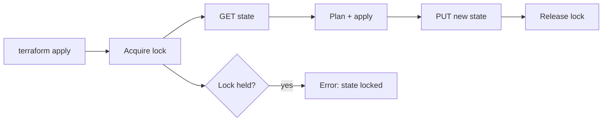

import { ConceptTemplate } from '@/features/kb/components/templates/ConceptTemplate'
import { Callout } from '@/features/kb/components/mdx/Callout'
import { ComparisonTable } from '@/features/kb/components/mdx/ComparisonTable'

export default function Layout({ children }) {
  return (
    <ConceptTemplate title="Backends">
      {children}
    </ConceptTemplate>
  )
}

A **backend** tells Terraform where the state snapshot lives and whether two applies can run at once. The default is `local`: a file named `terraform.tfstate` in the working directory. Production uses a remote backend so every engineer and every pipeline sees the same mapping from addresses to cloud IDs.

## 1. Deep Dive and Mechanics

**Init is when it binds.** Changing a backend block requires `terraform init -migrate-state` (or `-reconfigure`). The CLI copies state from the old store to the new one. Doing this by hand with `aws s3 cp` skips lock metadata and is how teams lose the source of truth.

**Partial config.** Backend blocks often omit secrets. Pipelines pass `-backend-config=bucket=...` or a `.hcl` file that is not committed. The committed file still documents the shape.

**Locking.** S3 originally locked via a DynamoDB table. Newer AWS backend settings can lock natively on S3. GCS uses object generations and a lock object. Azure Blob uses leases. A backend without a real lock is a race.

**Remote operations.** The `remote` / `cloud` backends do more than store JSON: they can execute the plan on someone else’s agent. That is a different product surface than “S3 plus DynamoDB.”

<Callout icon="error" title="Local state on a shared repo is an outage generator">
Two checkouts, two applies, two realities. The Git copy of `terraform.tfstate` will not save you — it is stale the moment anyone applies. Use a remote backend before the second human joins.
</Callout>

## 2. Mathematical / Theoretical Foundation

State is a **single-writer register**. Locking is mutual exclusion around read-modify-write of that register. Without it, two planners compute deltas from the same snapshot and the second write drops the first apply’s IDs.

Backend choice is also a **consistency and durability** choice: S3 + versioning + encryption vs a laptop SSD. Versioning is the undo button when a bad apply writes empty state.

<ComparisonTable
  headers={['Backend', 'Locking', 'Remote apply', 'Typical use']}
  rows={[
    ['local', 'None', 'No', 'Solo experiments'],
    ['s3', 'DynamoDB or S3 native', 'No', 'AWS-centric CI'],
    ['gcs', 'Object lock', 'No', 'GCP-centric CI'],
    ['azurerm', 'Blob lease', 'No', 'Azure-centric CI'],
    ['cloud / remote', 'Service-side', 'Yes', 'HCP Terraform'],
  ]}
/>

## 3. Real-World Implementation

```hcl
terraform {
  backend "s3" {
    bucket         = "acme-tfstate-prod"
    key            = "platform/network/terraform.tfstate"
    region         = "us-east-1"
    dynamodb_table = "acme-tf-locks"
    encrypt        = true
    kms_key_id     = "arn:aws:kms:us-east-1:123456789012:key/abcd-ef"
  }
}
```

```bash
terraform init
# After adding the backend block to a local-state project:
terraform init -migrate-state
```

Enable S3 versioning and Block Public Access on the bucket before the first migrate. The DynamoDB table needs a partition key named `LockID` (string).

## 4. Visualizations



## 5. Interview Prep

**Q: What does `-reconfigure` do that `-migrate-state` does not?**
**A:** Reconfigure points the working directory at a backend without copying state. Use it when the state is already in the destination. Migrate copies. Mixing them up can attach you to an empty key.

**Q: Why is the lock table not optional on S3?**
**A:** Two pipelines on the same key will interleave writes. The lock is the mutex. If you skip it, you are betting on calendar coordination.

**Q: Can modules have their own backend?**
**A:** No. Only the root module configures a backend. Child modules inherit that state file as part of the same snapshot.

## 6. Production Use Cases

- **One S3 bucket, many keys** — prefix per team (`app/foo/prod/...`) with IAM prefixes so teams cannot read each other’s state.
- **Bootstrap chicken-egg:** a tiny local or CloudFormation stack that creates the state bucket, then everything else uses that backend.
- **Break-glass:** versioning plus Object Lock on the state bucket so ransomware or a bad `rm` is recoverable.

<Callout icon="tip" title="Never commit backend secrets">
Access keys do not belong in the `backend` block. Use OIDC from GitHub Actions or instance roles. The committed block should be bucket, key, region, and lock table names only.
</Callout>
