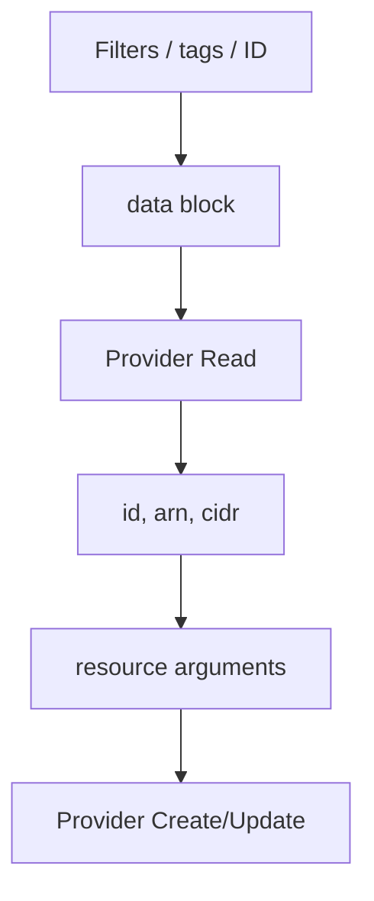

import { ConceptTemplate } from '@/features/kb/components/templates/ConceptTemplate'
import { Callout } from '@/features/kb/components/mdx/Callout'
import { ComparisonTable } from '@/features/kb/components/mdx/ComparisonTable'

export default function Layout({ children }) {
  return (
    <ConceptTemplate title="Data Sources">
      {children}
    </ConceptTemplate>
  )
}

A **data source** (`data "aws_ami" "al2023"`) asks a provider to **read** something Terraform does not manage in this state. Typical uses: latest AMI by filter, a VPC the network team created, an AWS Secrets Manager value, or `terraform_remote_state`. The result is available as `data.aws_ami.al2023.id`. Terraform will not delete that AMI when you destroy this stack.

## 1. Deep Dive and Mechanics

**Read at plan time.** Most data sources refresh during plan. If the lookup fails (no AMI match), plan fails. That is good: you do not apply a blank `ami = ""`.

**Filters are the API.** `most_recent`, `owners`, and `filter` blocks are provider-specific. Vague filters plus `most_recent = true` can flip to a new AMI every week and ForceNew every instance. Pin a name regex or an explicit AMI ID for prod.

**Dependencies.** A data source can reference a resource in the same module (`data.aws_subnet.this` looking up a subnet you just created). Terraform then reads after create — the first plan may show “known after apply.” Prefer passing the resource attribute directly if you own it; do not data-source your own resource without a reason.

**Not a substitute for import.** If you want Terraform to start managing an existing bucket, `import` it as a resource. A data source will never update that bucket’s encryption.

<Callout icon="warning" title="Secrets in data sources still hit state">
`data.aws_secretsmanager_secret_version` writes the secret string into state. Same rules as resource secrets: encrypt the backend and minimize who can GetObject.
</Callout>

## 2. Mathematical / Theoretical Foundation

A data source is a **query** Q(filters) → attributes, evaluated against the live API. It is not part of the desired graph’s write set. The planner treats the result as an input to resource vertices.

Non-determinism (`most_recent`) makes Q time-varying. Time-varying inputs to ForceNew attributes yield periodic replaces. Deterministic queries (ID or immutable tag) keep the graph stable.

<ComparisonTable
  headers={['Need', 'data source', 'resource']}
  rows={[
    ['Look up existing VPC', 'Yes', 'No'],
    ['Create and own a VPC', 'No', 'Yes'],
    ['Start managing a console VPC', 'No — import', 'Yes after import'],
    ['Read another state’s outputs', 'terraform_remote_state', 'No'],
  ]}
/>

## 3. Real-World Implementation

```hcl
data "aws_ami" "al2023" {
  most_recent = true
  owners      = ["amazon"]

  filter {
    name   = "name"
    values = ["al2023-ami-*-x86_64"]
  }

  filter {
    name   = "state"
    values = ["available"]
  }
}

data "aws_vpc" "platform" {
  tags = {
    Environment = "prod"
    Role        = "platform"
  }
}

resource "aws_instance" "web" {
  ami           = data.aws_ami.al2023.id
  instance_type = "t3.micro"
  subnet_id     = var.subnet_id
}
```

The VPC lookup fails closed if two VPCs share those tags — tighten tags or look up by ID.

## 4. Visualizations



## 5. Interview Prep

**Q: data vs terraform_remote_state?**
**A:** Remote state reads another Terraform snapshot’s outputs. A normal data source queries the cloud (or an API) by tags or ID. Use tags when you do not want to grant read on someone else’s state file.

**Q: Why did plan want to replace all instances this Monday?**
**A:** `most_recent` AMI moved. Pin the AMI ID in prod tfvars, or use a golden-AMI pipeline that writes a stable SSM parameter you data-source by name.

**Q: Can a data source create an object if missing?**
**A:** No. Some older patterns faked this with provisioners. The honest model is resource + import, or a separate module that owns the object.

## 6. Production Use Cases

- **AMI factories:** prod reads a pinned parameter; nonprod may use `most_recent` on a tested name prefix.
- **Shared VPCs:** app stacks look up `Role = platform` instead of hard-coding `vpc-0abc`.
- **Account aliases and caller identity** (`aws_caller_identity`) for bucket names that include account ID.

<Callout icon="tip" title="Fail on ambiguous lookups">
If the provider supports `limit` or errors on multiple matches, keep that. Silent `most_recent` across two matching images is how the wrong kernel ships.
</Callout>
