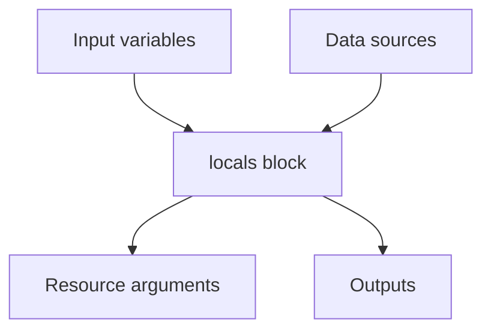

import { ConceptTemplate } from '@/features/kb/components/templates/ConceptTemplate'
import { Callout } from '@/features/kb/components/mdx/Callout'
import { ComparisonTable } from '@/features/kb/components/mdx/ComparisonTable'

export default function Layout({ children }) {
  return (
    <ConceptTemplate title="Locals">
      {children}
    </ConceptTemplate>
  )
}

**Locals** are named expressions scoped to one module. They are not inputs and not outputs. You use them to DRY a tag map, build a name prefix, or run `cidrsubnet` once so twelve subnets do not each re-derive the same arithmetic. Callers cannot set `local.foo`; they set variables, and you compute locals from those.

## 1. Deep Dive and Mechanics

**Syntax.** One or more `locals` blocks, merged by name. `local.common_tags` is the reference. Circular locals (`a` depends on `b` depends on `a`) are a config error.

**What belongs here.** Any expression you were about to copy-paste: a merged tag map, a filtered map of subnets, a boolean `is_prod`. Keep locals boring so a reader can jump to `local.name` and understand it.

**What does not.** Secrets from humans (that is a variable or a data source). Values other modules must set (variable). Values other modules must read (output).

**count / for_each helpers.** A local map of AZ → CIDR is the usual input to `for_each` on `aws_subnet`. Computing that map in-line on the resource is how modules become unreadable.

<Callout icon="tip" title="Locals are free documentation">
A well-named local (`private_subnet_cidrs`) is cheaper than a comment. If the expression needs a paragraph, it is doing too much — split locals or move to a small module.
</Callout>

## 2. Mathematical / Theoretical Foundation

Locals are **let-bindings** in a pure expression language. They are expanded into the graph before apply; there is no local in state. Changing a local that feeds a ForceNew attribute still replaces resources — the local is not a cache.

`cidrsubnet(prefix, newbits, netnum)` is integer math on IPv4/IPv6 prefixes. Off-by-one `netnum` collisions are the usual bug; compute the map in one local and unit-test it with `terraform console` or a `precondition`.

<ComparisonTable
  headers={['Kind', 'Who sets it', 'In state?']}
  rows={[
    ['variable', 'Caller / CLI', 'Values end up on resources'],
    ['local', 'This module', 'No — expanded away'],
    ['output', 'This module', 'Root outputs stored'],
  ]}
/>

## 3. Real-World Implementation

```hcl
variable "environment" { type = string }
variable "project" { type = string }
variable "vpc_cidr" { type = string }
variable "extra_tags" {
  type    = map(string)
  default = {}
}

locals {
  name = "${var.project}-${var.environment}"
  common_tags = merge(var.extra_tags, {
    Project     = var.project
    Environment = var.environment
    ManagedBy   = "terraform"
  })
  private_cidrs = {
    a = cidrsubnet(var.vpc_cidr, 4, 0)
    b = cidrsubnet(var.vpc_cidr, 4, 1)
  }
}

resource "aws_vpc" "app" {
  cidr_block = var.vpc_cidr
  tags       = merge(local.common_tags, { Name = local.name })
}
```

One change to `local.common_tags` updates every resource that merges it.

## 4. Visualizations



## 5. Interview Prep

**Q: Variable with a default vs local?**
**A:** If the caller might override it, use a variable. If it is derived and must stay consistent, use a local. A variable default that nobody should change is often a local in disguise.

**Q: Can I mark a local sensitive?**
**A:** Locals inherit sensitivity from the expressions they use. There is no `sensitive` argument on `locals`. Output the local with `sensitive = true` if you export it.

**Q: Why not compute tags in a shared module instead?**
**A:** You can — a tiny `tagging` module or a private package. Locals win when the logic is ten lines and not reused yet. Promote when a third root copies it.

## 6. Production Use Cases

- **Naming:** `local.name` on every `Name` tag and resource name_prefix.
- **Network math:** one map of subnet CIDRs consumed by `for_each`.
- **Feature flags:** `local.enable_nat = var.environment != "dev"` driving `count` on a NAT gateway.

<Callout icon="warning" title="Do not hide provider side effects in locals">
Locals cannot call APIs. If you need the latest AMI, that is a data source assigned to a local, not a local that “knows” an AMI ID you pasted last quarter.
</Callout>
