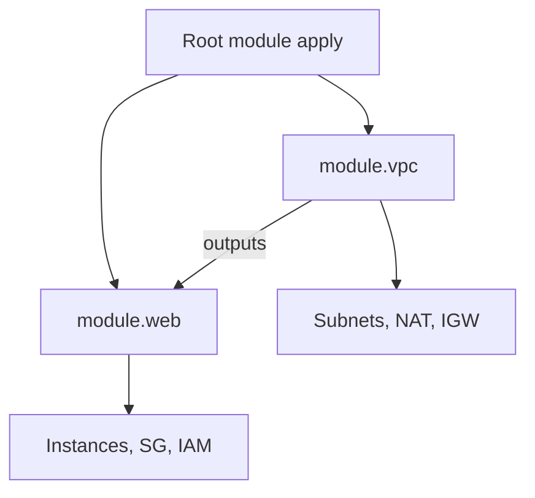

import { ConceptTemplate } from '@/features/kb/components/templates/ConceptTemplate'
import { Callout } from '@/features/kb/components/mdx/Callout'
import { ComparisonTable } from '@/features/kb/components/mdx/ComparisonTable'

export default function Layout({ children }) {
  return (
    <ConceptTemplate title="Modules">
      {children}
    </ConceptTemplate>
  )
}

A **module** is a directory of `.tf` files. The root module is wherever you run apply. A **child module** is called with a `module` block, a `source`, and arguments that map to that directory’s `variable` blocks. Modules are how you stop copying a 200-line VPC into every app repo.

## 1. Deep Dive and Mechanics

**Source types.** Local path (`../modules/vpc`), Git (`git::https://...//modules/vpc?ref=v1.2.0`), Terraform / OpenTofu registry (`terraform-aws-modules/vpc/aws`). Always pin `ref` or a registry version. Floating `main` is not a version.

**Encapsulation.** Callers see variables and outputs only. They do not reach `module.vpc.aws_route_table.this` unless you output it. That is the point.

**Composition.** A root can call `network`, `database`, and `app`. Those children can call smaller modules. Address prefixes nest: `module.app.module.queue.aws_sqs_queue.this`. Deep nesting makes `moved` blocks painful — two or three levels is plenty.

**init.** Modules are downloaded into `.terraform/modules`. Changing `source` or version requires re-init. The lock file does not pin module versions the way it pins providers — your `version` / `ref` argument is the pin.

<Callout icon="warning" title="A module is not a blast-radius boundary">
Child modules share the root’s state and lock. Splitting a module does not split state. If you need separate apply cadence, that is a second root and a remote-state or SSM edge.
</Callout>

## 2. Mathematical / Theoretical Foundation

A module call is **function application**: arguments → child graph → outputs. The child graph is spliced into the root DAG with a namespace prefix. `count` / `for_each` on a module call stamps the function N times with stable keys (`module.web["a"]`).

Version pins are **reproducibility**. Without them the same Git SHA of the root can build two different child graphs a week apart.

<ComparisonTable
  headers={['Pattern', 'State', 'When to use']}
  rows={[
    ['Child module', 'Same as root', 'Reuse and hide resources'],
    ['Separate root', 'Own backend key', 'Different owners or cadence'],
    ['Copy-paste root', 'N copies to drift', 'Never, except a one-off spike'],
  ]}
/>

## 3. Real-World Implementation

```hcl
# roots/prod/main.tf
module "vpc" {
  source  = "terraform-aws-modules/vpc/aws"
  version = "5.8.1"

  name = "app-prod"
  cidr = "10.40.0.0/16"

  azs             = ["us-east-1a", "us-east-1b"]
  private_subnets = ["10.40.0.0/20", "10.40.16.0/20"]
  public_subnets  = ["10.40.128.0/20", "10.40.144.0/20"]

  enable_nat_gateway = true
  tags               = local.common_tags
}

module "web" {
  source = "git::https://git.example.com/platform/modules.git//aws/web?ref=v2.3.0"

  vpc_id     = module.vpc.vpc_id
  subnet_ids = module.vpc.private_subnets
  extra_tags = local.common_tags
}
```

The git source uses `//aws/web` to pick a subdirectory and `ref=v2.3.0` to pin a tag.

## 4. Visualizations



## 5. Interview Prep

**Q: Module vs workspace?**
**A:** Module is code composition. Workspace (CLI or HCP) is a state namespace. You can call the same module from many workspaces.

**Q: Should every resource be a module?**
**A:** No. A one-resource module that only wraps `aws_sqs_queue` adds indirection. Module when you have a repeated *graph* (VPC, “secure bucket,” “service with logs and alarms”).

**Q: How do you upgrade a module without downtime?**
**A:** Pin, read the changelog, `terraform plan` on a clone of state. Watch for ForceNew inside the child. Use `moved` if the module renamed addresses. Canary one env first.

## 6. Production Use Cases

- **Private registry** of `secure-s3`, `rds-postgres`, and `eks-cluster` owned by the platform team.
- **terraform-aws-modules** upstream for VPC and IAM — pin versions, wrap if you need extra tags or GuardDuty hooks.
- **Service template:** an app team’s root is twenty lines of module calls, not 800 lines of raw resources.

<Callout icon="tip" title="Version like a library">
Semver the module repo. Breaking output types is a major. Add outputs in minors. Root modules bump the pin in a dedicated PR with a plan attached.
</Callout>
