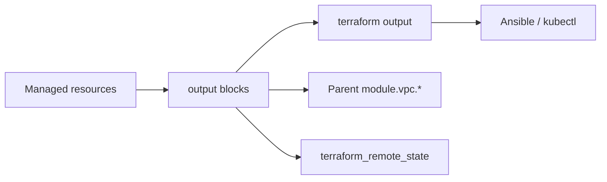

import { ConceptTemplate } from '@/features/kb/components/templates/ConceptTemplate'
import { Callout } from '@/features/kb/components/mdx/Callout'
import { ComparisonTable } from '@/features/kb/components/mdx/ComparisonTable'

export default function Layout({ children }) {
  return (
    <ConceptTemplate title="Outputs">
      {children}
    </ConceptTemplate>
  )
}

An **output** exports a value from a module: a VPC ID, a load-balancer DNS name, a generated password. After apply, `terraform output` prints root outputs. Child-module outputs are visible to the caller as `module.vpc.vpc_id`. Remote-state consumers only see what you output — not every resource attribute.

## 1. Deep Dive and Mechanics

**Root vs module.** Root outputs are the pipeline interface (`terraform output -json` → jq → Ansible inventory). Module outputs are the HCL interface between a child and its caller. If a child does not output it, the parent cannot read it.

**sensitive.** Redacts CLI display. The value still sits in state. Mark passwords sensitive so they do not land in CI logs; still lock down the backend.

**depends_on on outputs.** Rarely needed. Use it when the value is known before a side effect finishes (an IAM policy that must propagate before you hand an ARN to the next stage).

**Preconditions.** An output can fail the apply if a check is false — for example, “this list must have length 2.” That is a contract test at the module boundary.

<Callout icon="info" title="Outputs are a public API">
Renaming `vpc_id` to `vpcId` breaks every caller and every `terraform_remote_state` reader. Add a new output, migrate, then delete the old name.
</Callout>

## 2. Mathematical / Theoretical Foundation

If a module is a function from variables to a graph, outputs are the **projection** of that graph onto a small tuple. Hiding internal resource addresses is encapsulation: callers cannot reach `aws_route_table.this["priv"]` unless you output it.

JSON output is a map from name to an object with value, type, and a sensitive flag. Downstream automation should parse `-json`, not scrape human CLI tables.

<ComparisonTable
  headers={['Need', 'Use']}
  rows={[
    ['Pass ID to another module in the same state', 'Child output → parent → next module in'],
    ['Pass ID to another state', 'Root output + terraform_remote_state or SSM'],
    ['Pass ID to a human', 'terraform output or the apply log'],
    ['Hide a password from logs', 'sensitive = true (still in state)'],
  ]}
/>

## 3. Real-World Implementation

```hcl
output "vpc_id" {
  description = "ID of the application VPC"
  value       = aws_vpc.app.id
}

output "private_subnet_ids" {
  description = "Private subnets keyed by AZ suffix"
  value       = { for k, s in aws_subnet.private : k => s.id }
}

output "db_password" {
  description = "Generated master password"
  value       = random_password.db.result
  sensitive   = true
}
```

```bash
terraform output -raw vpc_id
terraform output -json | jq -r '.private_subnet_ids.value.a'
```

CI can write those values into a GitHub Actions output or an SSM parameter for the next job.

## 4. Visualizations



## 5. Interview Prep

**Q: Can I output an entire resource object?**
**A:** You can, but you leak every attribute and make the contract huge. Output the three IDs callers need.

**Q: Why is my output “known after apply” in the plan?**
**A:** The value depends on a computed attribute (AWS-assigned ID). The plan cannot print it yet. That is normal; the apply log will.

**Q: output vs `terraform_remote_state` of a child resource address?**
**A:** Remote state cannot reach arbitrary addresses — only outputs. Encapsulation is enforced.

## 6. Production Use Cases

- **Network module** returning `vpc_id`, subnet maps, and a baseline SG ID.
- **App pipeline** feeding the ALB DNS into a smoke-test job.
- **Secret handoff** of a `random_password` into Secrets Manager (and only outputting the secret ARN, not the password, when you can).

<Callout icon="tip" title="Prefer ARNs over passwords as outputs">
Write the password to Secrets Manager in the same module. Output `secret_arn`. Callers get IAM-controlled access without copying a secret through two state files.
</Callout>
