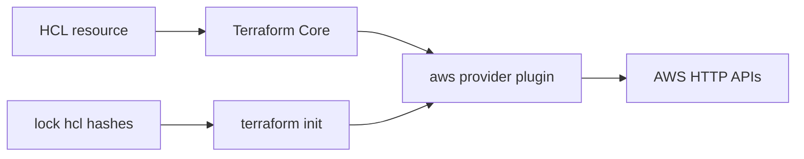

import { ConceptTemplate } from '@/features/kb/components/templates/ConceptTemplate'
import { Callout } from '@/features/kb/components/mdx/Callout'
import { ComparisonTable } from '@/features/kb/components/mdx/ComparisonTable'

export default function Layout({ children }) {
  return (
    <ConceptTemplate title="Terraform Providers">
      {children}
    </ConceptTemplate>
  )
}

The Terraform CLI does not contain AWS logic. A **provider** is a separate plugin (`hashicorp/aws`, `hashicorp/azurerm`, `integrations/github`) downloaded by `terraform init` from a registry. You declare required source and version, then one or more `provider` configuration blocks (region, assume-role, aliases).

## 1. Deep Dive and Mechanics

**required_providers.** The `terraform` block pins `source` (`hashicorp/aws`) and a version constraint. The lock file pins the exact version and hashes for linux/amd64, darwin, etc. Commit the lock file so CI matches laptops.

**Configuration.** `provider "aws"` sets region and auth. Auth usually comes from the environment (env vars, instance role, OIDC). Do not put static keys in the block.

**Aliases.** Configure a second AWS provider with `alias = "dr"` and a different region, then set `provider = aws.dr` on a resource. Same plugin, two clients. Needed for multi-region or two accounts in one root module.

**Protocol.** Terraform Core talks gRPC to the plugin (legacy providers used a different protocol). Schema describes attributes, ForceNew, and timeouts. When HashiCorp or OpenTofu bumps the protocol, old providers stop loading — another reason to pin.

<Callout icon="tip" title="Pin majors in required_providers">
`version = "~> 5.0"` is a floor against 6.x breaking ForceNew. Combined with the lock file you get reproducible plans. Floating `>= 5.0` in CI is how Monday’s pipeline replaces a database.
</Callout>

## 2. Mathematical / Theoretical Foundation

A provider is an **algebra of operations** over types: Create, Read, Update, Delete, Import. The schema is the type. Terraform Core is a generic graph interpreter parameterized by those algebras.

Version constraints are interval arithmetic on semver. The lock file intersects those intervals with a concrete point per platform. Two engineers without a lock file can pick different points in the same interval.

<ComparisonTable
  headers={['Piece', 'Lives in', 'Example']}
  rows={[
    ['Terraform Core', 'CLI binary', 'Graph, state, HCL'],
    ['Provider plugin', '.terraform/providers', 'aws_instance CRUD'],
    ['Provisioner', 'Core (limited)', 'local-exec'],
    ['Module', 'Your git or registry', 'Composition of resources'],
  ]}
/>

## 3. Real-World Implementation

```hcl
terraform {
  required_version = ">= 1.5.0"
  required_providers {
    aws = {
      source  = "hashicorp/aws"
      version = "~> 5.40"
    }
  }
}

provider "aws" {
  region = "us-east-1"
  default_tags {
    tags = {
      ManagedBy = "terraform"
    }
  }
}

provider "aws" {
  alias  = "replica"
  region = "us-west-2"
}

resource "aws_s3_bucket" "primary" {
  bucket = "acme-logs-use1"
}

resource "aws_s3_bucket" "replica" {
  provider = aws.replica
  bucket   = "acme-logs-usw2"
}
```

```bash
terraform init
terraform providers
```

`terraform providers` prints the tree of modules and which provider instance they need.

## 4. Visualizations



## 5. Interview Prep

**Q: What happens if two modules pin conflicting aws versions?**
**A:** Init fails unless the constraints intersect. A child module that wants `~> 4.0` and a root that wants `~> 5.0` cannot live in one graph. Upgrade the child.

**Q: Provider vs resource vs data source?**
**A:** Provider is the plugin and its configured client. Resource is a managed type in that plugin. Data source is a read-only type in that plugin.

**Q: How do you use two AWS accounts?**
**A:** Two provider blocks with different `assume_role` (or aliases) and `provider = aws.security` on resources that belong in the security account. Alternatively, split states entirely — often cleaner.

## 6. Production Use Cases

- **Multi-region DR:** alias per region, replicate buckets or RDS.
- **SaaS alongside cloud:** `github` + `aws` in one module so a repo and its OIDC role ship together.
- **azapi / AWS Cloud Control:** thin providers that track vendor OpenAPI when the main provider lags a new resource type.

<Callout icon="warning" title="default_tags can fight ignore_changes">
Provider-level `default_tags` merge into every taggable resource. If another tool owns a tag key, you will see perpetual diffs unless you exclude that key or stop defaulting it.
</Callout>
