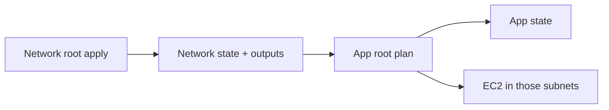

import { ConceptTemplate } from '@/features/kb/components/templates/ConceptTemplate'
import { Callout } from '@/features/kb/components/mdx/Callout'
import { ComparisonTable } from '@/features/kb/components/mdx/ComparisonTable'

export default function Layout({ children }) {
  return (
    <ConceptTemplate title="Remote State">
      {children}
    </ConceptTemplate>
  )
}

**Remote state** here means the data source `terraform_remote_state`: this root module opens another backend snapshot **read-only** and pulls its outputs. It is how an app stack learns the VPC ID from a networking stack without merging the two state files. It is not the same sentence as “we use a remote backend” (that is where *this* state is stored).

## 1. Deep Dive and Mechanics

**Outputs only.** The data source does not expose every resource attribute. The upstream module must `output` what others may consume. That is a public API. Changing an output name is a breaking change for every reader.

**Backend config duplication.** You repeat bucket, key, and region of the *other* state. Wrong key means empty or stale outputs — or a plan that points at stage while applying in prod if you mix keys.

**Refresh always reads.** Every plan fetches upstream state (unless you `-refresh=false`). A missing IAM `s3:GetObject` on the upstream key fails the app team’s plan even when they changed nothing.

**Tighter alternatives.** Many platforms now publish IDs to SSM Parameter Store, a Consul KV, or an account-level data source (`aws_vpc` by tag). That avoids granting app roles read on the whole network state file (which contains secrets).

<Callout icon="warning" title="State files are secret documents">
`terraform_remote_state` typically needs `s3:GetObject` on the entire upstream object. That object includes plaintext attributes. Prefer a narrow outputs-only channel (SSM) if the reader is a less-trusted team.
</Callout>

## 2. Mathematical / Theoretical Foundation

Splitting state is **cutting a DAG into subgraphs** with explicit edges. An edge is “output → variable or data.” Cycles are forbidden: network cannot also remote-state the app that remote-states the network.

The cost is **staleness and coupling**. Upstream apply must land before downstream plan sees new IDs. You traded one lock for a pipeline order constraint.

<ComparisonTable
  headers={['Share IDs via', 'Privilege needed', 'Coupling']}
  rows={[
    ['terraform_remote_state', 'Read entire upstream state', 'Output names + backend key'],
    ['SSM / Secrets Manager', 'Read one parameter', 'Parameter path contract'],
    ['Data source by tag', 'Describe APIs', 'Tag convention'],
    ['One combined state', 'Same apply role', 'One lock, huge blast radius'],
  ]}
/>

## 3. Real-World Implementation

```hcl
data "terraform_remote_state" "network" {
  backend = "s3"
  config = {
    bucket = "acme-tfstate-prod"
    key    = "platform/network/terraform.tfstate"
    region = "us-east-1"
  }
}

resource "aws_instance" "app" {
  ami                         = data.aws_ami.al2023.id
  instance_type               = "t3.medium"
  subnet_id                   = data.terraform_remote_state.network.outputs.private_subnet_ids[0]
  vpc_security_group_ids      = [data.terraform_remote_state.network.outputs.app_sg_id]
  associate_public_ip_address = false
}
```

The network root must export `private_subnet_ids` and `app_sg_id`. If those outputs disappear, this plan errors at refresh.

## 4. Visualizations



## 5. Interview Prep

**Q: Remote backend vs terraform_remote_state?**
**A:** Backend = where this module writes its own state. Data source = read another module’s outputs. You often have both.

**Q: Why not one state for the company?**
**A:** Plan time, lock contention, and blast radius. A typo in a sandbox resource should not lock production RDS.

**Q: How do you avoid cycles?**
**A:** Layering: org → network → data → app. Only point downstream. If two apps need each other’s ALB DNS, use DNS or SSM, not mutual remote state.

## 6. Production Use Cases

- **Platform / product split:** network team publishes outputs; twenty app repos consume them.
- **Account baselines:** a security state exports the central logging bucket ARN for every workload stack.
- **Migration:** temporary remote_state while you peel a monolith state into pieces, then switch readers to SSM.

<Callout icon="tip" title="Version the output contract">
Treat outputs like a module interface. Add new names; deprecate old ones in a later PR. Never reuse an output name for a different type.
</Callout>
