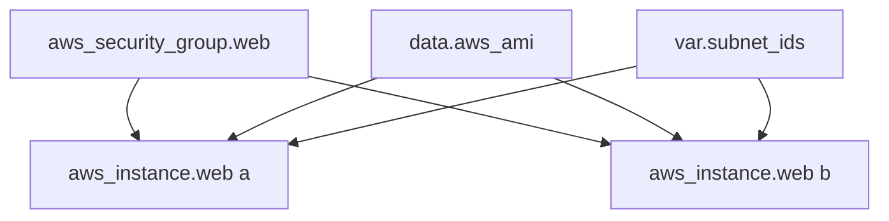

import { ConceptTemplate } from '@/features/kb/components/templates/ConceptTemplate'
import { Callout } from '@/features/kb/components/mdx/Callout'
import { ComparisonTable } from '@/features/kb/components/mdx/ComparisonTable'

export default function Layout({ children }) {
  return (
    <ConceptTemplate title="Resources">
      {children}
    </ConceptTemplate>
  )
}

A **resource** is the unit Terraform manages. The first label is the provider type (`aws_instance`). The second is a local name (`web`) used only inside this module. Together they form an address (`aws_instance.web`, or `aws_instance.web["a"]` with `for_each`). Arguments inside the block are the desired attributes. Terraform’s job is to make the remote object match.

## 1. Deep Dive and Mechanics

**CRUD through the provider.** Create posts to the API and records the ID. Read (refresh) GETs the object. Update PATCHes mutable fields. Delete removes it. If an attribute is ForceNew in the provider schema, update becomes replace.

**Dependencies.** Referencing `aws_subnet.app.id` from an instance creates an implicit edge. `dependsOn`-style `depends_on` is for hidden couplings (IAM eventual consistency, a policy that must exist before a role is used). Prefer implicit edges.

**Multiplicity.** `count` indexes from 0 and **shifts** when you insert in the middle — classic state move pain. `for_each` keys by a map or set so removing `"b"` does not renumber `"c"`. Prefer `for_each`.

**Provisioners.** `local-exec` and `remote-exec` run scripts as a last resort. They are not refreshed, not a desired state, and they fail apply in messy ways. Prefer cloud-init, userdata, or Ansible after the resource is up.

<Callout icon="tip" title="Address is identity">
Renaming `web` to `frontend` is a destroy-and-create unless you add a `moved` block. Treat local names as public IDs of the state file, not as casual comments.
</Callout>

## 2. Mathematical / Theoretical Foundation

Resources are **vertices** in the desired DAG. An attribute reference is a directed edge. `count` is an array of vertices with unstable indices; `for_each` is a dictionary of vertices with stable keys.

The provider schema is the type system: required vs optional, computed (API fills in), and ForceNew. Computed-only IDs are why you cannot know an ARN until after apply (unless you construct it from known parts).

<ComparisonTable
  headers={['Block', 'Writes cloud?', 'In state?']}
  rows={[
    ['resource', 'Yes', 'Yes — managed'],
    ['data', 'No', 'Yes — as a data object'],
    ['module', 'Indirectly', 'Addresses prefixed by module path'],
  ]}
/>

## 3. Real-World Implementation

```hcl
resource "aws_security_group" "web" {
  name   = "web-${var.environment}"
  vpc_id = var.vpc_id
}

resource "aws_instance" "web" {
  for_each = toset(["a", "b"])

  ami                    = data.aws_ami.al2023.id
  instance_type          = var.instance_type
  subnet_id              = var.subnet_ids[each.key]
  vpc_security_group_ids = [aws_security_group.web.id]

  tags = {
    Name = "web-${each.key}"
  }
}
```

`each.key` is `"a"` or `"b"`. Deleting `"b"` from the set destroys only `aws_instance.web["b"]`.

## 4. Visualizations



## 5. Interview Prep

**Q: count vs for_each for a list of AZ names?**
**A:** Convert the list to a set or a map keyed by AZ and use `for_each`. `count` plus `list[i]` will replace the wrong instances when the list order changes.

**Q: Why is there no resource for “run this bash on apply” as a first-class citizen?**
**A:** That is a provisioner. Terraform cannot refresh a shell script’s success. Put the script in the AMI or userdata so recreate is the update story.

**Q: What is a stale resource in state?**
**A:** The address exists in state but the API 404s on refresh. The next plan typically offers to recreate. If you deleted it on purpose, `state rm` or `removed` so Terraform does not bring it back.

## 6. Production Use Cases

- **One resource per cloud object** you are willing to recreate or update through PRs: instances, queues, DNS records.
- **Factory modules** that wrap five resources (role, policy, log group, function, alarm) behind one call.
- **`moved` blocks** during refactors so production IDs survive a rename.

<Callout icon="warning" title="Do not -target your way to green">
`-target=aws_instance.web` applies a subgraph and leaves the rest of the config unenforced. Use it to recover from a half-apply, then run a full plan immediately.
</Callout>
