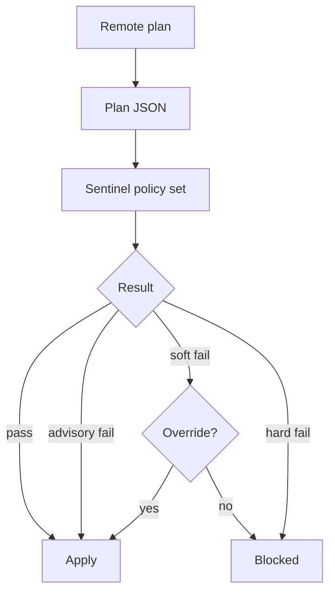

import { ConceptTemplate } from '@/features/kb/components/templates/ConceptTemplate'
import { Callout } from '@/features/kb/components/mdx/Callout'
import { ComparisonTable } from '@/features/kb/components/mdx/ComparisonTable'

export default function Layout({ children }) {
  return (
    <ConceptTemplate title="Sentinel Policies">
      {children}
    </ConceptTemplate>
  )
}

**Sentinel** is HashiCorp’s policy language, used on HCP Terraform / Terraform Enterprise as a **pre-apply gate**. After a plan exists, Sentinel evaluates rules against the plan, the config, and state. A failed hard-mandatory policy stops apply. It does not replace IAM: a policy can forbid an `m5.8xlarge` in the plan, but it cannot stop someone with console admin from launching one by hand.

## 1. Deep Dive and Mechanics

**When it runs.** VCS or CLI remote runs produce a plan JSON. Sentinel imports (`tfplan/v2`, `tfconfig/v2`, `tfstate/v2`) expose that data. Policies are grouped into policy sets attached to workspaces.

**Enforcement levels.** Advisory: warn, allow apply. Soft-mandatory: block, overridable by someone with override permission. Hard-mandatory: block, no UI override — change the policy or the plan.

**What you can say.** “No `aws_s3_bucket_public_access_block` missing,” “instance_type in an allow-list,” “every resource has `Owner` tag,” “no `0.0.0.0/0` on ssh.” Policies see planned values, so they can catch creates and updates.

**Not OpenTofu-native.** Sentinel is a HashiCorp product feature. OpenTofu shops use OPA, Conftest, Checkov, or Terrascan on the same plan JSON.

<Callout icon="info" title="Plan JSON is the portable artifact">
`terraform show -json tfplan` is what most policy engines consume. Sentinel is one consumer. If you leave HCP, keep producing that JSON.
</Callout>

## 2. Mathematical / Theoretical Foundation

A policy is a **predicate** P(plan, config, state) → pass/fail. Enforcement level is how the orchestrator interprets fail. Advisory is logging; mandatory is a transaction abort before the write set is applied.

Completeness is limited by what the plan exposes. A custom provisioner side effect is invisible. A resource created outside Terraform is invisible until it appears in state. Sentinel governs the Terraform path only.

<ComparisonTable
  headers={['Gate', 'Where it runs', 'Can override?']}
  rows={[
    ['Sentinel advisory', 'HCP between plan and apply', 'N/A — does not block'],
    ['Sentinel soft-mandatory', 'HCP', 'Yes, with permission'],
    ['Sentinel hard-mandatory', 'HCP', 'No'],
    ['OPA / Conftest', 'Your CI', 'Your process'],
    ['IAM / SCP', 'Cloud', 'No — API deny'],
  ]}
/>

## 3. Real-World Implementation

```python
# sentinel/restrict-instance-type.sentinel  (Sentinel language; illustrative)
# import "tfplan/v2" as tfplan
#
# allowed = ["t3.micro", "t3.small", "t3.medium"]
# instances = filter tfplan.resource_changes as _, rc {
#   rc.type is "aws_instance" and
#   rc.mode is "managed" and
#   rc.change.actions contains "create" or rc.change.actions contains "update"
# }
# main = rule {
#   all instances as _, inst {
#     inst.change.after.instance_type in allowed
#   }
# }
```

```yaml
# policy-set sketch (HCL/JSON in TFC; shown as YAML)
policies:
  - name: restrict-instance-type
    enforcement: hard-mandatory
  - name: require-owner-tag
    enforcement: soft-mandatory
```

Attach the policy set to prod workspaces. A plan that creates `m5.4xlarge` fails before AWS sees RunInstances.

## 4. Visualizations



## 5. Interview Prep

**Q: Sentinel vs IAM?**
**A:** Sentinel sees Terraform plans. IAM sees API calls from every client. You want both: Sentinel for fast feedback in the PR, SCP/IAM to catch the console and leaked keys.

**Q: Why did a public bucket still get created?**
**A:** Policy attached only to some workspaces, enforcement was advisory, or the bucket was created outside Terraform. Also check you asserted the right resource type — modern AWS S3 is several resource types, not one.

**Q: Can we use Sentinel with OpenTofu and GitHub Actions?**
**A:** Not as HCP Sentinel. Run OPA against `tofu show -json` instead. The policy idea is the same; the language differs.

## 6. Production Use Cases

- **Cost:** deny GPU instance families in non-ML workspaces.
- **Security:** require public-access blocks, forbid `0.0.0.0/0` on port 22, require encryption flags.
- **Tags:** Owner, DataClass, and NightlyShutdown on every taggable create.

<Callout icon="tip" title="Start advisory, then tighten">
Ship new rules as advisory for a week. Read the false positives (data sources, imported resources) then flip prod to hard-mandatory. A policy that blocks every apply will be disabled by the first on-call.
</Callout>
