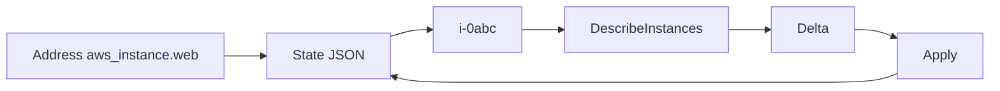

import { ConceptTemplate } from '@/features/kb/components/templates/ConceptTemplate'
import { Callout } from '@/features/kb/components/mdx/Callout'
import { ComparisonTable } from '@/features/kb/components/mdx/ComparisonTable'

export default function Layout({ children }) {
  return (
    <ConceptTemplate title="Terraform State">
      {children}
    </ConceptTemplate>
  )
}

**State** (`terraform.tfstate`) is Terraform’s memory. After you create `aws_instance.web`, state records `i-0abc...` and the attributes the provider returned. The next plan refreshes those IDs against the API. Without state, Terraform cannot know that `web` already exists and will try to create a second instance.

## 1. Deep Dive and Mechanics

**Bindings.** Each resource address maps to a provider, schema version, and attribute bag. `data` addresses are also stored. Outputs at the root are stored. Modules nest under `module.vpc.aws_subnet.private["a"]`.

**Refresh.** Plan reads state, calls Read on each object, and updates the in-memory snapshot. If the object is gone, the plan usually offers to create it again. If someone changed a tag in the console, the plan offers to change it back (unless `ignore_changes`).

**Locking and remote.** Local files do not lock. Remote backends do. Two applies without a lock can write two different bindings for the same address.

**Surgery.** `terraform state list`, `mv`, `rm`, `replace-provider`. `moved` blocks are the reviewable replacement for `state mv`. Never edit the JSON in vim unless you are in a disaster and you took a copy.

<Callout icon="error" title="State is a secrets file">
Providers persist almost every attribute, including `password` and access keys they just generated. Encrypt the backend, restrict IAM, and do not attach state objects to Slack “for debugging.”
</Callout>

## 2. Mathematical / Theoretical Foundation

State is a **partial function** from address → remote identity. Plan computes Δ such that applying Δ then writing state' keeps the function consistent with the API. Drift is the API changing while the function stays put until refresh.

Schema version on each resource lets providers migrate attributes (rename a field) when you upgrade. Skipping upgrades and then jumping three major provider versions is how state becomes unreadable.

<ComparisonTable
  headers={['Symptom', 'Likely cause', 'Fix']}
  rows={[
    ['Create already exists', 'Object not in state', 'import'],
    ['Plan wants to recreate everything', 'Wrong backend key / empty state', 'Check key, restore version'],
    ['Apply conflict / lock', 'Another run holds the mutex', 'Wait or break-glass unlock'],
    ['Orphan in cloud', 'state rm or failed create after API success', 'import or delete by hand'],
  ]}
/>

## 3. Real-World Implementation

```bash
terraform state list
terraform state show aws_instance.web
terraform state mv aws_instance.web aws_instance.frontend
# better in code:
# moved {
#   from = aws_instance.web
#   to   = aws_instance.frontend
# }

# Drop binding, keep the bucket
terraform state rm aws_s3_bucket.old
```

```hcl
moved {
  from = aws_instance.web
  to   = aws_instance.frontend
}
```

Commit the `moved` block, apply once, then you may delete it in a later PR.

## 4. Visualizations



## 5. Interview Prep

**Q: Why not query the cloud by tags and skip state?**
**A:** Tags are not unique and not always present. State is the join key Terraform actually implements. Some tools (Pulumi, CDK) still have a checkpoint — the name changes, the need does not.

**Q: What does `state rm` do to the cloud object?**
**A:** Nothing. It only forgets the binding. The next apply may create a duplicate if the resource block remains.

**Q: How do you recover a wiped state bucket?**
**A:** S3 versioning first. If versions are gone, you rebuild state by importing every address (painful) or you accept `terraform apply` will try to create duplicates and you must import before apply. This is why versioning is not optional.

## 6. Production Use Cases

- **Remote encrypted state** per workspace with lock and versioning.
- **Refactors** via `moved` so production IDs survive module extractions.
- **Break-glass** `state rm` when a resource was deleted in the console and you do not want Terraform to recreate it.

<Callout icon="tip" title="One state, one lifecycle">
Resources that change on different cadences (VPC vs Lambda) should not share a state file. You will lock the network to ship a function.
</Callout>
