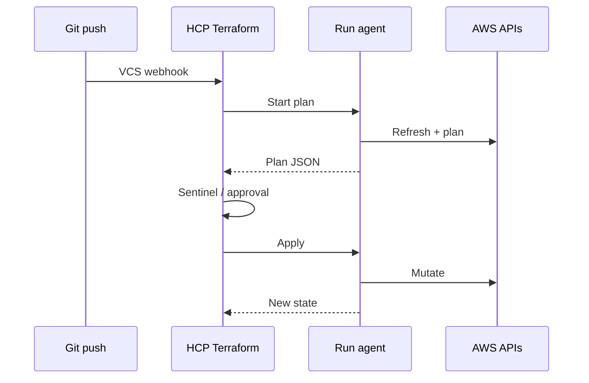

import { ConceptTemplate } from '@/features/kb/components/templates/ConceptTemplate'
import { Callout } from '@/features/kb/components/mdx/Callout'
import { ComparisonTable } from '@/features/kb/components/mdx/ComparisonTable'

export default function Layout({ children }) {
  return (
    <ConceptTemplate title="Terraform Cloud">
      {children}
    </ConceptTemplate>
  )
}

**Terraform Cloud** (HCP Terraform) moves `plan` and `apply` off laptops into HashiCorp-managed agents. A workspace binds a VCS repo or an API-driven config upload to a remote state, variable sets, and a run history. Credentials live as workspace env vars or OIDC to the cloud — not in an engineer’s shell profile.

## 1. Deep Dive and Mechanics

**Remote operations.** In the remote backend, the CLI packs the config and asks TFC to run. The agent checks out (or receives) the config, inits providers, plans, and optionally auto-applies. Local mode that only stores state on TFC still exists, but the product pitch is remote execution.

**Workspaces vs CLI workspaces.** A TFC workspace is a SaaS object: one state, one variable set, one run queue. It is not the same thing as `terraform workspace new` inside a single backend. Conflating the two in interviews is a common miss.

**Registry and no-code.** The private module registry versions internal modules. No-code provisioning wraps a module in a self-service form for app teams.

**Governance.** Sentinel (or OPA run tasks) inspects the plan JSON before apply. Cost estimation and health assessments are add-ons. Run tasks can call an external HTTPS endpoint (your own policy service).

<Callout icon="info" title="Name change">
HashiCorp markets this as HCP Terraform. Docs, env vars (`TF_CLOUD_*`), and older blog posts still say Terraform Cloud. Same control plane.
</Callout>

## 2. Mathematical / Theoretical Foundation

TFC is a **queue plus a state store**. Runs on one workspace are serialized: that is distributed locking with a UI. Variable precedence is a merge of workspace vars, variable sets, and env. The speculative plan on a PR is a plan without apply — same delta math as local CLI, different identity (the agent’s IAM).

The security model is **credential isolation**: the laptop never holds the apply role. The new risk is the TFC org: who can write variables and who can approve applies.

<ComparisonTable
  headers={['Runner', 'Where apply happens', 'State', 'Policy']}
  rows={[
    ['HCP Terraform', 'HashiCorp agents (or yours)', 'Hosted', 'Sentinel / run tasks'],
    ['Atlantis / Terrateam', 'Your CI or bot', 'Your backend', 'Your checks'],
    ['Laptop CLI', 'Engineer machine', 'Local or S3', 'None unless you add it'],
  ]}
/>

## 3. Real-World Implementation

```hcl
terraform {
  cloud {
    organization = "acme"
    workspaces {
      name = "net-prod"
    }
  }
  required_providers {
    aws = {
      source  = "hashicorp/aws"
      version = "~> 5.0"
    }
  }
}

provider "aws" {
  region = "us-east-1"
}
```

```bash
# After linking the workspace to GitHub, a merge triggers a run.
# Local equivalent once you are logged in:
terraform login
terraform init
terraform plan
```

OIDC to AWS is configured on the workspace so the agent assumes `arn:aws:iam::123456789012:role/tfc-net-prod` without static keys.

## 4. Visualizations



## 5. Interview Prep

**Q: TFC workspace vs `terraform workspace`?**
**A:** TFC workspace = one remote state and run queue in the SaaS. CLI workspace = a state namespace inside one backend. Enterprises usually use many TFC workspaces, not CLI workspaces.

**Q: Why remote apply instead of GitHub Actions plus S3 state?**
**A:** Central audit log, Sentinel, concurrency control, and no AWS keys in Actions if you use TFC’s OIDC. Actions is cheaper and more portable; you must build the rest.

**Q: What is speculative vs final plan?**
**A:** Speculative plans run on pull requests and cannot apply. The final plan on the default branch is the one you approve.

## 6. Production Use Cases

- **Platform team** owning 200 workspaces with shared variable sets for the org AWS role.
- **Regulated apply path:** two-person approval on prod workspaces, Sentinel hard-mandatory on public S3.
- **Self-service modules** in the private registry so product teams never copy a VPC.

<Callout icon="tip" title="One workspace, one blast radius">
Do not hang the company network and every microservice in a single TFC workspace. Failed locks and 30-minute plans will become your on-call.
</Callout>
