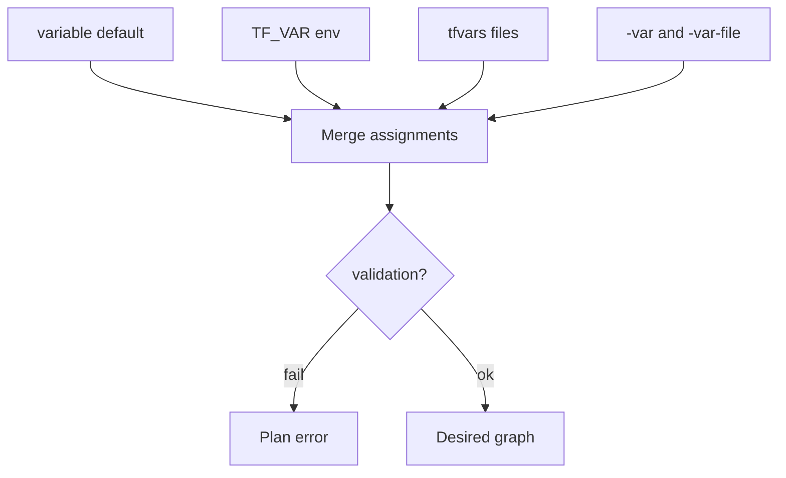

import { ConceptTemplate } from '@/features/kb/components/templates/ConceptTemplate'
import { Callout } from '@/features/kb/components/mdx/Callout'
import { ComparisonTable } from '@/features/kb/components/mdx/ComparisonTable'

export default function Layout({ children }) {
  return (
    <ConceptTemplate title="Variables">
      {children}
    </ConceptTemplate>
  )
}

Terraform **input variables** are the parameters of a module. The root module gets them from the environment, `*.tfvars` files, and CLI flags. A child module gets them only from the calling `module` block. Variables are not a substitute for `locals` (computed inside) or `outputs` (what you export).

## 1. Deep Dive and Mechanics

**Declaration.** `variable "name"` sets `type`, `default`, `description`, `sensitive`, `nullable`, and `validation` blocks. Types include `string`, `number`, `bool`, `list`, `set`, `map`, `object`, and `tuple`. Objects are how you pass a structured “cluster config” without twenty scalars.

**tfvars.** `terraform.tfvars` and `*.auto.tfvars` load automatically. Named files need `-var-file=prod.tfvars`. Keep secrets out of committed tfvars; use a secret manager or CI-injected `TF_VAR_*` env vars.

**Precedence (high wins).** Environment `TF_VAR_name`, then terraform.tfvars, then auto tfvars, then `-var` / `-var-file` in command order. The exact ladder is documented per version — do not rely on memory in an interview without saying “highest is CLI.”

**Sensitive.** Marks the value redacted in CLI output. It is still in state. Sensitive is a display bit, not encryption.

<Callout icon="info" title="Root vs module variables">
A variable in a child module is not automatically a root flag. You must thread it: root variable → module argument → child variable. That threading is the module’s API.
</Callout>

## 2. Mathematical / Theoretical Foundation

Variables are **typed holes** in a desired graph. Validation is a predicate evaluated before providers run. Failed validation is cheaper than a failed apply.

Precedence is a **last-writer-wins overlay** of assignment sources. That is why two `-var-file` flags are order-dependent. Treat the CLI invocation as part of the config.

<ComparisonTable
  headers={['Knob', 'Set by', 'Visible to caller']}
  rows={[
    ['variable', 'Caller or default', 'Yes — it is the API'],
    ['local', 'This module only', 'No'],
    ['output', 'This module', 'Yes — return values'],
    ['env TF_VAR_*', 'Process environment', 'Root only'],
  ]}
/>

## 3. Real-World Implementation

```hcl
variable "environment" {
  type        = string
  description = "Short name used in tags and names"
  validation {
    condition     = contains(["dev", "stage", "prod"], var.environment)
    error_message = "environment must be dev, stage, or prod."
  }
}

variable "instance_type" {
  type    = string
  default = "t3.micro"
  validation {
    condition     = can(regex("^t3\\.", var.instance_type))
    error_message = "This module only allows t3 family instance types."
  }
}

resource "aws_instance" "web" {
  ami           = data.aws_ami.al2023.id
  instance_type = var.instance_type
  tags = {
    Environment = var.environment
  }
}
```

```bash
export TF_VAR_environment=prod
terraform plan -var="instance_type=t3.small" -var-file=secret.tfvars
```

Validation runs before the AWS API is called. A typo `prd` fails fast.

## 4. Visualizations



## 5. Interview Prep

**Q: Why did my default lose to an environment variable I forgot about?**
**A:** `TF_VAR_instance_type` in your shell profile wins over the default. `terraform console` and `env | grep TF_VAR` are the debug tools.

**Q: Should every module take region as a variable?**
**A:** Often the provider already has region. Duplicate variables that disagree with the provider config are a source of bugs. Pass region once at the root provider and derive names from `var.environment`.

**Q: list vs set vs map for subnet IDs?**
**A:** Use `list` if order matters (AZ alignment). Use `set` if you only care about membership. Use `map` keyed by AZ name when you need stable addressing under `for_each`.

## 6. Production Use Cases

- **Env files:** `dev.tfvars` / `prod.tfvars` in CI with `-var-file` selected by the pipeline environment.
- **Module catalogs:** a VPC module with validated CIDR and required tags so product teams cannot omit `Owner`.
- **Secret injection:** `TF_VAR_db_password` from GitHub OIDC + Secrets Manager, never from git.

<Callout icon="tip" title="Validate at the edge">
Put regex and `contains` checks on root and published modules. Internal locals can assume those invariants already held.
</Callout>
