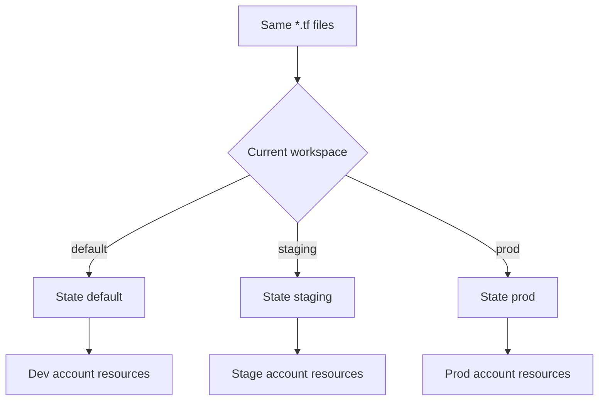

import { ConceptTemplate } from '@/features/kb/components/templates/ConceptTemplate'
import { Callout } from '@/features/kb/components/mdx/Callout'
import { ComparisonTable } from '@/features/kb/components/mdx/ComparisonTable'

export default function Layout({ children }) {
  return (
    <ConceptTemplate title="Workspaces">
      {children}
    </ConceptTemplate>
  )
}

Terraform **CLI workspaces** attach extra state files to a single working directory. `terraform workspace new staging` creates a named state. `terraform workspace select prod` points subsequent plans at a different snapshot. The HCL does not change unless you read `terraform.workspace` in an expression.

## 1. Deep Dive and Mechanics

**Default workspace.** Every backend starts with `default`. Local backends store others under `terraform.tfstate.d/<name>`. Remote backends encode the name in the state key (S3) or in the remote workspace mapping.

**What workspaces are not.** They are not isolation boundaries for IAM, not separate directories, and not HCP Terraform workspaces. Using one directory and `terraform.workspace` to distinguish prod vs dev is convenient and easy to mis-select.

**The foot-gun.** A human on the `default` workspace applying prod-sized variables is a classic outage. Many teams abandoned CLI workspaces for **one directory per env** (or one TFC workspace per env) with `*.tfvars` and separate backend keys.

**When they still win.** Ephemeral PR environments: create workspace `pr-1234`, apply, test, destroy, delete workspace. The name is the lifecycle.

<Callout icon="warning" title="Select is a global in that checkout">
`terraform workspace select prod` persists in local backend metadata. The next `apply` in that clone is prod even if the engineer thinks they are in a feature branch. Print `terraform workspace show` in CI and fail if it is not the expected name.
</Callout>

## 2. Mathematical / Theoretical Foundation

A workspace is a **key in a map of states** keyed by name, with one “current” pointer per working directory. Isolation is only as good as that pointer. Resource addresses stay the same (`aws_instance.web`); cloud IDs differ per snapshot.

`terraform.workspace` is a compile-time string in the graph. Using it to pick instance size is a conditional in the desired graph, not a backend feature.

<ComparisonTable
  headers={['Pattern', 'State files', 'Mis-apply risk', 'Best for']}
  rows={[
    ['CLI workspaces', 'N in one backend prefix', 'High if select is wrong', 'PR previews, similar envs'],
    ['Dir per env', 'N explicit backend keys', 'Lower', 'Long-lived prod/stage'],
    ['HCP workspace per env', 'N SaaS objects', 'Lowest with approvals', 'Team-shared runners'],
  ]}
/>

## 3. Real-World Implementation

```hcl
variable "instance_type" {
  type = map(string)
  default = {
    default = "t3.micro"
    staging = "t3.small"
    prod    = "m5.large"
  }
}

resource "aws_instance" "web" {
  ami           = data.aws_ami.al2023.id
  instance_type = var.instance_type[terraform.workspace]
  tags = {
    Name        = "web-${terraform.workspace}"
    Environment = terraform.workspace
  }
}
```

```bash
terraform workspace new staging
terraform apply -auto-approve
terraform workspace select prod
terraform plan
```

Prefer looking up a map over a ternary chain once you have more than two names.

## 4. Visualizations



## 5. Interview Prep

**Q: Are CLI workspaces good for prod vs dev?**
**A:** They work, but a wrong `select` is catastrophic. Interview-strong answer: use separate backend keys and separate AWS accounts; reserve CLI workspaces for short-lived clones.

**Q: How does S3 store non-default workspaces?**
**A:** Under a prefix that includes `env:/<name>/` plus your key (implementation detail by version). Never “clean up” those keys with a casual S3 lifecycle rule.

**Q: Can two workspaces share a resource?**
**A:** Not safely. Each state believes it owns the IDs it recorded. Sharing means import fights or `terraform_remote_state`, not two workspaces writing one instance.

## 6. Production Use Cases

- **PR preview stacks** named after the pull request, destroyed on merge.
- **Training labs** where each student gets a workspace on a shared module.
- **Soft multi-region** experiments where region is a variable and workspace is `prod-eu` vs `prod-us` — still consider separate roots if blast radius matters.

<Callout icon="tip" title="Fail closed in CI">
Set `TF_WORKSPACE` explicitly in the pipeline. Do not rely on whatever leftover workspace a self-hosted runner had from the last job.
</Callout>
