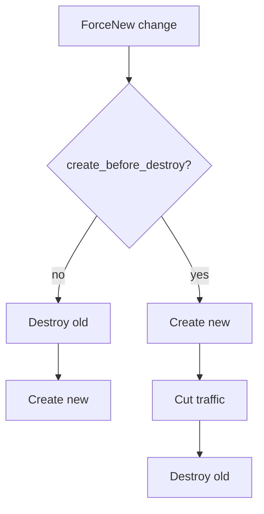

import { ConceptTemplate } from '@/features/kb/components/templates/ConceptTemplate'
import { Callout } from '@/features/kb/components/mdx/Callout'
import { ComparisonTable } from '@/features/kb/components/mdx/ComparisonTable'

export default function Layout({ children }) {
  return (
    <ConceptTemplate title="Lifecycle Rules">
      {children}
    </ConceptTemplate>
  )
}

A Terraform **lifecycle** block changes how the planner treats one resource address. Defaults are: replace by destroy-then-create, follow the graph, and reconcile every attribute. Lifecycle flags exist because those defaults take production down or fight an out-of-band system.

## 1. Deep Dive and Mechanics

**create_before_destroy.** When a change is ForceNew, Terraform normally destroys first. This flag flips the order so the new object exists before the old one is removed. You still need a unique name (or `name_prefix`) and something that cuts traffic over (ALB target group attachment). Without that, you have two nodes and no cutover.

**prevent_destroy.** Plan fails if the resource would be destroyed. It does not protect against deleting the state file or destroying from the console. It is a seatbelt for the next apply, not a cloud-side deletion lock.

**ignore_changes.** A list of attribute names (or `all`) omitted from the diff. Use when an autoscaler, a vendor, or a GitOps controller owns a field. Overuse means Terraform no longer represents reality.

**replace_triggered_by and precondition.** Newer language: force replace when another resource changes, and `precondition` / `postcondition` blocks to fail plan when an assumption is false (AMI is not public, list is non-empty).

<Callout icon="warning" title="prevent_destroy is not a backup">
Removing the lifecycle block in the same PR that deletes the resource is a valid plan. Code review is the real control. Pair with IAM deny on `rds:DeleteDBInstance` for the apply role if the data is sacred.
</Callout>

## 2. Mathematical / Theoretical Foundation

Lifecycle flags are **local edits to the planner’s cost function**. Default replace cost is “destroy old, create new.” `create_before_destroy` adds a temporary overlap (two nodes in the set). `ignore_changes` projects the desired vector onto a subspace — those coordinates are taken from state, not config.

`prevent_destroy` is a hard constraint: if the delta contains Destroy for that address, the plan is rejected. It is not a lock on the API.

<ComparisonTable
  headers={['Flag', 'Planner effect', 'Use when']}
  rows={[
    ['create_before_destroy', 'Overlap on replace', 'Zero-downtime instance/ASG swaps'],
    ['prevent_destroy', 'Reject destroy plans', 'Databases, state buckets'],
    ['ignore_changes', 'Drop attributes from diff', 'Externally mutated tags or desired_count'],
    ['replace_triggered_by', 'Force replace', 'User data must follow a secret version'],
  ]}
/>

## 3. Real-World Implementation

```hcl
resource "aws_launch_template" "web" {
  name_prefix = "web-"
  image_id    = data.aws_ami.al2023.id
  lifecycle {
    create_before_destroy = true
  }
}

resource "aws_db_instance" "app" {
  engine         = "postgres"
  instance_class = "db.t3.medium"
  lifecycle {
    prevent_destroy = true
  }
}

resource "aws_instance" "bastion" {
  ami           = data.aws_ami.al2023.id
  instance_type = "t3.micro"
  tags          = local.billing_tags
  lifecycle {
    ignore_changes = [tags["LastPatched"]]
  }
}
```

The bastion still converges AMI and type; a patch-orchestration tag is left alone.

## 4. Visualizations



## 5. Interview Prep

**Q: Why did create_before_destroy fail on an aws_instance with a fixed Name tag?**
**A:** The name or EIP association collided. The new instance cannot be created until the old name is free. Use `name_prefix`, attach via a target group, and move the EIP after create.

**Q: ignore_changes = all — when is that honest?**
**A:** Almost never on a resource you intend to manage. It is a temporary import bandage. Prefer importing the real config or `removed` / `moved` blocks.

**Q: Does prevent_destroy stop `terraform destroy`?**
**A:** Yes, for that resource the plan errors. Someone can still remove the block or use `-target` on other resources. It is not IAM.

## 6. Production Use Cases

- **ASG launch templates** that must roll new versions without a capacity hole.
- **State buckets and KMS keys** created by Terraform itself — prevent_destroy plus IAM.
- **EKS node desired_count** owned by Cluster Autoscaler: ignore that field so apply does not fight the scaler.

<Callout icon="tip" title="Prefer replace_triggered_by over taint">
`terraform taint` is imperative and forgotten. Encoding “replace me when this secret version changes” in HCL is reviewable and repeatable.
</Callout>
