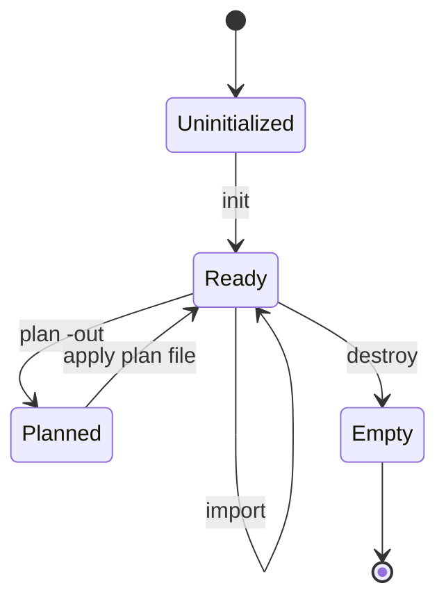

import { ConceptTemplate } from '@/features/kb/components/templates/ConceptTemplate'
import { Callout } from '@/features/kb/components/mdx/Callout'
import { ComparisonTable } from '@/features/kb/components/mdx/ComparisonTable'

export default function Layout({ children }) {
  return (
    <ConceptTemplate title="Init, Plan, Apply, Destroy">
      {children}
    </ConceptTemplate>
  )
}

Terraform’s CLI is a **state machine you drive with commands**. `init` makes the working directory usable. `plan` computes a delta. `apply` executes it. `destroy` is apply of an empty desired graph. `import` (and the `import` block) attaches an existing cloud object to an address so the next plan is not a create.

## 1. Deep Dive and Mechanics

**init.** Downloads providers and modules into `.terraform/`, configures the backend, and writes a lock file (` .terraform.lock.hcl`) for provider hashes. Re-run init when you change required_providers or the backend.

**plan.** Refresh (unless disabled), walk the graph, print create `+`, update `~`, destroy `-`, replace `-/+`. `-out=tfplan` serializes the plan. In CI, apply **that file**, not a second live plan.

**apply.** With no args, apply re-plans and asks for `yes`. `terraform apply tfplan` executes the saved set. `-auto-approve` skips the prompt; still prefer a saved plan in prod.

**destroy.** Reverse-topo delete of everything in state (or `-target`). Equivalent to removing all resource blocks and applying, but explicit.

**import.** Classic: `terraform import aws_s3_bucket.logs my-bucket`. The resource block must already exist and roughly match. Terraform 1.5+ `import` blocks run at plan/apply and can generate config with `-generate-config-out`. Import never creates the cloud object; it only writes the ID into state.

<Callout icon="tip" title="Save the plan in CI">
`terraform plan -out=tfplan` then a human (or policy) reviews the log, then `terraform apply tfplan`. Two unsaved applies can see different refreshes (someone else changed a SG) and ship a surprise.
</Callout>

## 2. Mathematical / Theoretical Foundation

Plan is a **pure-ish function** of (config, state, refreshed actuals) → delta. Apply is the effectful interpretation of that delta. Serializing the plan freezes the function’s output so apply is not a second sample.

Import is **binding**: address A now denotes cloud ID X. If config disagrees with X’s attributes, the next plan updates X. If you skip import and apply, you try to create a second X and the API errors on uniqueness.

<ComparisonTable
  headers={['Command', 'Mutates cloud?', 'Mutates state?']}
  rows={[
    ['init', 'No', 'Only backend migrate'],
    ['plan', 'No', 'No (refresh is in-memory unless you apply)'],
    ['apply', 'Yes', 'Yes'],
    ['destroy', 'Yes', 'Yes (empties addresses)'],
    ['import', 'No', 'Yes (adds binding)'],
  ]}
/>

## 3. Real-World Implementation

```bash
terraform init
terraform plan -out=tfplan
terraform show -no-color tfplan
terraform apply tfplan

# Existing bucket created in the console:
# 1) write resource "aws_s3_bucket" "logs" { bucket = "acme-logs" }
# 2) bind it
terraform import aws_s3_bucket.logs acme-logs
terraform plan   # should be empty or only tags

# Teardown of a preview env
terraform destroy -auto-approve
```

```hcl
import {
  to = aws_s3_bucket.logs
  id = "acme-logs"
}

resource "aws_s3_bucket" "logs" {
  bucket = "acme-logs"
}
```

The `import` block is the reviewable, repeatable form. After a successful apply you can delete the block.

## 4. Visualizations



## 5. Interview Prep

**Q: Why is apply without a saved plan risky in a busy account?**
**A:** Apply runs a new refresh. Between the reviewed plan and the apply, another actor may have changed the same objects. The saved plan is the reviewed delta.

**Q: import vs `terraform state rm`?**
**A:** Import adds a binding. `state rm` drops a binding without destroying the cloud object (the object becomes orphaned from Terraform). Opposite operations.

**Q: What does `-target` do to destroy/apply?**
**A:** Restricts the graph to that address and its dependencies. It is a break-glass tool that leaves the rest of the config unapplied. Do not make it the normal pipeline.

## 6. Production Use Cases

- **PR pipelines:** plan on the PR, apply the saved plan on merge to main.
- **Brownfield:** import a year of console-built VPCs, then enforce tags going forward.
- **Ephemeral previews:** apply on PR open, destroy on PR close, same root module.

<Callout icon="warning" title="Destroy is not selective by default">
`terraform destroy` is the whole state. For one resource, remove its block (or use `removed`) and apply, or destroy with `-target` knowing you are leaving drift versus config.
</Callout>
