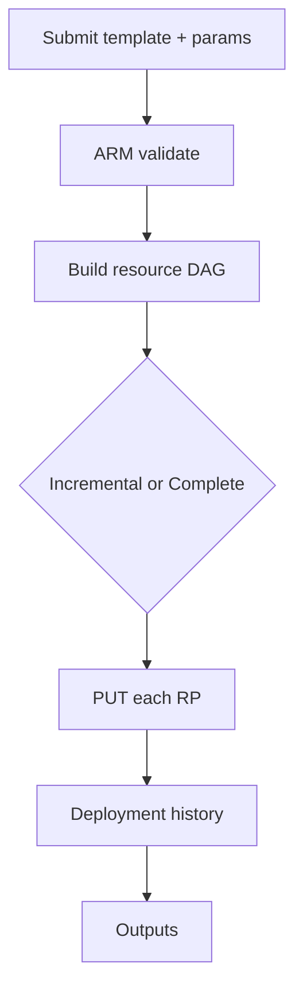

import { ConceptTemplate } from '@/features/kb/components/templates/ConceptTemplate'
import { Callout } from '@/features/kb/components/mdx/Callout'
import { ComparisonTable } from '@/features/kb/components/mdx/ComparisonTable'

export default function Layout({ children }) {
  return (
    <ConceptTemplate title="ARM Templates">
      {children}
    </ConceptTemplate>
  )
}

**ARM templates** are the on-the-wire contract for Azure Resource Manager. Every portal click, every Bicep file, and every SDK deployment eventually becomes a JSON document with `$schema`, `parameters`, `variables`, `resources`, and `outputs`. ARM stores each deployment as an object you can inspect, what-if, and incremental-update.

## 1. Deep Dive and Mechanics

**Deployment modes.** Incremental (default) creates or updates listed resources and leaves extras alone. Complete mode deletes resources in the group that are not in the template — a foot-gun that still exists for empty-RG enforcement.

**Expression language.** ARM is not a general language. Functions such as `concat`, `resourceId`, `reference`, and `copyIndex` run on the control plane while the graph is built. A `copy` block is the official loop. Nested and linked templates are how you compose.

**Idempotent PUTs.** Most resource providers treat the template resource as a desired body. Re-deploying the same JSON should converge. Some properties are create-only; changing them forces a new resource name or a manual migration.

**Portal export.** The portal can dump a working RG as ARM JSON. That dump is a starting point, not a style guide: it is verbose, often complete-mode unsafe, and full of hard-coded IDs.

<Callout icon="warning" title="Complete mode deletes strangers">
If someone created a disk by hand in the same resource group, a Complete deployment whose template omits that disk will delete it. Prefer Incremental plus Azure Policy, or isolate one stack per RG.
</Callout>

## 2. Mathematical / Theoretical Foundation

ARM evaluates a **template function language** over a resource DAG. Edges come from explicit `dependsOn` and from `reference` / symbolic name use. Evaluation is not Turing-complete on purpose: no user-defined functions in classic ARM (Bicep user-defined functions compile down to expressions).

The deployment object is an audit log: inputs, outputs, provisioningState. That is Azure’s analogue of Terraform state, except Azure owns it and you do not download a JSON mapping of every attribute unless you query.

<ComparisonTable
  headers={['Concern', 'ARM JSON', 'Bicep', 'Terraform on Azure']}
  rows={[
    ['Authoring', 'Verbose JSON + functions', 'DSL that emits ARM', 'HCL + azurerm / azapi'],
    ['State home', 'Deployment history in Azure', 'Same, after compile', 'Your backend'],
    ['What-if', 'Native', 'Native via compile', 'terraform plan'],
  ]}
/>

## 3. Real-World Implementation

```yaml
# Equivalent ARM shape shown as YAML for readability; production files are often JSON.
$schema: https://schema.management.azure.com/schemas/2019-04-01/deploymentTemplate.json#
contentVersion: 1.0.0.0
parameters:
  location:
    type: string
    defaultValue: "[resourceGroup().location]"
resources:
  - type: Microsoft.Storage/storageAccounts
    apiVersion: "2023-01-01"
    name: "[concat('st', uniqueString(resourceGroup().id))]"
    location: "[parameters('location')]"
    sku:
      name: Standard_LRS
    kind: StorageV2
    properties:
      minimumTlsVersion: TLS1_2
      allowBlobPublicAccess: false
outputs:
  storageId:
    type: string
    value: "[resourceId('Microsoft.Storage/storageAccounts', concat('st', uniqueString(resourceGroup().id)))]"
```

Submit with `az deployment group create --resource-group rg-app --template-file storage.json`. Expressions in square brackets run on ARM, not on your laptop.

## 4. Visualizations



## 5. Interview Prep

**Q: Why do ARM function calls look like strings with square brackets?**
**A:** JSON has no first-class expression nodes. ARM overloads string values: if the string starts with `[` it is parsed as an expression. That is why authoring JSON by hand is painful and why Bicep exists.

**Q: Incremental vs Complete — which is production default?**
**A:** Incremental. Complete is for tightly owned RGs where the template is the only writer. Most app teams cannot promise that.

**Q: How does ARM relate to Bicep and the Azure Terraform providers?**
**A:** Bicep compiles to ARM. Terraform azurerm speaks Azure Resource Manager APIs directly and keeps its own state. azapi is a thinner Terraform wrapper over the same REST specs ARM uses.

## 6. Production Use Cases

- **Regulated Azure estates** that must show deployment history and what-if in Azure-native tooling.
- **Marketplace and first-party samples** still ship ARM JSON because it is the lowest common denominator.
- **Pipeline steps** that deploy the same template to many subscriptions with a parameter file per region.

<Callout icon="tip" title="Decompile then delete the JSON">
`az bicep decompile` turns an exported template into Bicep you can actually review. Keep the Bicep as source; regenerate JSON in CI if a tool still demands it.
</Callout>
