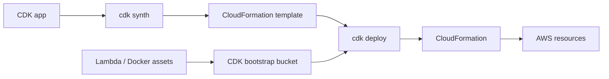

import { ConceptTemplate } from '@/features/kb/components/templates/ConceptTemplate'
import { Callout } from '@/features/kb/components/mdx/Callout'
import { ComparisonTable } from '@/features/kb/components/mdx/ComparisonTable'

export default function Layout({ children }) {
  return (
    <ConceptTemplate title="AWS CDK">
      {children}
    </ConceptTemplate>
  )
}

**AWS CDK** is a library and CLI that turns object-oriented code into CloudFormation templates. You do not apply AWS APIs from the construct tree at synth time. `cdk synth` executes your app, walks constructs, and writes YAML/JSON. `cdk deploy` uploads that template (and assets) so CloudFormation can create a stack. If you wanted a multi-cloud language host, that is Pulumi.

## 1. Deep Dive and Mechanics

**Construct levels.** L1 (`CfnBucket`) is a 1:1 class per CloudFormation resource. L2 (`s3.Bucket`) adds defaults: encryption, block public access, events. L3 patterns (`ecsPatterns.ApplicationLoadBalancedFargateService`) stamp a whole architecture. Most teams should live in L2 and write their own L3 for the company baseline.

**Apps, stacks, constructs.** An `App` contains one or more `Stack` objects (CloudFormation stacks, 500–1000 resource limits still apply). Nested stacks and cross-stack references become CFN exports or SSM parameters.

**Assets.** Lambda code and Docker images are hashed, published to S3/ECR by the CDK toolkit, then referenced from the template. That is why a “hello world” deploy still needs a bootstrap stack (`CDKToolkit`) in the account/region.

**cdk.context.json.** VPC lookups and AZ lists are cached. Commit the file or your CI will try to look up VPCs at synth time and drift.

<Callout icon="warning" title="Synth is not deploy">
Unit tests can assert on the synthesized template with `assertions.Template`. They do not prove IAM is right in the account. Still run `cdk diff` against the live stack in the pipeline.
</Callout>

## 2. Mathematical / Theoretical Foundation

CDK is a **code generator**. The construct tree is an AST. Synthesis is a tree walk that emits a declarative document. CloudFormation remains the solver: replacement vs update, rollback, and drift detection happen there.

Escape hatches matter theoretically: when L2 hides a property, you drop to L1 or `addPropertyOverride`. That is an admission that the generator is incomplete relative to the CFN schema.

<ComparisonTable
  headers={['Layer', 'You touch', 'Who applies']}
  rows={[
    ['L2/L3 CDK', 'Classes and props', 'CloudFormation after synth'],
    ['Raw CloudFormation', 'YAML/JSON', 'CloudFormation'],
    ['Pulumi / Terraform', 'Program or HCL', 'Provider plugins, not CFN'],
  ]}
/>

## 3. Real-World Implementation

```python
from aws_cdk import App, Stack, Duration
from aws_cdk import aws_sqs as sqs
from constructs import Construct

class QueueStack(Stack):
    def __init__(self, scope: Construct, construct_id: str, **kwargs) -> None:
        super().__init__(scope, construct_id, **kwargs)
        sqs.Queue(
            self,
            "Jobs",
            visibility_timeout=Duration.seconds(60),
            encryption=sqs.QueueEncryption.KMS_MANAGED,
        )

app = App()
QueueStack(app, "JobsDev")
app.synth()
```

`cdk deploy JobsDev` synthesizes a template with an AWS::SQS::Queue and asks CloudFormation to create or update the stack named JobsDev.

## 4. Visualizations



## 5. Interview Prep

**Q: Why bootstrap?**
**A:** The toolkit needs an S3 bucket, roles, and sometimes an ECR repo in each target account/region to stage assets and execute lookups. Without `cdk bootstrap`, deploy fails before CloudFormation starts.

**Q: CDK vs Terraform for AWS-only?**
**A:** CDK if you want CFN rollback, drift, and IAM identity-based deploy in-account. Terraform if you already have modules, need non-AWS providers, or dislike stack resource limits. Both are valid; mixing them on the same resource is not.

**Q: What breaks when you rename a construct ID?**
**A:** Logical IDs in the template change. CloudFormation treats that as delete-plus-create unless you set an override logical ID. Databases and buckets are the usual casualties.

## 6. Production Use Cases

- **Service repos** where app developers already write TypeScript and review a construct PR faster than 800 lines of YAML.
- **Internal platforms** publishing an L3 `SecureService` construct that mandates logging, alarms, and private subnets.
- **Pipeline apps** (`pipelines.CodePipeline`) that self-mutate: the stack deploys the pipeline that deploys the rest.

<Callout icon="tip" title="Pin the CDK and CLI together">
A CLI that is far ahead of `aws-cdk-lib` produces confusing synth errors. Same version line in the image and the lockfile.
</Callout>
