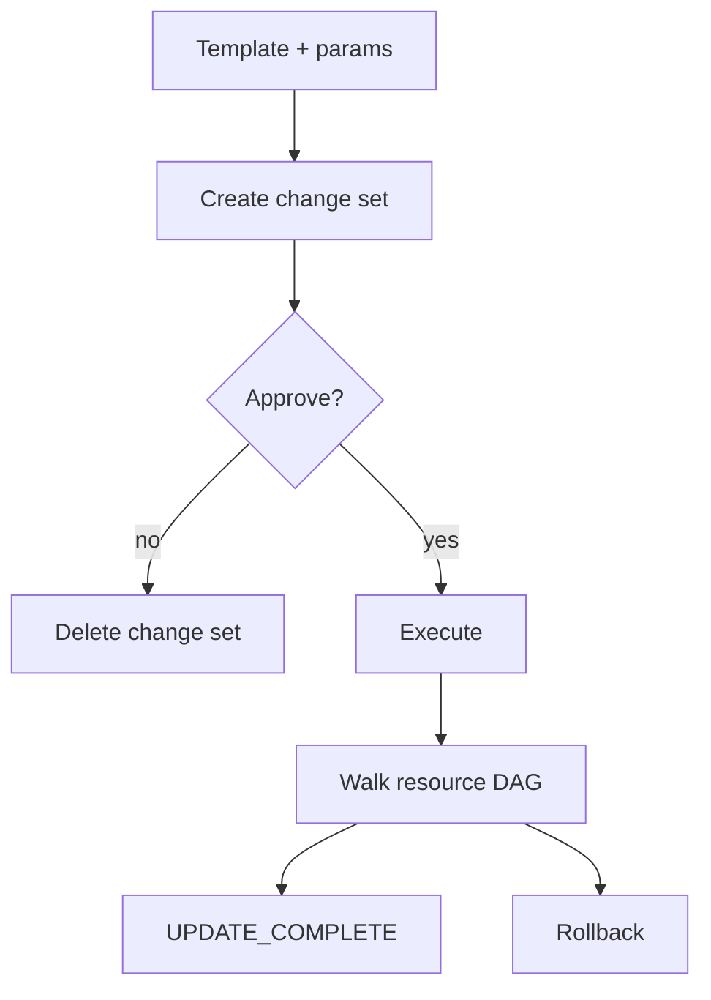

import { ConceptTemplate } from '@/features/kb/components/templates/ConceptTemplate'
import { Callout } from '@/features/kb/components/mdx/Callout'
import { ComparisonTable } from '@/features/kb/components/mdx/ComparisonTable'

export default function Layout({ children }) {
  return (
    <ConceptTemplate title="AWS CloudFormation">
      {children}
    </ConceptTemplate>
  )
}

**AWS CloudFormation** is the in-account orchestrator for AWS resources. A **stack** is a named set of resources defined by a template. Create, update, and delete are server-side workflows with events, rollbacks, and (on many resource types) drift detection. You do not keep a tfstate file; AWS does.

## 1. Deep Dive and Mechanics

**Template anatomy.** `Parameters`, `Mappings`, `Conditions`, `Resources`, `Outputs`. Intrinsic functions (`Ref`, `GetAtt`, `Sub`, `If`) resolve during stack operations. `DependsOn` is explicit; most edges come from `Ref` / `GetAtt`.

**Change sets.** A change set is a plan you can review before execute. Pipelines should create a change set, wait for approval, then execute that exact set — same idea as `terraform plan -out`.

**Rollback.** Failed creates delete new resources (unless you disable rollback). Failed updates attempt to restore the previous template. That is the feature Terraform users cite when they stay on CFN for databases.

**Nested stacks and StackSets.** Nested stacks split templates under a parent. StackSets push the same template to many accounts/regions — landing-zone territory.

**Drift.** `DetectStackDrift` compares live properties to the last template. Out-of-band console edits show as DRIFTED. Not every property on every type is covered.

<Callout icon="tip" title="CDK and SAM still land here">
AWS CDK, SAM, and many Service Catalog products synthesize CloudFormation. Debugging `UPDATE_ROLLBACK_FAILED` is a CFN skill even if you never write YAML by hand.
</Callout>

## 2. Mathematical / Theoretical Foundation

CloudFormation is a **hosted desired-state machine**. The template is D. The stack resource list is the service’s state. Update computes a resource-level delta and walks a DAG. Rollback is the inverse walk with previous property bags.

Stack resource limits (historically 500, later raised) force modularity. Exports (`Fn::Export`) are global-ish names per region — a coupling mechanism that makes deletes painful if an importer still exists.

<ComparisonTable
  headers={['Topic', 'CloudFormation', 'Terraform']}
  rows={[
    ['Scope', 'AWS (plus a few custom resources)', 'Any provider'],
    ['State', 'AWS-managed stack', 'You run a backend'],
    ['Rollback', 'Native on failure', 'No automatic undo of a half-apply'],
    ['Plan artifact', 'Change set', 'Saved plan file'],
  ]}
/>

## 3. Real-World Implementation

```yaml
AWSTemplateFormatVersion: "2010-09-09"
Description: Encrypted SQS queue for job workers
Parameters:
  QueueName:
    Type: String
Resources:
  JobsQueue:
    Type: AWS::SQS::Queue
    Properties:
      QueueName: !Ref QueueName
      KmsMasterKeyId: alias/aws/sqs
      VisibilityTimeout: 60
Outputs:
  QueueUrl:
    Value: !Ref JobsQueue
    Export:
      Name: !Sub "${AWS::StackName}-QueueUrl"
```

```bash
aws cloudformation deploy \
  --stack-name jobs-dev \
  --template-file queue.yaml \
  --parameter-overrides QueueName=jobs-dev
```

`deploy` is a wrapper that creates or executes a change set. The export name is unique per region.

## 4. Visualizations



## 5. Interview Prep

**Q: Stack vs change set vs StackSet?**
**A:** A stack is the live grouping. A change set is a proposed update to one stack. A StackSet is a multiplier that creates stack instances across accounts and regions.

**Q: What is UPDATE_ROLLBACK_FAILED?**
**A:** Rollback itself failed (resource hung, permission missing). You must fix the resource or skip it with `continue-update-rollback`, then get the stack writable again. Interviewers love this because it is a real 3 a.m. state.

**Q: Custom resources vs Terraform provider?**
**A:** A custom resource is a Lambda that CFN invokes for Create/Update/Delete. Use it for gaps in CFN types. If you need many non-AWS APIs, Terraform or Pulumi is less painful than a fleet of custom resources.

## 6. Production Use Cases

- **Account baselines** via StackSets: guardrails, CloudTrail, and config recorders in every spoke account.
- **Service teams** that want in-account apply with IAM roles and no state bucket to share.
- **Marketplace and GuardDuty-style** products that ship a “launch stack” button.

<Callout icon="warning" title="Exports are sticky">
You cannot delete a stack while another stack imports its export. Cross-stack refs via SSM parameters or a well-known S3 object are easier to disentangle than a web of export names.
</Callout>
