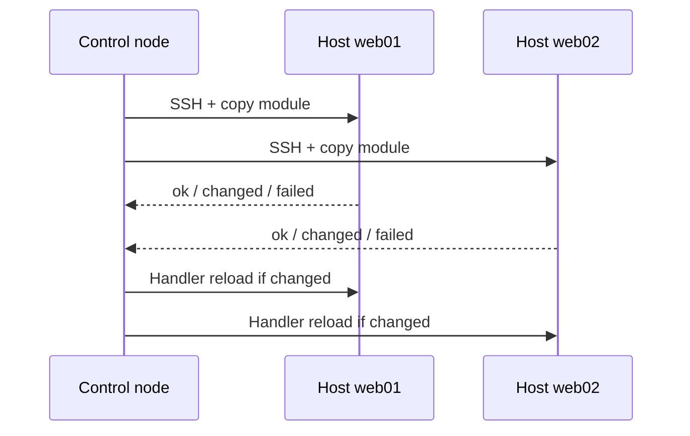

import { ConceptTemplate } from '@/features/kb/components/templates/ConceptTemplate'
import { Callout } from '@/features/kb/components/mdx/Callout'
import { ComparisonTable } from '@/features/kb/components/mdx/ComparisonTable'

export default function Layout({ children }) {
  return (
    <ConceptTemplate title="Ansible">
      {children}
    </ConceptTemplate>
  )
}

**Ansible** (Red Hat) is a push-based automation engine. You list hosts in an inventory and describe tasks in YAML playbooks. The control node opens SSH (or WinRM), copies small Python modules, and converges packages, files, services, and cloud extras. It is not a replacement for Terraform: Terraform creates the VM; Ansible paints the guest.

## 1. Deep Dive and Mechanics

**Agentless.** There is no long-lived daemon on the target. That removes cert rotation and another listening port, at the cost of needing reachable SSH and a Python interpreter on Linux hosts.

**Inventory plus play.** Inventory can be INI, YAML, or a dynamic script (AWS EC2 plugin, Kubernetes). A play maps a host pattern to a list of tasks. Each task names a module (`apt`, `copy`, `systemd`, `amazon.aws.ec2_instance`) and arguments. Handlers fire only when a task reports changed (typical pattern: restart nginx after a config copy).

**Idempotence is module-defined.** A well-written module checks current state before mutating. A raw `command` or `shell` task is not idempotent unless you add `creates` or a `changed_when` expression.

**Execution model.** Plays run host-by-host with a fork count. Strategies (`linear`, `free`) trade predictability for speed. Facts (gathered OS data) feed conditionals such as `when: ansible_os_family == "Debian"`.

<Callout icon="info" title="Control node is the blast radius">
SSH keys, vault passwords, and inventory live on the controller. Treat that machine like a CI runner: no shared laptops, short-lived credentials, and Ansible Vault or a secret manager for `group_vars`.
</Callout>

## 2. Mathematical / Theoretical Foundation

Ansible is **desired-state over an unordered-looking list**. Tasks are sequential per host, so you still encode a total order. Convergence is not a global SAT solve: if task 3 fails, later tasks never run unless you set `ignore_errors` or blocks with rescue.

Compared with Puppet catalogs, Ansible is closer to a scripted fold: state_n+1 = module(state_n, args). Drift correction happens only when you run the play again. There is no 30-minute pull loop unless you add cron or Event-Driven Ansible.

<ComparisonTable
  headers={['Tool', 'Transport', 'Default model', 'Sweet spot']}
  rows={[
    ['Ansible', 'SSH / WinRM push', 'Playbook tasks', 'Config, app deploy, one-shot orchestration'],
    ['Terraform', 'Provider APIs', 'Graph + state', 'Provisioning cloud objects'],
    ['Puppet', 'Agent pull', 'Compiled catalog', 'Long-lived fleets with continuous enforce'],
  ]}
/>

## 3. Real-World Implementation

```yaml
# inventory/prod.yml
all:
  children:
    web:
      hosts:
        web01.internal:
        web02.internal:

# site.yml
- name: Converge web tier
  hosts: web
  become: true
  vars:
    nginx_worker_connections: 2048
  tasks:
    - name: Install nginx
      ansible.builtin.apt:
        name: nginx
        state: present
        update_cache: true

    - name: Write nginx config
      ansible.builtin.template:
        src: nginx.conf.j2
        dest: /etc/nginx/nginx.conf
        mode: "0644"
      notify: Reload nginx

  handlers:
    - name: Reload nginx
      ansible.builtin.systemd:
        name: nginx
        state: reloaded
```

Run with `ansible-playbook -i inventory/prod.yml site.yml`. The template task notifies the handler only when the rendered file changes.

## 4. Visualizations



## 5. Interview Prep

**Q: Why is Ansible called agentless if it still needs Python on the box?**
**A:** There is no Ansible daemon or incoming control port. Python is a runtime for the modules that SSH drops in `/tmp` and removes. Windows uses PowerShell over WinRM instead.

**Q: When do you still pick Puppet or Salt over Ansible?**
**A:** Thousands of long-lived hosts that must self-heal every 30 minutes without a central push, or when you already have a catalog/module estate. Ansible wins for simplicity and orchestration.

**Q: How do you keep secrets out of git?**
**A:** Ansible Vault for files, or lookup plugins against AWS Secrets Manager / HashiCorp Vault. Never commit plaintext `group_vars` passwords.

## 6. Production Use Cases

- **Day-2 on VMs:** patching, user accounts, sshd hardening after Terraform or an image bake.
- **App rollout:** pull an artifact, render unit files, flip a systemd service, then hit a load-balancer health check.
- **Network and SaaS:** many collections talk to switches, Palo Alto, and ServiceNow without a second DSL.

<Callout icon="tip" title="Pair with Terraform, do not duplicate it">
Let Terraform own VPCs and instance IDs. Export those IDs as inventory (dynamic inventory or a generated YAML file) and let Ansible own packages and files. Two sources of truth for the same SG rule will fight.
</Callout>
