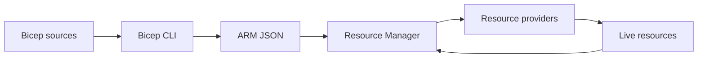

import { ConceptTemplate } from '@/features/kb/components/templates/ConceptTemplate'
import { Callout } from '@/features/kb/components/mdx/Callout'
import { ComparisonTable } from '@/features/kb/components/mdx/ComparisonTable'

export default function Layout({ children }) {
  return (
    <ConceptTemplate title="Bicep">
      {children}
    </ConceptTemplate>
  )
}

**Bicep** is a typed, declarative language that compiles 1:1 to Azure Resource Manager templates. Azure never executes Bicep on the control plane. The CLI or a pipeline runs `az bicep build` (or `what-if` / `create` which compile first), then submits ARM JSON. You get day-zero Azure API coverage without writing the JSON by hand.

## 1. Deep Dive and Mechanics

**Transpile, do not interpret.** Bicep modules, loops (`for`), and conditions become ARM `copy` and nested templates. Symbolic names (`vnet.id`) become ARM resourceId expressions. There is no Bicep runtime in the region.

**Scopes.** A file targets a resource group, subscription, management group, or tenant. `targetScope` must match how you deploy. Landing-zone code often uses subscription scope for role assignments and RG creation.

**Modules.** A module is another Bicep file deployed as a nested deployment. Outputs flow back as typed values. This is how you split network vs app without one 4,000-line file.

**What-if.** `az deployment group what-if` asks ARM to compute the delta against live Azure. It is the analogue of `terraform plan`, but the engine is server-side.

<Callout icon="tip" title="Prefer Bicep over hand-written ARM">
Microsoft treats Bicep as the authoring format. New samples and VS Code tooling land there first. Keep compiled JSON out of git unless a reviewer cannot install the Bicep CLI.
</Callout>

## 2. Mathematical / Theoretical Foundation

Bicep is a **source-to-source compiler** into a restricted JSON language. The interesting theory sits in ARM: a desired resource graph, dependency edges from `dependsOn` and implicit references, and an idempotent PUT model (ARM is create-or-update on most resource types).

Completeness vs Terraform-on-Azure: Bicep’s types come from Azure’s resource provider schemas, so a new Microsoft.Foo type is available as soon as the RP ships. A Terraform provider must implement the Go resource. That is a coverage argument, not a multi-cloud argument.

<ComparisonTable
  headers={['Format', 'Who authors', 'Who applies', 'Azure API lag']}
  rows={[
    ['Bicep', 'Humans', 'ARM after compile', 'Day zero'],
    ['ARM JSON', 'Humans or Bicep', 'ARM', 'Day zero'],
    ['Terraform azurerm', 'Humans', 'Terraform CLI', 'Provider release cycle'],
  ]}
/>

## 3. Real-World Implementation

```hcl
// storage.bicep — Bicep syntax (not HCL, but closest fenced language)
targetScope = 'resourceGroup'

param location string = resourceGroup().location
param namePrefix string

resource stg 'Microsoft.Storage/storageAccounts@2023-01-01' = {
  name: '${namePrefix}st${uniqueString(resourceGroup().id)}'
  location: location
  sku: {
    name: 'Standard_LRS'
  }
  kind: 'StorageV2'
  properties: {
    minimumTlsVersion: 'TLS1_2'
    allowBlobPublicAccess: false
  }
}

output storageId string = stg.id
```

Deploy with `az deployment group create --resource-group rg-app --template-file storage.bicep --parameters namePrefix=acme`. The compiled JSON is what ARM stores on the deployment object.

## 4. Visualizations



## 5. Interview Prep

**Q: Does Azure “understand Bicep”?**
**A:** No. The control plane stores and executes ARM templates. Bicep is a local (or pipeline) compile step, similar to TypeScript emitting JavaScript.

**Q: Why would a team still use Terraform on Azure?**
**A:** Multi-cloud, existing module libraries, or state/policy workflows already built around Terraform Cloud / OpenTofu. For Azure-only greenfield, Bicep plus what-if is the native path.

**Q: How do you share a vnet ID across repos?**
**A:** Module outputs, a subscription-level deployment that writes IDs to a deployment script or Key Vault, or `existing` resource lookups by name. Avoid hardcoding GUIDs.

## 6. Production Use Cases

- **App resource groups:** storage, Key Vault, App Service, and RBAC in one module called per environment.
- **Platform landing zones:** management-group policy assignments and subscription vending at `targetScope` subscription or managementGroup.
- **Portal parity:** export a working resource from the portal as ARM, decompile to Bicep, then clean types and parameters.

<Callout icon="warning" title="uniqueString is sticky">
Names that include `uniqueString(resourceGroup().id)` cannot be moved to another RG without a replace. Decide naming once; storage account names are globally unique and painful to rename.
</Callout>
