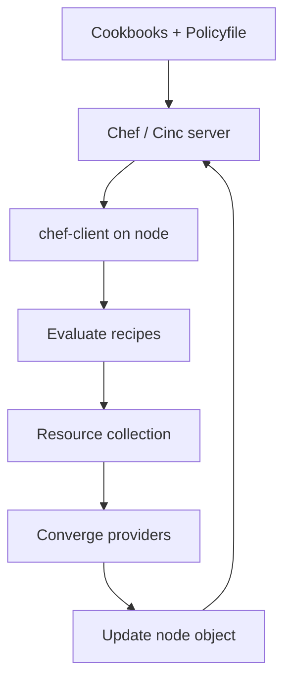

import { ConceptTemplate } from '@/features/kb/components/templates/ConceptTemplate'
import { Callout } from '@/features/kb/components/mdx/Callout'
import { ComparisonTable } from '@/features/kb/components/mdx/ComparisonTable'

export default function Layout({ children }) {
  return (
    <ConceptTemplate title="Chef">
      {children}
    </ConceptTemplate>
  )
}

**Chef** made infrastructure a Ruby problem. You write **recipes** grouped into **cookbooks**. A Chef Infra Client on each node pulls a run list from Chef Infra Server (or a local policy), evaluates the Ruby, and converges resources (`package`, `template`, `service`). Progress, Cinc, and Policyfiles are the modern names you will see after the Chef/Progress licensing era.

## 1. Deep Dive and Mechanics

**Chef Server vs Solo.** Server mode: nodes check in, get a run list and encrypted data bag items, upload a node object. Solo / Zero / `cinc-client` with Policyfiles can run from a tarball — closer to “apply this graph” without a central server.

**Resources and providers.** Recipes look imperative (`package 'nginx' do action :install end`) but each resource is supposed to be idempotent. The provider does the OS-specific work. Custom resources (formerly LWRPs) wrap multi-step patterns.

**Search and data bags.** The server indexes node attributes. Recipes can `search(:node, "role:web")` to build upstream lists. That is powerful and a testing nightmare: unit tests must stub search.

**Why teams left.** Immutable images and Kubernetes removed the need to babysit 10-year-old pets. Ruby DSLs are harder to staff than YAML. Chef is still correct for large VM estates that already have a supermarket of cookbooks.

<Callout icon="info" title="Cinc is the community line">
Cinc Client and Cinc Server are the free rebuilds of Chef Infra. If a job description says Chef but the license budget is zero, Cinc is the compatible path.
</Callout>

## 2. Mathematical / Theoretical Foundation

A Chef run is **ordered evaluation of a resource collection**. Recipes execute Ruby top to bottom, inserting resources into a collection; the client then converges that collection. Notifications (`notifies :restart`) add edges. It is not a globally optimized catalog in the Puppet sense — compile and converge are closer together, and Ruby side effects during compile are a classic foot-gun.

Idempotence is cultural. A `execute` resource without a `not_if` guard is a script.

<ComparisonTable
  headers={['Aspect', 'Chef', 'Puppet', 'Ansible']}
  rows={[
    ['Language', 'Ruby recipes', 'Puppet DSL', 'YAML'],
    ['Default topology', 'Client + server', 'Agent + primary', 'Push from controller'],
    ['Testing story', 'ChefSpec + Test Kitchen', 'rspec-puppet', 'Molecule'],
  ]}
/>

## 3. Real-World Implementation

```python
# cookbooks/web/recipes/default.rb  (Ruby; python fence unused)
# package 'nginx' do
#   action :install
# end
#
# template '/etc/nginx/nginx.conf' do
#   source 'nginx.conf.erb'
#   notifies :reload, 'service[nginx]', :delayed
# end
#
# service 'nginx' do
#   action [:enable, :start]
# end
```

```yaml
# Policyfile.lock.json excerpt (conceptual)
name: web
run_list:
  - recipe[web::default]
default_attributes:
  nginx:
    worker_connections: 2048
```

`cinc-client` or `chef-client` applies the run list. The template resource checksums the rendered file and only notifies reload on change.

## 4. Visualizations



## 5. Interview Prep

**Q: Recipe vs cookbook vs role vs Policyfile?**
**A:** A recipe is one Ruby file of resources. A cookbook is the package (recipes, templates, attributes). Roles were the old run-list assembler. Policyfiles pin cookbook versions and attributes per policy group — prefer them over roles.

**Q: Why is `search` in a recipe risky?**
**A:** It couples converge to live index data. Empty search at scale (index lag) can remove upstreams from a config and outage you. Prefer explicit attributes or Consul/DNS.

**Q: Chef vs Terraform?**
**A:** Terraform creates the instance and the security group. Chef configures the guest after boot (or, better, you bake an image with Packer + Chef then never Chef again). Do not model AWS VPCs as Chef resources in 2026.

## 6. Production Use Cases

- **Enterprise VM baselines** with hundreds of existing cookbooks (Windows especially, where Chef still has depth).
- **Compliance:** InSpec (same family) for audits, Chef for remediation on the same nodes.
- **Image pipelines:** Test Kitchen + Chef to bake AMIs, then throw away the agent in production.

<Callout icon="tip" title="Guard every execute">
If you must shell out, set `not_if` or `only_if` to a cheap test. Unguarded `execute` is why Chef runs are not boring — and boring is the goal.
</Callout>
