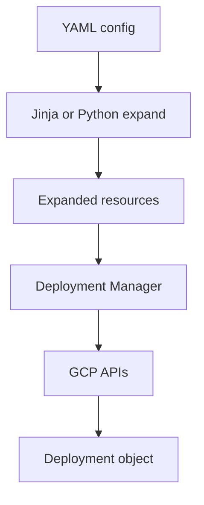

import { ConceptTemplate } from '@/features/kb/components/templates/ConceptTemplate'
import { Callout } from '@/features/kb/components/mdx/Callout'
import { ComparisonTable } from '@/features/kb/components/mdx/ComparisonTable'

export default function Layout({ children }) {
  return (
    <ConceptTemplate title="Google Deployment Manager">
      {children}
    </ConceptTemplate>
  )
}

**Google Deployment Manager** is GCP’s native “upload a config, get a deployment object” service. A deployment names a set of resources. DM expands templates, calls Google APIs, and tracks those resources as one unit you can update or tear down. Google has since invested far more in the Terraform Google provider and in Config Connector / Infrastructure Manager; DM remains in production estates that started early.

## 1. Deep Dive and Mechanics

**Config plus templates.** The top-level file is YAML listing resources and template imports. Logic lives in Jinja or Python templates that print resource fragments. DM runs that expansion in the service, then applies.

**Deployment as a unit.** `gcloud deployment-manager deployments create` registers the graph. Updates compute a patch. Delete removes every resource DM created — including ones you would rather keep if you were sloppy about what you put in the config.

**IAM and APIs.** The Deployment Manager service account must hold the IAM roles the resources need. Missing `deploymentmanager.googleapis.com` or a disabled API shows up as opaque 403s.

**Industry shift.** Google’s own samples and many landing-zone modules are Terraform-first. Infrastructure Manager is Google’s hosted Terraform/OpenTofu-style runner. Treat new DM as a compatibility choice, not a greenfield default.

<Callout icon="info" title="DM is GCP-only">
There is no Azure resource type. If the same repo must create a Cloud SQL instance and a Cloudflare record, you want Terraform, Pulumi, or two pipelines.
</Callout>

## 2. Mathematical / Theoretical Foundation

DM is **template expansion then reconciliation**. Python/Jinja is a generator: it is not the source of truth after expansion. The expanded YAML is. That is the same split as Helm (templates → manifest) or CDK (code → CloudFormation).

Resource identity is type + name inside the deployment. Rename in the template and DM may delete and recreate. There is no portable state file you copy to another cloud.

<ComparisonTable
  headers={['GCP IaC path', 'Authoring', 'Runner', 'Google’s current emphasis']}
  rows={[
    ['Deployment Manager', 'YAML + Jinja/Python', 'DM service', 'Maintenance'],
    ['Terraform google provider', 'HCL', 'Your CLI or CI', 'Primary docs and modules'],
    ['Infrastructure Manager', 'HCL / Terraform', 'Hosted on GCP', 'Managed Terraform'],
  ]}
/>

## 3. Real-World Implementation

```yaml
# vm.yaml
resources:
  - name: demo-vm
    type: compute.v1.instance
    properties:
      zone: us-central1-a
      machineType: zones/us-central1-a/machineTypes/e2-micro
      disks:
        - boot: true
          autoDelete: true
          initializeParams:
            sourceImage: projects/debian-cloud/global/images/family/debian-12
      networkInterfaces:
        - network: global/networks/default
          accessConfigs:
            - name: external-nat
              type: ONE_TO_ONE_NAT
```

```bash
gcloud deployment-manager deployments create demo \
  --config vm.yaml
gcloud deployment-manager deployments describe demo
```

The describe output is DM’s record of what it believes it owns.

## 4. Visualizations



## 5. Interview Prep

**Q: Should a new GCP-only team start on Deployment Manager?**
**A:** Usually no. Use Terraform or Infrastructure Manager unless you are extending an existing DM graph you cannot afford to rewrite this quarter.

**Q: Why did Google keep writing Terraform providers if DM exists?**
**A:** Customers standardized on HCL. A first-party provider with fast resource coverage beats pushing a GCP-only DSL.

**Q: What is the failure mode of putting a production disk in a DM deployment?**
**A:** `deployments delete` can wipe the disk. Split data resources into a longer-lived deployment or manage them outside DM.

## 6. Production Use Cases

- **Legacy GCP orgs** with years of DM YAML and IAM already pointed at the DM service account.
- **Simple one-off labs** where installing Terraform is more ceremony than a 40-line YAML.
- **Migration projects** that export DM resources and import them into Terraform state, then freeze DM.

<Callout icon="tip" title="Inventory before you migrate">
`gcloud deployment-manager deployments list` plus each manifest is the map of what DM will fight you for. Import those resources into Terraform, then delete the DM deployment with `--delete-policy abandon` so GCP objects survive.
</Callout>
