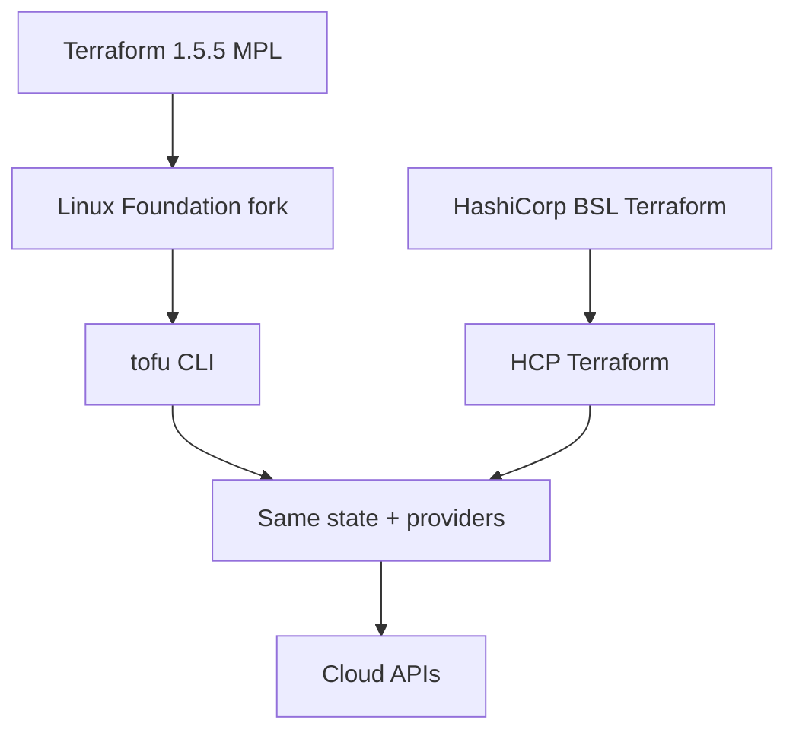

import { ConceptTemplate } from '@/features/kb/components/templates/ConceptTemplate'
import { Callout } from '@/features/kb/components/mdx/Callout'
import { ComparisonTable } from '@/features/kb/components/mdx/ComparisonTable'

export default function Layout({ children }) {
  return (
    <ConceptTemplate title="OpenTofu">
      {children}
    </ConceptTemplate>
  )
}

**OpenTofu** is a community-driven fork of the last MPL-licensed Terraform. The binary is `tofu`. HCL modules, providers from the public registry, and existing `terraform.tfstate` files generally work. The project exists because HashiCorp moved Terraform to the Business Source License in 2023, which blocks competitors from offering Terraform-as-a-service.

## 1. Deep Dive and Mechanics

**Drop-in workflow.** `tofu init`, `tofu plan`, `tofu apply` are the same state machine: providers, graph, backend, lock. Most CI images can swap the binary and keep the same `-chdir` and `-var-file` flags.

**Registry and providers.** OpenTofu can install providers from registry.opentofu.org and, with configuration, from the HashiCorp registry. Provider protocol compatibility is the real compatibility story — not the CLI name.

**Where they diverge.** Post-fork features land on different schedules: some state encryption, early variable evaluation, and community PRs appear in OpenTofu first. Terraform Cloud / HCP Terraform features (Sentinel, run tasks) stay on the HashiCorp side unless you use an alternative (Spacelift, env0, Terrateam).

**State migration.** Moving CLI-only state is usually “point the same backend at `tofu`.” Moving off HCP Terraform is a product migration, not a binary rename.

<Callout icon="warning" title="Pin which binary CI runs">
A laptop on Terraform 1.9 and a pipeline on OpenTofu 1.8 can emit state that the other refuses. Pick one engine per root module and record it in `.terraform-version` or a mise/asdf tool file — plus the tofu equivalent.
</Callout>

## 2. Mathematical / Theoretical Foundation

Fork compatibility is a **protocol and file-format** problem. State JSON version, provider protocol, and HCL grammar must stay in lockstep for a drop-in claim to hold. Each project that extends state (encryption, new resource identity) risks a one-way door.

Licensing is not math, but it is the constraint: BSL forbids offering the software as a competing hosted service. OpenTofu’s MPL (and Linux Foundation governance) is why Atlantis-like hosts can keep a fully open engine.

<ComparisonTable
  headers={['Item', 'Terraform (HashiCorp)', 'OpenTofu']}
  rows={[
    ['License', 'BSL for the CLI', 'MPL under LF'],
    ['CLI name', 'terraform', 'tofu'],
    ['HCL modules', 'Yes', 'Yes, with version skew risk'],
    ['HCP / Sentinel', 'First-party', 'Use third-party runners'],
  ]}
/>

## 3. Real-World Implementation

```bash
# Install OpenTofu, then reuse an existing root module
tofu version
tofu init
tofu plan -out=tfplan
tofu apply tfplan
```

```hcl
terraform {
  required_version = ">= 1.6.0"
  required_providers {
    aws = {
      source  = "hashicorp/aws"
      version = "~> 5.0"
    }
  }
}
```

The `terraform` block name is still `terraform` in HCL — OpenTofu reads it. Only the binary name changes.

## 4. Visualizations



## 5. Interview Prep

**Q: Is OpenTofu a new language?**
**A:** No. It is a competing implementation of the Terraform workflow. You rewrite process and license, not every module.

**Q: Can we mix Terraform apply and tofu apply on one state?**
**A:** Do not. State format can drift. Choose one CLI per state file.

**Q: Why would a company stay on HashiCorp Terraform?**
**A:** HCP Terraform, official support contracts, Sentinel, and a desire to track HashiCorp’s feature line. Why they leave: BSL, cost, or a requirement that the engine stay OSI-approved.

## 6. Production Use Cases

- **In-house platforms** that wrap the CLI and cannot accept BSL for a hosted runner.
- **Public-sector and OSS shops** with a hard open-source mandate.
- **Gradual exits from HCP** where modules stay HCL and only the runner and binary change.

<Callout icon="tip" title="Test a clone of state first">
Copy the backend key to a throwaway prefix, run `tofu init` + plan, and diff against a Terraform plan from the same commit. Only cut DNS (the backend key) when the two plans match.
</Callout>
