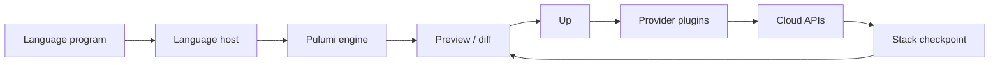

import { ConceptTemplate } from '@/features/kb/components/templates/ConceptTemplate'
import { Callout } from '@/features/kb/components/mdx/Callout'
import { ComparisonTable } from '@/features/kb/components/mdx/ComparisonTable'

export default function Layout({ children }) {
  return (
    <ConceptTemplate title="Pulumi">
      {children}
    </ConceptTemplate>
  )
}

**Pulumi** lets you provision cloud objects with a general-purpose language instead of HCL or YAML. Your program runs once to *register* resources. The engine then diffs that registration graph against the stack’s checkpoint and talks to provider plugins — the same class of CRUD plugins Terraform popularized. The language is imperative; the apply is still declarative.

## 1. Deep Dive and Mechanics

**Two processes.** The language host (Node, Python, Go, or .NET) executes your program. Each `new aws.s3.Bucket(...)` call sends an object to the Pulumi engine over gRPC. The engine does not re-run your loops during apply; it applies the already-built graph.

**Stacks.** A stack is an isolated state file plus config (dev vs prod). `pulumi up` previews, then mutates. Secrets in config are encrypted with a stack key (Pulumi Cloud or a self-managed KMS).

**Providers and packages.** Classic providers wrap the same schema Terraform providers expose (bridged). Native providers (especially Azure Native, AWS Native) track the cloud’s OpenAPI more closely. Component resources are classes that expand into several child resources — your own L3 constructs.

**Not CloudFormation.** Pulumi calls cloud APIs directly. That is the same operational model as Terraform, not a synth-to-YAML pipeline like AWS CDK.

<Callout icon="info" title="Preview is not a unit test">
`pulumi preview` still needs credentials and often live reads. Put policy and type checks in CI, and use `pulumi test` / `unittest.mock` for the logic that decides how many buckets to register.
</Callout>

## 2. Mathematical / Theoretical Foundation

Pulumi separates **program evaluation** from **graph reconciliation**. Evaluation is ordinary control flow: loops, imports, and conditionals produce a finite set of resource URNs. Reconciliation is the same desired-vs-actual delta as other IaC engines.

A URN is a stable identity: stack + type + name. Rename a logical name and the engine treats it as destroy-plus-create unless you use an alias. That is why names in code are part of the public API of a stack.

<ComparisonTable
  headers={['Tool', 'Authoring', 'Apply engine', 'Cloud scope']}
  rows={[
    ['Pulumi', 'TS / Python / Go / C#', 'Pulumi engine + providers', 'Multi-cloud'],
    ['Terraform', 'HCL', 'Terraform core + providers', 'Multi-cloud'],
    ['AWS CDK', 'TS / Python / Java / C# / Go', 'CloudFormation stacks', 'AWS first'],
  ]}
/>

## 3. Real-World Implementation

```python
import pulumi
import pulumi_aws as aws

config = pulumi.Config()
env = config.require("env")

bucket = aws.s3.Bucket(
    "artifacts",
    versioning=aws.s3.BucketVersioningArgs(enabled=True),
    server_side_encryption_configuration=aws.s3.BucketServerSideEncryptionConfigurationArgs(
        rule=aws.s3.BucketServerSideEncryptionConfigurationRuleArgs(
            apply_server_side_encryption_by_default=aws.s3.BucketServerSideEncryptionConfigurationRuleApplyServerSideEncryptionByDefaultArgs(
                sse_algorithm="AES256",
            )
        )
    ),
    tags={"Environment": env},
)

pulumi.export("bucket_name", bucket.id)
```

`pulumi config set env prod` then `pulumi up` creates one encrypted, versioned bucket and prints the name as a stack output.

## 4. Visualizations



## 5. Interview Prep

**Q: If Pulumi is “just Python,” why can I not create resources inside a request handler at runtime?**
**A:** The program is a constructor for a graph, not a long-running controller. Apply happens in CLI/CI. Putting `pulumi up` on the request path would contend on stack locks and is not the product model.

**Q: Pulumi vs CDK?**
**A:** Both give you real languages. CDK synthesizes CloudFormation and inherits stack limits, drift, and rollback. Pulumi is multi-cloud and applies through providers. Choose CDK when you want AWS-native stack operations; choose Pulumi when you want one program across AWS, Azure, and k8s.

**Q: How do you share a VPC ID with another stack?**
**A:** `StackReference` reads the other stack’s exports, or you store IDs in SSM / a data source. Do not bake account-specific IDs into the library.

## 6. Production Use Cases

- **Platform libraries:** an internal Python package that returns a “private S3 bucket” component every product team imports.
- **Kubernetes plus cloud:** one program creates an EKS cluster and then Kubernetes Deployments with the same `pulumi up`.
- **Policy packs:** OPA-style or Pulumi CrossGuard checks blocking public buckets before up proceeds.

<Callout icon="tip" title="Pin provider versions">
Language lockfiles are not enough. Pin `pulumi-aws` (and the underlying plugin) in CI. Provider minors change ForceNew attributes and will replace databases if you float.
</Callout>
