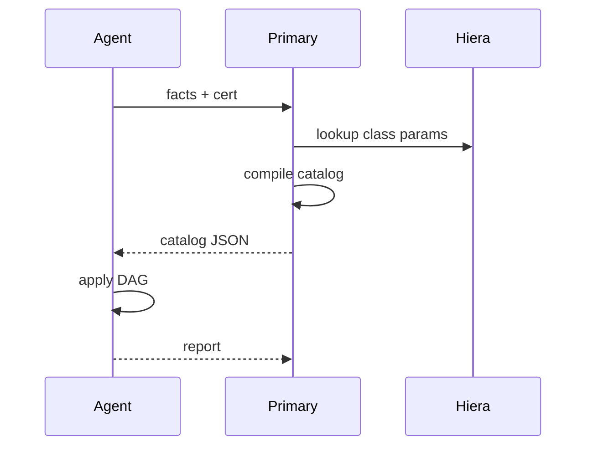

import { ConceptTemplate } from '@/features/kb/components/templates/ConceptTemplate'
import { Callout } from '@/features/kb/components/mdx/Callout'
import { ComparisonTable } from '@/features/kb/components/mdx/ComparisonTable'

export default function Layout({ children }) {
  return (
    <ConceptTemplate title="Puppet">
      {children}
    </ConceptTemplate>
  )
}

**Puppet** defined fleet configuration for a decade of pre-container servers. You declare resources (`package`, `file`, `service`, `user`) in a DSL. The compiler turns that into a catalog — a JSON graph of desired resources. The agent applies the catalog and reports. The model is pull: agents phone the primary (master) on a timer, typically 30 minutes.

## 1. Deep Dive and Mechanics

**Catalog compile.** Classification (roles/profiles, Hiera data, facts) selects which classes a node gets. The compiler on the primary (or a compiler pool) evaluates the DSL, resolves Hiera, and emits a catalog. Agents do not compile production catalogs in the classic architecture.

**Providers under types.** A `package` type has yum, apt, chocolatey providers. You write `ensure => installed`; Puppet picks the OS-specific commands. That abstraction was the original pitch versus shell scripts.

**Reporting and drift.** Each run is a report: unchanged, changed, failed. If a human deletes a user that the catalog requires, the next agent run recreates it. That is continuous enforcement, not a one-shot playbook.

**Puppet 7/8 and Bolt.** Modern Puppet still sells the model for regulated fleets. Bolt adds agentless task/plan push for the Ansible-shaped jobs. Many shops are frozen on Open Source Puppet 7 after Perforce licensing changes — treat version and license as a project risk.

<Callout icon="info" title="Roles and profiles">
The common pattern: profiles compose technical resources (nginx profile), roles compose profiles (web_role). Nodes include one role. That keeps the site.pp graph readable and testable with rspec-puppet.
</Callout>

## 2. Mathematical / Theoretical Foundation

Puppet compiles a **desired catalog** — a DAG of resources with before/require/notify/subscribe edges. Apply is a walk of that DAG. Idempotence is the type/provider contract: evaluating the same catalog twice should be a no-op if the machine did not drift.

Hiera is hierarchical data lookup: more specific layers (node, environment, datacenter) override defaults. That is a simple priority merge, not a constraint solver.

<ComparisonTable
  headers={['Tool', 'Agent', 'Authored as', 'Enforcement']}
  rows={[
    ['Puppet', 'Usually yes', 'DSL + Hiera', 'Periodic pull'],
    ['Chef', 'Yes', 'Ruby recipes', 'Periodic pull'],
    ['Ansible', 'No', 'YAML plays', 'When you push'],
  ]}
/>

## 3. Real-World Implementation

```python
# nginx.pp — Puppet DSL shown in a python fence only as a stand-in;
# production files use the .pp extension and Puppet parser.

# package { 'nginx':
#   ensure => installed,
# }
# file { '/etc/nginx/nginx.conf':
#   ensure  => file,
#   content => template('nginx/nginx.conf.erb'),
#   require => Package['nginx'],
#   notify  => Service['nginx'],
# }
# service { 'nginx':
#   ensure => running,
#   enable => true,
# }
```

```yaml
# hiera.yaml (hierarchy sketch)
version: 5
defaults:
  datadir: data
  data_hash: yaml_data
hierarchy:
  - name: "Per-node"
    path: "nodes/%{trusted.certname}.yaml"
  - name: "Common"
    path: "common.yaml"
```

The agent’s next run compiles (on the primary) with facts and Hiera, then converges package, file, and service in dependency order.

## 4. Visualizations



## 5. Interview Prep

**Q: Why is Puppet called declarative if the DSL has conditionals?**
**A:** Conditionals run at compile time to choose which resources enter the catalog. The catalog itself is a set of desired resources, not a shell script the agent interprets line by line.

**Q: Agent vs Ansible for a 200-host bank?**
**A:** Puppet (or similar pull CM) if hosts must self-heal when the network to CI is down and auditors want continuous enforce. Ansible if you already rebuild from images and only need occasional push.

**Q: What is rspec-puppet for?**
**A:** Compile-time tests: given facts and Hiera, assert the catalog contains a file with a given mode. They do not boot a VM unless you add acceptance tests (Beaker, Litmus).

## 6. Production Use Cases

- **Regulated Unix fleets** that cannot go fully immutable this year: sshd, auditd, users, and STIGs enforced every half hour.
- **Mixed OS estates** where one `package` type covers RHEL and Windows via providers.
- **Brownfield** where Puppet has classified 5,000 nodes and a rewrite would take longer than the remaining life of the VMs.

<Callout icon="warning" title="Compiler load is a capacity plan">
A thundering herd after a primary outage will stampede compile. Scale compilers, use environment caching, and avoid expensive functions in hot classes.
</Callout>
