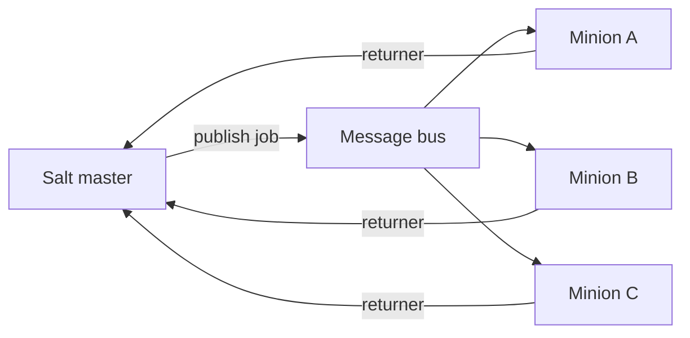

import { ConceptTemplate } from '@/features/kb/components/templates/ConceptTemplate'
import { Callout } from '@/features/kb/components/mdx/Callout'
import { ComparisonTable } from '@/features/kb/components/mdx/ComparisonTable'

export default function Layout({ children }) {
  return (
    <ConceptTemplate title="SaltStack">
      {children}
    </ConceptTemplate>
  )
}

**Salt** (SaltStack, now under Broadcom/VMware lineage) is a remote-execution and state engine. A master publishes jobs; minions subscribe and run Python execution modules. The same bus delivers **states** (declarative YAML/Jinja) and ad-hoc commands (`pkg.install`, `service.restart`). Speed is the product thesis: an always-on message bus, not a 30-minute pull cron.

## 1. Deep Dive and Mechanics

**Master and minion.** Minions keep a persistent connection (historically ZeroMQ, with other transports available). The master authenticates minion keys. A publish-subscribe job includes a target (glob, grain, compound matcher) and a function. Returners ship results back to the master or to Redis/MySQL.

**States vs execution modules.** `pkg.installed` in a SLS file is a state that should converge. `pkg.install` on the CLI is a one-shot. Highstate is “apply all states assigned to this minion.”

**Grains and pillars.** Grains are facts the minion knows about itself (OS, IPs). Pillars are master-side data, targeted per minion — the place for secrets and environment knobs. Renderers default to YAML plus Jinja.

**Masterless.** `salt-call --local` applies states from the filesystem with no master. Useful in images and CI. Orchestration runners (`state.orchestrate`) sequence multi-minion workflows on the master.

<Callout icon="warning" title="The master is a control plane">
Anyone who can publish on the bus can run root on every accepted minion. Lock down master SSH, key acceptance, and pillar encryption. A compromised master is a fleet-wide incident.
</Callout>

## 2. Mathematical / Theoretical Foundation

Salt’s remote layer is **pub/sub fan-out**: one message, N subscribers, O(1) publish cost plus per-minion execute. That is why “patch 10,000 boxes now” is the demo.

The state compiler builds a requisites graph (`require`, `watch`, `onchanges`). It is a DAG of state IDs, similar in spirit to Puppet catalogs but authored as YAML. Idempotence is per-state function, not a global solver.

<ComparisonTable
  headers={['System', 'Default transport', 'Config style', 'Latency to fleet']}
  rows={[
    ['Salt', 'Persistent bus', 'SLS YAML + Jinja', 'Seconds'],
    ['Ansible', 'SSH per task', 'Playbooks', 'Minutes at large N'],
    ['Puppet', 'HTTPS pull', 'DSL catalog', 'Agent interval'],
  ]}
/>

## 3. Real-World Implementation

```yaml
# /srv/salt/web.sls
nginx:
  pkg.installed: []
  service.running:
    - enable: True
    - require:
      - pkg: nginx

/etc/nginx/nginx.conf:
  file.managed:
    - source: salt://nginx/nginx.conf
    - user: root
    - group: root
    - mode: "644"
    - watch_in:
      - service: nginx
```

```bash
# Accept the minion, then converge only web-role hosts
salt-key -a web01
salt -G "role:web" state.apply web
```

The `watch_in` requisite reloads nginx only when the file state reports a change.

## 4. Visualizations



## 5. Interview Prep

**Q: Salt vs Ansible for a 20-host shop?**
**A:** Ansible. Salt’s bus and key infrastructure is overhead until you need sub-minute fan-out or already run Salt at scale.

**Q: Where do you put database passwords?**
**A:** Pillars (encrypted), not grains and not the SLS tree that every minion can read. Target pillars so only DB minions receive them.

**Q: What is highstate?**
**A:** The full set of states the master assigns to a minion (typically via top.sls). `state.apply` can run one SLS; highstate means “everything you should be.”

## 6. Production Use Cases

- **Incident patching:** push a CVE fix to a grain match in one publish.
- **Hybrid estates:** one master talking to VMs that are too long-lived to rebuild from images.
- **Orchestrated cutovers:** runner jobs that drain a node, apply state, then uncordon — still used where k8s is not the unit of deploy.

<Callout icon="tip" title="Match on grains, not host lists">
`salt -G "role:web"` survives IP churn. Hard-coded minion ID lists in runbooks rot the first time autoscaling appears.
</Callout>
