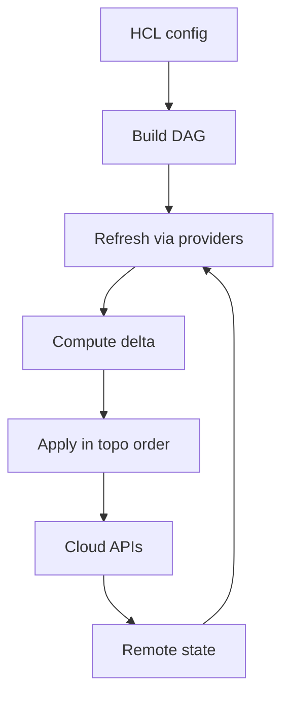

import { ConceptTemplate } from '@/features/kb/components/templates/ConceptTemplate'
import { Callout } from '@/features/kb/components/mdx/Callout'
import { ComparisonTable } from '@/features/kb/components/mdx/ComparisonTable'

export default function Layout({ children }) {
  return (
    <ConceptTemplate title="Terraform">
      {children}
    </ConceptTemplate>
  )
}

**Terraform** is a declarative provisioner. You describe the infrastructure you want in HCL. The CLI builds a dependency graph, diffs it against recorded state plus a live refresh, and then calls cloud APIs through providers. It does not configure packages inside a guest OS; that is a different job (Ansible, cloud-init, images).

## 1. Deep Dive and Mechanics

**Core vs providers.** The Terraform binary is a graph engine and a state machine. It does not know what an EC2 instance is. A provider plugin (usually a separate Go binary from the public registry) implements Create, Read, Update, and Delete for each resource type.

**Plan then apply.** `terraform plan` walks the graph, refreshes remote objects, and emits a change set: create, update in place, replace, or destroy. `terraform apply` executes that set in topological order. Immutable attributes (AMI, most subnet CIDRs) force a replace rather than a patch.

**State is the join key.** HCL names such as `aws_instance.web` are local addresses. The real cloud ID lives only in `terraform.tfstate`. Without state, Terraform cannot tell an existing VM from a missing one and will try to create a duplicate.

**License split.** HashiCorp moved Terraform to the Business Source License. OpenTofu is the Linux Foundation fork of the last MPL line and remains HCL-compatible for most modules.

<Callout icon="warning" title="State contains secrets">
Every attribute the provider returns is stored in state, including generated passwords and connection strings. Treat the state object like a credential store: encrypt it, lock it, and never commit it.
</Callout>

## 2. Mathematical / Theoretical Foundation

Terraform is **convergent reconciliation**. Let D be desired config and A the actual world as observed through APIs. The planner computes a delta that, if applied, should move A toward D. Dependencies form a DAG: a subnet cannot exist before its VPC. Parallelism is the width of the ready set in that DAG.

Idempotence is approximate, not algebraic. Two applies of the same config should be a no-op only if refresh agrees with state and no human mutated the console. Drift is A changing without D changing.

<ComparisonTable
  headers={['Approach', 'You write', 'Engine decides']}
  rows={[
    ['Imperative CLI', 'Ordered API calls', 'Almost nothing'],
    ['Terraform HCL', 'Desired graph', 'Order, parallelism, replace vs update'],
    ['CloudFormation', 'Desired stack YAML', 'Service-side workflow and rollback'],
  ]}
/>

## 3. Real-World Implementation

```hcl
terraform {
  required_version = ">= 1.5.0"
  required_providers {
    aws = {
      source  = "hashicorp/aws"
      version = "~> 5.0"
    }
  }
  backend "s3" {
    bucket         = "acme-tf-state"
    key            = "prod/network/terraform.tfstate"
    region         = "us-east-1"
    dynamodb_table = "acme-tf-locks"
    encrypt        = true
  }
}

provider "aws" {
  region = "us-east-1"
}

resource "aws_vpc" "main" {
  cidr_block           = "10.20.0.0/16"
  enable_dns_support   = true
  enable_dns_hostnames = true
}

output "vpc_id" {
  value = aws_vpc.main.id
}
```

Init downloads the AWS provider and configures the S3 backend. Plan shows one create. Apply writes the VPC ID into remote state.

## 4. Visualizations



## 5. Interview Prep

**Q: Why can you not just delete HCL and expect the cloud object to vanish if you never applied?**
**A:** Destroy only acts on addresses that exist in state. Untracked console resources are invisible. Tracked resources whose blocks you delete are scheduled for destroy on the next apply.

**Q: Terraform vs CloudFormation for a multi-account AWS shop that also has Azure DNS?**
**A:** Terraform (or OpenTofu) can model both in one language and one pipeline. CloudFormation is stronger for AWS-native rollback and service coverage on day zero, but it does not speak Azure.

**Q: What happens if two engineers apply at once against local state?**
**A:** Last writer wins and the graph can fork. Remote backends plus a lock table serialize applies.

## 6. Production Use Cases

- **Landing zones:** accounts, VPCs, IAM baselines, shared DNS, and peering as versioned modules.
- **App stacks:** RDS, IAM roles, queues, and target groups created per service repo.
- **SaaS glue:** GitHub repos, Datadog monitors, and PagerDuty services beside the cloud resources they observe.

<Callout icon="tip" title="Keep blast radius small">
One giant root module that owns the company is a 40-minute plan and a single lock. Split state by lifecycle: network, data, and app. Pass IDs through outputs or a data source, not copy-paste.
</Callout>
