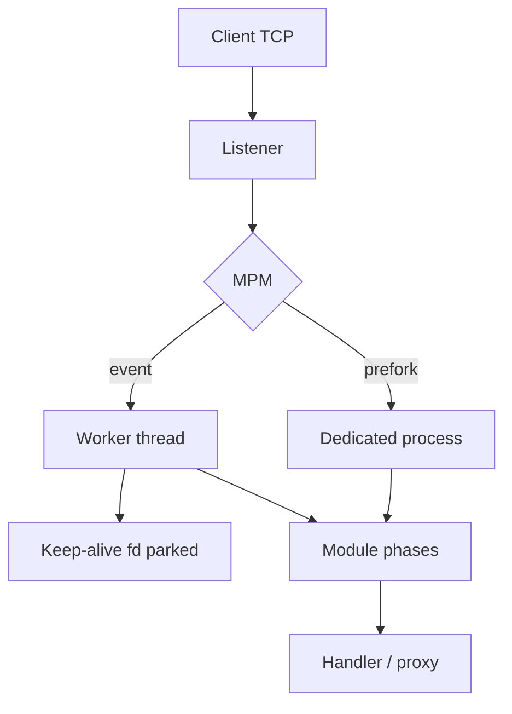

import { ConceptTemplate } from '@/features/kb/components/templates/ConceptTemplate'
import { Callout } from '@/features/kb/components/mdx/Callout'
import { ComparisonTable } from '@/features/kb/components/mdx/ComparisonTable'

export default function Layout({ children }) {
  return (
    <ConceptTemplate title="Apache HTTP Server">
      {children}
    </ConceptTemplate>
  )
}

**Apache HTTP Server** (httpd) is the open-source server that made cheap shared hosting possible. It won the 1990s and 2000s by being **modular** and **per-directory configurable**. Those same choices — a process or thread per connection, and a disk walk for `.htaccess` — are why Nginx later ate the high-concurrency edge.

## 1. Deep Dive and Mechanics

**MPM.** Apache does not have one concurrency model. A **Multi-Processing Module** picks the model at start:

- **prefork**: one process per connection. No threads, so non-thread-safe modules (classic `mod_php`) are safe. RAM cost is linear in concurrent clients.
- **worker**: process pool plus threads. Better density, still a thread per connection.
- **event**: keeps idle keep-alive connections off the worker threads so threads serve active requests. This is the modern default on most distros.

**Modules.** Almost every feature is a `mod_*` hook: `mod_rewrite`, `mod_ssl`, `mod_proxy`, `mod_http2`. The core is a request pipeline; modules register at phases (URI translate, auth, fixup, handler, log).

**`.htaccess`.** On each request Apache can walk from the document root down the path, merge overrides, and apply rewrites without a reload. That is the shared-hosting product. It is also extra `stat` and parse work on the hot path.

**C10k.** A thousand concurrent keep-alives in prefork means a thousand heavy processes. At tens of megabytes each, the box OOMs long before the NIC saturates. Event MPM plus proxying to a PHP-FPM or app pool is how Apache survives today.

<Callout icon="warning" title="Disable .htaccess on the edge">
Set `AllowOverride None` and put rewrite rules in the main config when you control the box. Per-request directory walks are a latency and I/O tax you do not need on a dedicated origin.
</Callout>

## 2. Mathematical / Theoretical Foundation

Think of the server as a **queueing system**. Arrival latency is fine; **holding a worker for the whole keep-alive idle time** is not. If mean request service is S and you hold the worker for idle time I, utilization is about λ times (S + I). Event MPM shrinks I toward zero for idle sockets (the kernel holds the fd; the thread is free).

Memory: `workers × RSS_per_worker`. Prefork RSS is not shared after copy-on-write dirties pages (PHP heaps do this immediately). Threaded MPMs share the text segment and much of the heap, so the constant factor drops.

<ComparisonTable
  headers={['MPM', 'Unit of concurrency', 'PHP model', 'Failure mode']}
  rows={[
    ['prefork', 'Process', 'mod_php in-process', 'RAM explosion under keep-alive'],
    ['worker', 'Thread', 'PHP-FPM via proxy', 'Thread-unsafe modules'],
    ['event', 'Thread plus idle fds', 'PHP-FPM via proxy', 'Still not an async proxy at Nginx scale'],
    ['Nginx worker', 'Event loop', 'FastCGI / proxy', 'Config reload, not .htaccess'],
  ]}
/>

## 3. Real-World Implementation

```text
# /etc/apache2/sites-available/app.conf
<VirtualHost *:80>
    ServerName app.example.com
    DocumentRoot /var/www/app/public

    <Directory /var/www/app/public>
        AllowOverride None
        Require all granted
    </Directory>

    ProxyPass /api/ http://127.0.0.1:8080/api/
    ProxyPassReverse /api/ http://127.0.0.1:8080/api/
</VirtualHost>
```

Pair this with `mpm_event` and a separate PHP-FPM or application process. Do not run `mod_php` inside prefork on a public edge in 2026.

## 4. Visualizations



## 5. Interview Prep

**Q: Why did Nginx displace Apache on the public edge?**
**A:** Event-driven workers handle tens of thousands of idle connections without a thread or process each. Apache event MPM closed the gap but `.htaccess` and a heavier request path still lose on static and reverse-proxy workloads.

**Q: When is Apache still the right default?**
**A:** Shared hosting, `.htaccess`-driven apps (WordPress rewrites), and shops whose ops runbooks are Apache modules — plus Windows-adjacent shops that already standardized on httpd.

**Q: prefork versus event?**
**A:** prefork if you must load a non-thread-safe module in-process. Otherwise event plus an out-of-process app server.

## 6. Production Use Cases

- **Shared hosting** panels that sell per-directory overrides as the product.
- **Legacy LAMP** origins behind a modern TLS-terminating proxy.
- **Intranet apps** that depend on `mod_auth_*` and existing Apache access policies.

<Callout icon="tip" title="Treat Apache as an origin, not the internet">
Terminate TLS and absorb bot traffic on Nginx, Caddy, or a cloud load balancer. Let Apache serve the PHP or CGI app it already knows.
</Callout>
