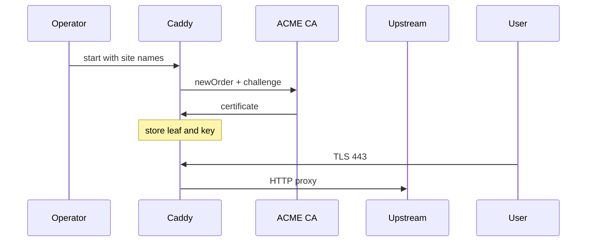

import { ConceptTemplate } from '@/features/kb/components/templates/ConceptTemplate'
import { Callout } from '@/features/kb/components/mdx/Callout'
import { ComparisonTable } from '@/features/kb/components/mdx/ComparisonTable'

export default function Layout({ children }) {
  return (
    <ConceptTemplate title="Caddy">
      {children}
    </ConceptTemplate>
  )
}

**Caddy** is a memory-safe Go server that treats **HTTPS as the default**, not a weekend project. You give it a hostname; it talks ACME to Let's Encrypt or another CA, stores the cert, serves TLS 1.2-plus, and renews before expiry. That is the whole pitch — and why small teams pick it over a hand-rolled Nginx plus certbot cron.

## 1. Deep Dive and Mechanics

**Caddyfile.** The human config is site addresses plus directives (`reverse_proxy`, `file_server`, `encode`, `basicauth`). JSON is the real API; the Caddyfile compiles down to it. The admin API on localhost can hot-load that JSON without a full process bounce.

**Automatic HTTPS.** On start, Caddy collects every public site name. For each name it:

1. Solves an ACME HTTP-01 or TLS-ALPN-01 challenge (or DNS-01 via a plugin).
2. Writes the leaf and key to storage (local disk or a shared store).
3. Builds a TLS config that rejects ancient protocols.
4. Schedules renewal at roughly two-thirds of the cert lifetime.

**Adapters and plugins.** Modules add DNS providers, authentication, dynamic upstreams. The binary is still one static Go executable: drop it on Alpine, no libc drama.

**HTTP.** Caddy speaks HTTP/1.1, HTTP/2, and HTTP/3 (QUIC) without a second listener puzzle. HTTP/3 needs UDP 443 open; many corporate networks still block it, so TCP fallback stays mandatory.

<Callout icon="warning" title="ACME needs a reachable challenge">
HTTP-01 requires port 80 from the public internet. If you only expose 443, use TLS-ALPN-01 or a DNS-01 plugin. Split-horizon DNS and captive portals break issuance in ways a static cert file never will.
</Callout>

## 2. Mathematical / Theoretical Foundation

Certificate lifetime is a **renewal race**. Let’s Encrypt leaves are typically 90 days. If renewal starts at 60 days and retry backoff is exponential, you need enough slack that a CA outage of a few days does not expire the site. Caddy’s scheduler plus retries encode that slack; a weekly cron that “usually works” does not.

Go’s scheduler plus `net/http` is an **M:N** model: goroutines, not a thread per connection. Idle HTTPS connections cost a stack that starts small and a TLS session; you will not hit Apache-prefork RAM math, but you can still exhaust file descriptors and ephemeral ports.

<ComparisonTable
  headers={['Server', 'TLS default', 'Config style', 'Hot reload']}
  rows={[
    ['Caddy', 'ACME on by default', 'Caddyfile / JSON API', 'Admin API'],
    ['Nginx', 'Manual cert paths', 'Declarative blocks', 'Reload signal'],
    ['Apache', 'mod_ssl + files', 'VirtualHost', 'Graceful restart'],
    ['Traefik', 'ACME resolver', 'Labels / CRDs', 'Orchestrator watch'],
  ]}
/>

## 3. Real-World Implementation

```text
example.com {
    encode gzip
    reverse_proxy 127.0.0.1:8080
}

www.example.com {
    redir https://example.com{uri} permanent
}
```

The first site block provisions and serves TLS for `example.com`. The second issues a 301. Storage lives under Caddy’s data directory; back that up or point it at a shared volume if you run more than one replica.

## 4. Visualizations



## 5. Interview Prep

**Q: Why not Nginx plus certbot?**
**A:** You can. Caddy collapses issuance, renewal, OCSP/stapling-era details, and cipher policy into the server. Fewer moving parts, fewer expired-cron incidents. Nginx still wins on raw tunable proxy features and muscle memory.

**Q: Can Caddy do zero-downtime config changes?**
**A:** Yes, via the JSON admin API or a graceful reload. In-flight requests drain; new connections see the new routes.

**Q: Is a single binary enough for multi-node HA?**
**A:** Certificates must be shared (network storage or an external store) or you will race ACME and hit rate limits. Put a VIP or anycast in front; do not let every replica hammer the CA.

## 6. Production Use Cases

- **Internal tools and staging** where “HTTPS by default” beats a ticket to the PKI team.
- **Small public sites** and indie SaaS that do not want a separate cert pipeline.
- **Dev and demo boxes** that should never ship plaintext HTTP by accident.

<Callout icon="tip" title="Pin a CA and a storage backend">
Defaults are Let’s Encrypt and local disk. Production replicas need shared storage and an explicit issuer so a rebuild does not surprise you with rate limits or a missing volume.
</Callout>
