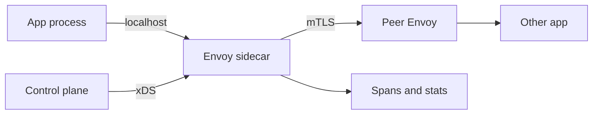

import { ConceptTemplate } from '@/features/kb/components/templates/ConceptTemplate'
import { Callout } from '@/features/kb/components/mdx/Callout'
import { ComparisonTable } from '@/features/kb/components/mdx/ComparisonTable'

export default function Layout({ children }) {
  return (
    <ConceptTemplate title="Envoy">
      {children}
    </ConceptTemplate>
  )
}

**Envoy** is the data-plane proxy Lyft open-sourced and the CNCF adopted. Applications talk to localhost; Envoy owns **timeouts, retries, mTLS, outlier ejection, and span headers**. Configuration is not a file you reload — it is a stream of xDS resources from a control plane (Istio, Consul, homemade).

## 1. Deep Dive and Mechanics

**Listeners, filters, clusters.** A **listener** binds a port. A **filter chain** (HTTP connection manager, TCP proxy, Wasm) parses and mutates. A **cluster** is an upstream with endpoints, health, and load-balancing policy. Routes bind path and header matchers to clusters.

**xDS.** The family of discovery APIs:

- LDS — listeners
- RDS — HTTP routes
- CDS — clusters
- EDS — endpoints
- SDS — secrets (certs)

The control plane streams incremental updates over gRPC. Envoy applies them without dropping the listen socket. That is the difference from “rewrite nginx.conf and hope the reload is graceful.”

**Sidecar versus edge.** In a mesh, one Envoy per pod intercepts inbound and outbound. At the edge, a fleet of Envoys is the ingress. Same binary, different listener layout.

**Resilience.** Per-route timeouts, retry budgets (so retries do not amplify outages), circuit breaking on pending requests and connections, and **outlier detection** that ejects a 5xx-hot endpoint from the cluster.

<Callout icon="warning" title="Retries are a load multiplier">
A 10 percent 503 rate with two retries is roughly 1.2 times upstream work — until a total outage, when it becomes a thundering herd. Cap retry budget and use hedged or idempotent-only retries.
</Callout>

## 2. Mathematical / Theoretical Foundation

Outlier ejection is a **sliding-window failure detector**. If an endpoint’s 5xx ratio exceeds a threshold over N requests, it is removed for a base ejection time that grows with consecutive ejections. This is φ-accrual adjacent: you trade false ejections (brief blips) against mean time to isolate a bad replica.

Retry amplification: if each hop retries R times independently across H hops, worst-case fan-out is about (1+R)^H. Mesh policy must set a **global retry budget**, not hop-local “retry 3.”

<ComparisonTable
  headers={['Proxy', 'Config plane', 'Sweet spot', 'Reload model']}
  rows={[
    ['Envoy', 'xDS gRPC', 'Mesh + programmable edge', 'In-place resource swap'],
    ['Nginx', 'Static files', 'Static + simple LB', 'Reload workers'],
    ['HAProxy', 'File + runtime socket', 'L4/L7 LB at huge CPS', 'Hitless reload'],
    ['Traefik', 'Orchestrator watch', 'K8s ingress, ACME', 'Dynamic routers'],
  ]}
/>

## 3. Real-World Implementation

```yaml
static_resources:
  listeners:
    - name: ingress
      address:
        socket_address: { address: 0.0.0.0, port_value: 8080 }
      filter_chains:
        - filters:
            - name: envoy.filters.network.http_connection_manager
              typed_config:
                "@type": type.googleapis.com/envoy.extensions.filters.network.http_connection_manager.v3.HttpConnectionManager
                stat_prefix: ingress
                route_config:
                  name: local
                  virtual_hosts:
                    - name: app
                      domains: ["*"]
                      routes:
                        - match: { prefix: "/" }
                          route:
                            cluster: app_cluster
                            timeout: 2s
                            retry_policy:
                              retry_on: "5xx"
                              num_retries: 2
                http_filters:
                  - name: envoy.filters.http.router
  clusters:
    - name: app_cluster
      connect_timeout: 0.25s
      type: STRICT_DNS
      lb_policy: LEAST_REQUEST
      load_assignment:
        cluster_name: app_cluster
        endpoints:
          - lb_endpoints:
              - endpoint:
                  address:
                    socket_address: { address: app.svc, port_value: 80 }
```

Static YAML is for labs. Production uses CDS and EDS so endpoints appear when pods do.

## 4. Visualizations



## 5. Interview Prep

**Q: Why Envoy instead of Nginx in a mesh?**
**A:** xDS, uniform telemetry, and per-rpc policy (retries, outlier, mTLS) without each language team reinventing a client. Nginx can proxy; it is not a live-updated data plane API.

**Q: What does LEAST_REQUEST actually do?**
**A:** Prefer the endpoint with the fewest outstanding requests (often with a random choice of two). Better than round-robin when request cost is heavy-tailed.

**Q: Where do you terminate TLS?**
**A:** Edge listener for public certs; sidecar mTLS for east-west. Do not confuse “TLS to the mesh” with “TLS to the process” — plaintext localhost to the sidecar is the usual split.

## 6. Production Use Cases

- **Service mesh data plane** (Istio, OSM, homemade xDS).
- **API edge** with gRPC-JSON transcoding, JWT auth, and canary weights.
- **Multi-cluster ingress** where endpoints churn faster than file deploys.

<Callout icon="tip" title="Export the same labels everywhere">
Envoy stats and spans are only useful if cluster names and route names match your SLIs. Invent a naming scheme before the first dashboard.
</Callout>
