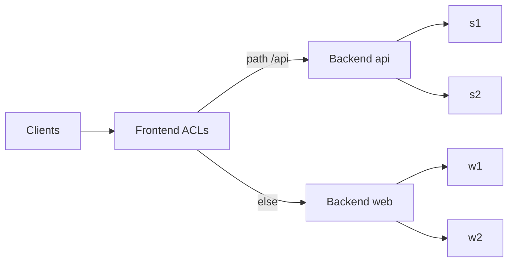

import { ConceptTemplate } from '@/features/kb/components/templates/ConceptTemplate'
import { Callout } from '@/features/kb/components/mdx/Callout'
import { ComparisonTable } from '@/features/kb/components/mdx/ComparisonTable'

export default function Layout({ children }) {
  return (
    <ConceptTemplate title="HAProxy">
      {children}
    </ConceptTemplate>
  )
}

**HAProxy** is a purpose-built load balancer. Nginx can balance; HAProxy’s entire design is **frontends, backends, and a runtime map of connections**. It is the box in front of Reddit-scale HTTP and of boring internal TCP (MySQL, Redis) when you want health checks without a mesh.

## 1. Deep Dive and Mechanics

**Process model.** One master, many event-driven workers (or a single thread historically). The hot path is accept, parse enough of the protocol to pick a server, splice or proxy bytes. Extra features (ACLs, Lua, SPOE) sit beside that path, not instead of it.

**Frontends and backends.** A **frontend** binds and applies ACLs (path, header, SNI, src). A **backend** is a server pool plus algorithm and health checks. `use_backend` is the routing table.

**Stick tables.** In-memory counters and maps: per-IP connection rate, login failures, session affinity keys. They power both **sticky sessions** and **abuse controls** without an external Redis.

**Health.** Active checks (HTTP GET on a path, TCP connect) plus passive observe (too many 5xx). Failed servers leave the pool; they re-enter after a rise count.

**Reload.** A new process takes the listen fds; the old one drains. That is the “hitless reload” story — still not free if you hold millions of idle connections that must migrate.

<Callout icon="warning" title="Sticky sessions hide dead servers">
IP-hash or cookie affinity will keep sending a user to a dying replica until the check fails. Pair stickiness with aggressive health checks, or put session state in Redis and use leastconn.
</Callout>

## 2. Mathematical / Theoretical Foundation

**leastconn** picks argmin of active connections. If request sizes are i.i.d., this approximates join-the-shortest-queue, which for heavy tails beats round-robin (the supermarket vs. one-queue result).

**Source hash:** `server = hash(src) mod N`. When N changes (deploy, failure), most mappings move unless you use **consistent hashing**. HAProxy’s `balance uri` and map-based hashes exist because naive modulo shreds caches.

Capacity: a modern core can do well over 100k HTTP req/s if you are not doing TLS or huge Lua. TLS termination moves the bottleneck to crypto; offload or use hardware AES-NI and session tickets.

<ComparisonTable
  headers={['Algorithm', 'State used', 'When it wins', 'When it hurts']}
  rows={[
    ['roundrobin', 'None', 'Homogeneous, short requests', 'One slow replica starves'],
    ['leastconn', 'In-flight count', 'Long polls, varied cost', 'Need accurate conn accounting'],
    ['source / stick', 'Hash or table', 'In-memory sessions', 'Uneven load, painful deploys'],
    ['random / two choices', 'Sample of two', 'Large N, cheap pick', 'Need recent load signal'],
  ]}
/>

## 3. Real-World Implementation

```text
frontend https_in
    bind :443 ssl crt /etc/haproxy/site.pem
    acl is_api path_beg /api
    use_backend api if is_api
    default_backend web

backend api
    balance leastconn
    option httpchk GET /health
    http-check expect status 200
    server s1 10.0.1.11:8080 check
    server s2 10.0.1.12:8080 check

backend web
    balance roundrobin
    server w1 10.0.2.11:80 check
    server w2 10.0.2.12:80 check
```

Runtime: `echo "show stat" | socat stdio /var/run/haproxy.sock` for CSV stats you can scrape.

## 4. Visualizations



## 5. Interview Prep

**Q: HAProxy versus Nginx as a load balancer?**
**A:** HAProxy is deeper at L4, stick tables, and runtime ACL stats. Nginx is a better static-file server and a familiar reverse proxy. Many shops run Nginx at the app edge and HAProxy at the VIP.

**Q: Layer 4 versus Layer 7?**
**A:** `mode tcp` balances bytes after accept (SNI can still be read). `mode http` parses requests so you can route on path and inject cookies. L7 costs CPU; L4 costs less and cannot do path routing.

**Q: How do you drain a server?**
**A:** Mark it `maint` or lower its weight to zero, wait until `scur` hits zero, then take it out. Health-check failure is the emergency path, not the deploy path.

## 6. Production Use Cases

- **Public VIP** in front of a Kubernetes NodePort or a VM pool.
- **TCP proxy** for databases when you want failover without a mesh sidecar.
- **Rate-limit and bot** front doors using stick-table counters.

<Callout icon="tip" title="Export show stat, not just syslog">
The stats socket is the source of truth for queued connections and response times. Scrape it into Prometheus if you want leastconn to stay honest.
</Callout>
