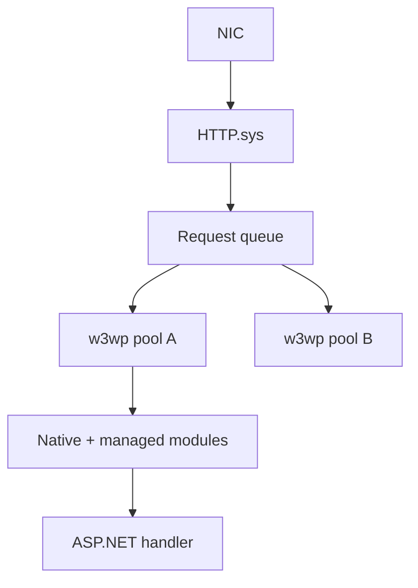

import { ConceptTemplate } from '@/features/kb/components/templates/ConceptTemplate'
import { Callout } from '@/features/kb/components/mdx/Callout'
import { ComparisonTable } from '@/features/kb/components/mdx/ComparisonTable'

export default function Layout({ children }) {
  return (
    <ConceptTemplate title="IIS">
      {children}
    </ConceptTemplate>
  )
}

**IIS** (Internet Information Services) is the Windows Server web stack. If the shop runs Active Directory, SQL Server, and ASP.NET, IIS is the front door: **Kerberos/NTLM**, **application pools**, and a module pipeline that looks like Apache’s phases with Microsoft names.

## 1. Deep Dive and Mechanics

**Application pools.** Each pool is one or more `w3wp.exe` worker processes with an identity, CLR version, and recycle policy. Site A in pool A can leak or pin CPU; site B in pool B keeps serving. Recycle on a schedule or on memory threshold to paper over unmanaged leaks — a feature and a smell.

**Integrated pipeline.** In classic mode, IIS ran native modules then handed off to ASP.NET. Integrated mode is one pipeline: `AuthenticateRequest`, `AuthorizeRequest`, `MapHandler`, `ExecuteRequestHandler`, `EndRequest`. Native and managed modules interleave.

**Windows authentication.** The browser on a domain-joined PC sends a Negotiate ticket. IIS validates against AD. Intranet apps skip a login form. That only works if SPNs, Kerberos delegation, and the site bindings are right — the usual “401.2” rabbit hole.

**Bindings.** A site is IP plus port plus optional host header (and SNI for TLS). Central Certificate Store or `netsh http` sslcert bindings attach the cert to the kernel HTTP.sys listener, not to a user-mode nginx-style file.

**HTTP.sys.** The kernel queues requests, does initial TLS (optionally), and dispatches to the right pool. That is why IIS can take a worker recycle without dropping the TCP listen.

<Callout icon="warning" title="Recycles drop in-flight work">
Overlapped recycle starts a new worker first, but in-process session state and long WebSocket connections still die. Put session in SQL or Redis and treat recycle as a deploy, not a health strategy.
</Callout>

## 2. Mathematical / Theoretical Foundation

Isolation is a **blast-radius** control. If failure probability of a site is p and sites share one process, one crash takes all. With N pools, a crash takes 1/N of the estate (assuming independence). You pay N times the working-set baseline.

Queueing: HTTP.sys is the queue, `w3wp` is the server. If queue length grows while CPU is idle, you are stuck in managed locks or outbound calls — scale-out will not help until you fix the wait.

<ComparisonTable
  headers={['Feature', 'IIS', 'Apache / Nginx']}
  rows={[
    ['Process isolation', 'App pools + HTTP.sys', 'Separate processes / workers'],
    ['Windows auth', 'Negotiate / Kerberos native', 'mod_auth_* or extra modules'],
    ['Config', 'applicationHost.config + web.config', 'httpd.conf / nginx.conf'],
    ['Typical app', 'ASP.NET, classic ASP', 'PHP, static, reverse proxy'],
  ]}
/>

## 3. Real-World Implementation

```powershell
Install-WindowsFeature Web-Server, Web-Windows-Auth
Import-Module WebAdministration
New-WebAppPool -Name BillingPool
Set-ItemProperty IIS:\AppPools\BillingPool -Name managedRuntimeVersion -Value v4.0
New-Website -Name Billing -Port 80 -HostHeader billing.corp.example -PhysicalPath C:\sites\billing -ApplicationPool BillingPool
Set-WebConfigurationProperty -Filter /system.webServer/security/authentication/windowsAuthentication -Name enabled -Value $true -PSPath IIS:\Sites\Billing
```

Prefer locking auth in `applicationHost.config` for the site rather than letting every `web.config` override it in production.

## 4. Visualizations



## 5. Interview Prep

**Q: What does an application pool actually isolate?**
**A:** The worker process, identity, CLR, and crash domain. It does not isolate the kernel listener or the machine’s CPU. A runaway pool can still starve others on a noisy host.

**Q: Why do intranet SSO setups fail after a hostname change?**
**A:** Kerberos SPNs are bound to the service account and the URL the browser uses. A new host header without a matching SPN falls back to NTLM or a 401 loop.

**Q: IIS versus Kestrel in modern ASP.NET?**
**A:** Kestrel is the in-process server. In production on Windows, IIS (or HTTP.sys) is often still the reverse proxy: TLS, Windows auth, and shared hosting. On Linux containers, Kestrel sits behind Nginx or a cloud LB and IIS is gone.

## 6. Production Use Cases

- **Corporate intranet** with silent Windows auth and AD groups as roles.
- **Legacy ASP.NET** apps that still ship as IIS sites on Windows Server VMs.
- **Hybrid** fronts where IIS terminates Windows auth and proxies to a Linux API.

<Callout icon="tip" title="Log HTTP.sys queue length">
If `CurrentQueueSize` climbs, add instances only after you know whether you are CPU-bound or wait-bound. Pool recycle will not drain a lock.
</Callout>
