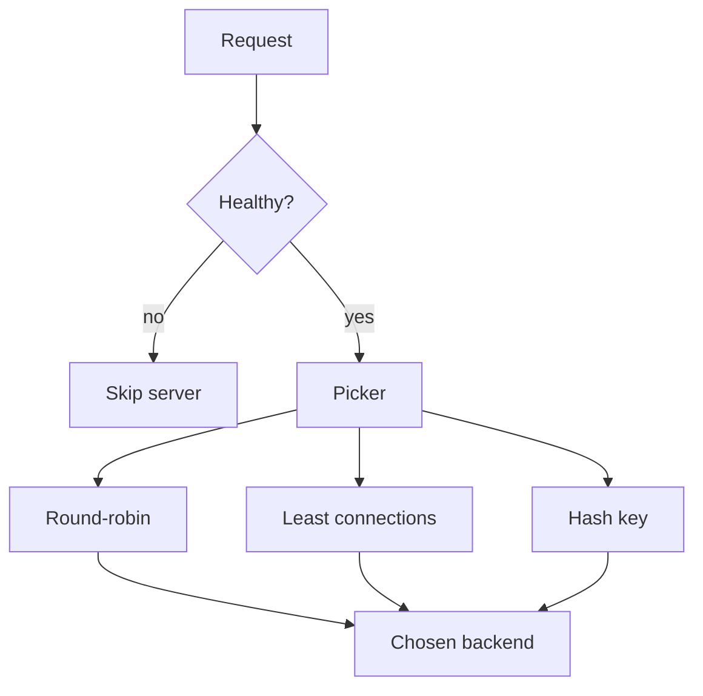

import { ConceptTemplate } from '@/features/kb/components/templates/ConceptTemplate'
import { Callout } from '@/features/kb/components/mdx/Callout'
import { ComparisonTable } from '@/features/kb/components/mdx/ComparisonTable'

export default function Layout({ children }) {
  return (
    <ConceptTemplate title="Load Balancing Algorithms">
      {children}
    </ConceptTemplate>
  )
}

A **load balancing algorithm** is the function from “incoming request plus pool state” to “one backend.” The function is useless if the pool still contains the dead box. Design the **health signal** first, then pick a picker that matches request cost and session needs.

## 1. Deep Dive and Mechanics

**Static pickers** ignore live load:

- **Round-robin** — walk the list. Fair only if every request is the same cost and every box is the same size.
- **Weighted round-robin** — bigger boxes get more tickets.
- **IP / cookie hash** — same client lands on the same server (sticky sessions).

**Dynamic pickers** read counters:

- **Least connections** — fewest in-flight HTTP or TCP sessions.
- **Least time / EWMA latency** — prefer the historically fast replica (NGINX Plus, Envoy peak EWMA).
- **Power of two choices** — sample two backends, pick the less loaded. Near-optimal with cheap state.

**Health.** Active probes (GET `/health` every few seconds, consecutive failure threshold) remove a server. Passive checks watch real 5xx and latency. Slow-start ramps a returning server so it does not eat a stampede.

**Layer.** L4 algorithms see connections. L7 algorithms see requests, so one HTTP/2 connection can still fan out across backends per stream.

<Callout icon="warning" title="Hash affinity is not a session store">
When the pool size changes, a naive `hash mod N` remaps most clients. Use consistent hashing or put session state in Redis and drop stickiness.
</Callout>

## 2. Mathematical / Theoretical Foundation

**Join-the-shortest-queue (JSQ)** minimizes expected wait under many models. True JSQ needs global in-flight counts. **Power of two** (Mitzenmacher) gets close: the maximum load drops from log-log N toward log-log-log territory versus random.

**Consistent hashing** places servers on a ring. A departure only remaps the arc that belonged to that server, not everyone. Virtual nodes smooth imbalance.

Weights: if capacity is c_i, target rate λ_i = λ * c_i / sum(c). Weighted RR approximates this without measuring λ. Leastconn approximates it when connection count tracks work.

<ComparisonTable
  headers={['Algorithm', 'Input', 'Best for', 'Risk']}
  rows={[
    ['Round-robin', 'Cursor', 'Identical short requests', 'One slow host piles up'],
    ['Weighted RR', 'Weights', 'Mixed VM sizes', 'Weights go stale'],
    ['Least connections', 'In-flight', 'Long-lived or varied cost', 'Needs accurate accounting'],
    ['Source hash', 'Client key', 'In-process sessions', 'Skew and remap on churn'],
    ['Power of two', 'Two samples', 'Large homogeneous pools', 'Needs a load metric'],
  ]}
/>

## 3. Real-World Implementation

```nginx
upstream api {
    least_conn;
    server 10.0.1.11:8080 weight=3 max_fails=3 fail_timeout=10s;
    server 10.0.1.12:8080 weight=3;
    server 10.0.1.13:8080 weight=1;
}

server {
    listen 80;
    location / {
        proxy_pass http://api;
        proxy_next_upstream error timeout http_502 http_503;
    }
}
```

`least_conn` plus weights plus `max_fails` is the usual “good enough” Nginx pool. Envoy would express the same idea as `LEAST_REQUEST` plus outlier ejection.

## 4. Visualizations



## 5. Interview Prep

**Q: Why is least-conn better than round-robin for APIs?**
**A:** Request cost is heavy-tailed. Round-robin will keep feeding a replica that is already stuck on a slow query. Least-conn (or least-request) steers new work away from that pile.

**Q: When do you want sticky sessions?**
**A:** Only when the app stores session in local memory and you cannot change it. Prefer externalizing state. Stickiness fights even load and graceful deploys.

**Q: Active versus passive health checks?**
**A:** Active checks catch “process up, handler dead” if the probe hits a real dependency. Passive checks catch bad deploys that still pass `/health`. Use both.

## 6. Production Use Cases

- **Stateless API pools** with least-conn or power-of-two and no affinity.
- **WebSocket or gRPC** streams where connection count is the load signal.
- **CDN origin** shields using consistent hashing so cache keys stay warm.

<Callout icon="tip" title="Measure imbalance, not just average latency">
A healthy average can hide one hot shard. Plot per-backend in-flight and p99. If one bar dominates, the algorithm or the weights are lying.
</Callout>
