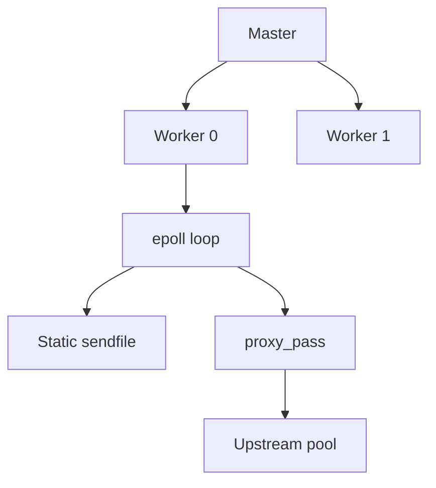

import { ConceptTemplate } from '@/features/kb/components/templates/ConceptTemplate'
import { Callout } from '@/features/kb/components/mdx/Callout'
import { ComparisonTable } from '@/features/kb/components/mdx/ComparisonTable'

export default function Layout({ children }) {
  return (
    <ConceptTemplate title="Nginx">
      {children}
    </ConceptTemplate>
  )
}

**Nginx** (engine-x) was Igor Sysoev’s answer to the **C10k problem**. Instead of a process per connection, a small set of workers run non-blocking event loops (`epoll`, `kqueue`). The same binary serves static files, terminates TLS, and reverse-proxies to app runtimes.

## 1. Deep Dive and Mechanics

**Master and workers.** The master reads config, binds sockets, and manages workers. Each worker is single-threaded and handles thousands of connections. `worker_processes auto` usually means one per CPU. Blocking work inside a worker (slow disk, a bad Lua, a resolver stall) stalls every connection on that worker.

**Phases.** A request walks rewrite, access, content, and log phases. `location` blocks pick the content handler: `root` / `alias` for files, `proxy_pass` for upstreams, `fastcgi_pass` for PHP-FPM.

**Upstream.** Named pools with RR, least_conn, hash, and (in Plus) least_time. `proxy_next_upstream` retries idempotent failures. Buffers and `proxy_buffering` decide whether the worker stores the upstream body or streams it.

**Reload.** `nginx -s reload` starts new workers on the same listen fds and drains old ones. In-flight requests finish; WebSockets may still get cut if you recycle too fast.

**Open source versus Plus.** Plus adds live activity dashboards, JWT, more health-check depth, and dynamic upstream APIs. Open source covers most origin and ingress jobs.

<Callout icon="warning" title="One blocking call poisons a worker">
A `proxy_pass` to a hung upstream without `proxy_connect_timeout` and read timeouts pins connections. Set connect, send, and read timeouts on every upstream. Never `proxy_pass` to a DNS name that can block the resolver without a cache.
</Callout>

## 2. Mathematical / Theoretical Foundation

Connections are cheap because the worker stores a small connection object and a state machine, not a 8 MB thread stack. Memory is roughly `connections × state_size + buffers`. `worker_connections` times workers is the hard cap; file descriptors must be at least that plus upstream fds.

Event loops are **O(ready events)** per tick, not O(all connections). Idle keep-alives sit in the kernel until traffic or timeout.

<ComparisonTable
  headers={['Job', 'How Nginx does it', 'Watch out']}
  rows={[
    ['Static files', 'sendfile, open file cache', 'Huge directories, missing sendfile'],
    ['Reverse proxy', 'proxy_pass + headers', 'Buffering and timeouts'],
    ['Load balance', 'upstream + least_conn', 'No native active checks in OSS'],
    ['TLS offload', 'listen ssl, session tickets', 'OCSP and cert reload ops'],
  ]}
/>

## 3. Real-World Implementation

```nginx
worker_processes auto;
error_log /var/log/nginx/error.log warn;

http {
    upstream app {
        least_conn;
        server 127.0.0.1:3000;
        keepalive 32;
    }

    server {
        listen 443 ssl http2;
        server_name app.example.com;
        ssl_certificate     /etc/ssl/certs/app.pem;
        ssl_certificate_key /etc/ssl/private/app.key;

        location / {
            root /var/www/html;
            try_files $uri $uri/ /index.html;
        }

        location /api/ {
            proxy_http_version 1.1;
            proxy_set_header Host $host;
            proxy_set_header X-Real-IP $remote_addr;
            proxy_set_header Connection "";
            proxy_connect_timeout 2s;
            proxy_read_timeout 10s;
            proxy_pass http://app;
        }
    }
}
```

## 4. Visualizations



## 5. Interview Prep

**Q: Why one worker per core?**
**A:** The worker is single-threaded. Extra workers on the same core fight for cache and run-queue time. Too few workers leave cores idle. Pinning (`worker_cpu_affinity`) helps on NUMA boxes.

**Q: How is Nginx different from Apache prefork?**
**A:** Prefork pays a process per connection. Nginx multiplexes connections on a few event loops. Apache event MPM narrowed the gap; Nginx still tends to win as a dumb, fast proxy.

**Q: What happens on reload?**
**A:** New workers load the new config and inherit listen sockets. Old workers stop accepting and exit when their connections drain — or when you time them out.

## 6. Production Use Cases

- **TLS-terminating edge** in front of Node, Gunicorn, or PHP-FPM.
- **Static + SPA** hosting with `try_files` falling through to `index.html`.
- **Ingress** via ingress-nginx in Kubernetes (same mental model, extra annotations).

<Callout icon="tip" title="Reuse upstream keepalives">
Set `keepalive` on the upstream and `proxy_http_version 1.1` with an empty Connection header. Otherwise every API call opens a new TCP connection to localhost.
</Callout>
