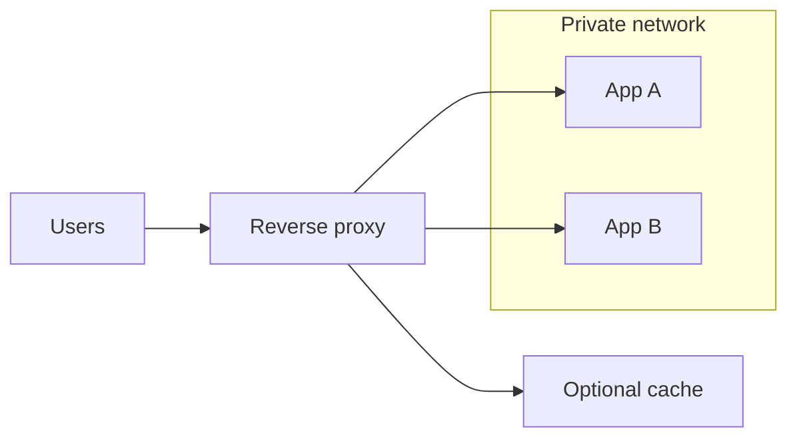

import { ConceptTemplate } from '@/features/kb/components/templates/ConceptTemplate'
import { Callout } from '@/features/kb/components/mdx/Callout'
import { ComparisonTable } from '@/features/kb/components/mdx/ComparisonTable'

export default function Layout({ children }) {
  return (
    <ConceptTemplate title="Reverse Proxies">
      {children}
    </ConceptTemplate>
  )
}

A **reverse proxy** sits in front of your origin servers. Clients believe they are talking to the site; they are talking to Nginx, HAProxy, Envoy, Caddy, or a cloud ALB. The proxy **forwards** to private apps, and it is where TLS, routing, and coarse caching usually live.

## 1. Deep Dive and Mechanics

**Hop.** Client → proxy (public IP) → origin (RFC1918 or mesh). The origin never needs a public address. The proxy sanitizes headers, sets `X-Forwarded-For` / `Forwarded`, and chooses an upstream.

**Jobs that accumulate at this hop:**

1. **TLS termination** — decrypt once, speak HTTP inside a trusted network (or re-encrypt).
2. **Routing** — host, path, header, or cookie to the right service.
3. **Load balancing** — pick a healthy replica.
4. **Caching** — store GET responses keyed by URL and vary headers.
5. **Shielding** — rate limits, WAF, request size caps, HTTP/2 fan-in.

**API gateways** are reverse proxies with a product catalog: keys, quotas, request transform, developer portals. Kong, Apigee, and AWS API Gateway are still proxies underneath.

**Hop-by-hop headers** (`Connection`, `Keep-Alive`, `Transfer-Encoding`) must not be blindly copied. HTTP/2 to the client and HTTP/1.1 to the origin is normal; the proxy is the protocol translator.

<Callout icon="warning" title="Trust X-Forwarded-For only from you">
If the proxy appends the client IP but the app trusts the leftmost value, anyone can spoof an IP. Trust the rightmost address added by your edge, or overwrite the header at the proxy.
</Callout>

## 2. Mathematical / Theoretical Foundation

A reverse proxy is a **multiplexer**. Fan-in of C client connections onto U upstreams with keep-alive reuse cuts sockets from C to about U times a small pool. That is why an origin can serve more users than it has threads.

Cache hit rate h reduces origin QPS to (1 − h) of arrivals (for cacheable GETs). Hit rate dies if you `Vary` on too many headers or put cookies on every response.

<ComparisonTable
  headers={['Kind', 'Who is hidden', 'Typical product', 'Trust direction']}
  rows={[
    ['Forward proxy', 'The client', 'Corp egress, Squid', 'Server sees proxy IP'],
    ['Reverse proxy', 'The origin', 'Nginx, ALB, Envoy', 'Client sees site IP'],
    ['API gateway', 'The origin plus policy', 'Kong, Apigee', 'Same as reverse + auth'],
    ['Mesh sidecar', 'Peer identity', 'Envoy sidecar', 'mTLS between hops'],
  ]}
/>

## 3. Real-World Implementation

```nginx
server {
    listen 443 ssl;
    server_name api.example.com;

    location / {
        proxy_set_header Host $host;
        proxy_set_header X-Real-IP $remote_addr;
        proxy_set_header X-Forwarded-For $proxy_add_x_forwarded_for;
        proxy_set_header X-Forwarded-Proto $scheme;
        proxy_pass http://10.0.1.10:8080;
    }
}
```

The app must read the forwarded proto if it generates absolute redirects; otherwise it will emit `http://` links behind a TLS edge.

## 4. Visualizations



## 5. Interview Prep

**Q: Forward versus reverse proxy in one sentence?**
**A:** Forward proxies represent clients to the internet; reverse proxies represent servers to clients.

**Q: Why not expose the app port directly?**
**A:** You lose a choke point for TLS, authn, request limits, and pool changes. You also advertise internal topology and versions.

**Q: When is a gateway not just a proxy?**
**A:** When you need per-consumer credentials, quotas, and a catalog. If you only need host and path routing, a reverse proxy is enough.

## 6. Production Use Cases

- **Public website edge** terminating TLS and splitting `/` static from `/api`.
- **Blue-green or canary** by shifting upstream weights on the proxy.
- **Internal platform** entry (ingress) in Kubernetes.

<Callout icon="tip" title="Make the proxy the only public listener">
Origins bind to localhost or a private NIC. Security groups then become simple: 443 to the proxy, nothing to the app subnet from 0.0.0.0/0.
</Callout>
