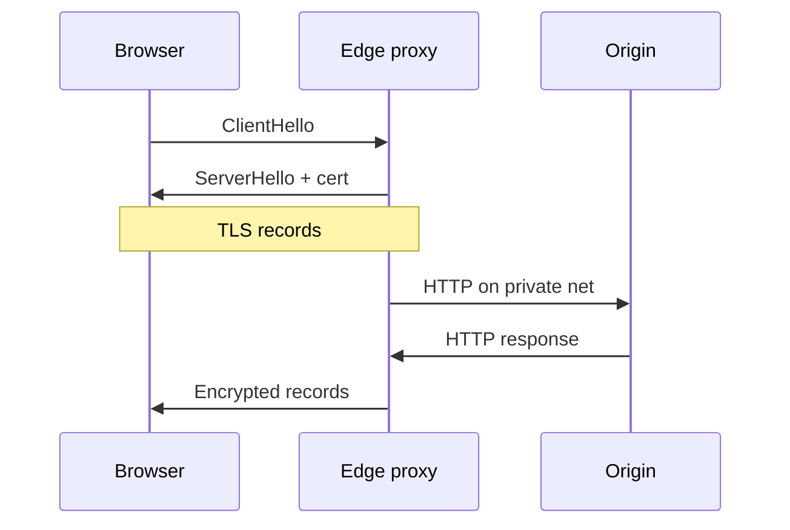

import { ConceptTemplate } from '@/features/kb/components/templates/ConceptTemplate'
import { Callout } from '@/features/kb/components/mdx/Callout'
import { ComparisonTable } from '@/features/kb/components/mdx/ComparisonTable'

export default function Layout({ children }) {
  return (
    <ConceptTemplate title="TLS Termination">
      {children}
    </ConceptTemplate>
  )
}

**TLS termination** (SSL offload) means the public handshake ends at the edge. The proxy holds the certificate and private key, decrypts, and forwards **plaintext HTTP** (or a new TLS session) to backends. Origins spend CPU on business logic, not on RSA/ECDHE and record encryption for every client.

## 1. Deep Dive and Mechanics

**Handshake.** The expensive part is the **asymmetric** handshake (ECDHE + signature) and cert verify. After that, AES-GCM or ChaCha20 is cheap on modern CPUs, especially with session resumption (tickets or IDs) and TLS 1.3’s 1-RTT.

**Where the key lives.** The terminator needs the private key or an external KMS/HSM (Amazon ACM on an ALB, SDS in Envoy). Origins do not.

**Modes:**

- **Terminate** — client TLS ends at the LB; HTTP inside the VPC.
- **Re-encrypt** — terminate, then open a second TLS session to the origin (often with an internal CA).
- **Passthrough** — LB only sees TCP or SNI; the origin owns the cert. No HTTP routing on path.

**HTTP details.** After terminate, the proxy should send `X-Forwarded-Proto: https` so apps generate secure cookies and HSTS-safe redirects. `Secure` cookies set by the app still work if the browser only saw HTTPS.

<Callout icon="error" title="Plaintext east of the LB is visible to anything on that network">
A packet capture on a compromised node reads tokens and PII. PCI and zero-trust shops re-encrypt or use mesh mTLS. “The VPC is trusted” is a policy claim, not a cryptographic one.
</Callout>

## 2. Mathematical / Theoretical Foundation

Handshake cost dominates short connections. If a client makes one tiny API call per TCP session, you pay a full handshake per request. HTTP/2 and keep-alive **amortize** that cost across many requests. TLS 1.3 plus 0-RTT (with replay rules) shrinks repeat visits.

Let H be handshake CPU and R be per-record crypto. Total CPU ≈ N_new × H + bytes × R. Termination concentrates N_new × H on the edge fleet, which you can scale and tune (session tickets, hardware offload) without touching every microservice.

<ComparisonTable
  headers={['Mode', 'Who has the cert', 'Path routing', 'Inner confidentiality']}
  rows={[
    ['Terminate', 'Edge', 'Yes', 'Depends on L3 isolation'],
    ['Re-encrypt', 'Edge + origin CA', 'Yes at edge', 'TLS to origin'],
    ['Passthrough', 'Origin', 'SNI only', 'End-to-end'],
    ['mTLS mesh', 'Workloads', 'Sidecar', 'Peer-authenticated'],
  ]}
/>

## 3. Real-World Implementation

```nginx
server {
    listen 443 ssl http2;
    ssl_certificate     /etc/ssl/certs/site.pem;
    ssl_certificate_key /etc/ssl/private/site.key;
    ssl_protocols       TLSv1.2 TLSv1.3;
    ssl_session_cache   shared:SSL:10m;
    ssl_session_timeout 1d;

    location / {
        proxy_set_header X-Forwarded-Proto $scheme;
        proxy_set_header Host $host;
        proxy_pass http://127.0.0.1:8080;
    }
}
```

For re-encrypt, `proxy_pass` becomes `https://origin` plus a trusted internal CA bundle.

## 4. Visualizations



## 5. Interview Prep

**Q: Why terminate at the load balancer?**
**A:** One place to renew certs, one place to disable TLS 1.0, and you spare app pods the handshake storm. You also get HTTP routing the LB could not do in passthrough.

**Q: When do you refuse to terminate?**
**A:** When regulators or threat models require ciphertext until the process that owns the data, or when the inner network is multi-tenant and untrusted.

**Q: Terminate versus passthrough for gRPC?**
**A:** Terminate (or re-encrypt) if the proxy must do HTTP/2 routing and retries. Passthrough if only SNI-based tenancy matters and the origin speaks TLS itself.

## 6. Production Use Cases

- **Public ALB / NLB + ACM** in AWS with HTTP target groups.
- **ingress-nginx or Envoy** at the cluster edge with a wildcard cert.
- **Banking** re-encrypt or mesh mTLS so packet taps on the overlay are useless.

<Callout icon="tip" title="Rotate tickets when you rotate keys">
TLS session tickets encrypt resumption state with a ticket key. If that key is static across a year, a stolen ticket key decrypts old resumptions. Rotate ticket keys on a schedule.
</Callout>
